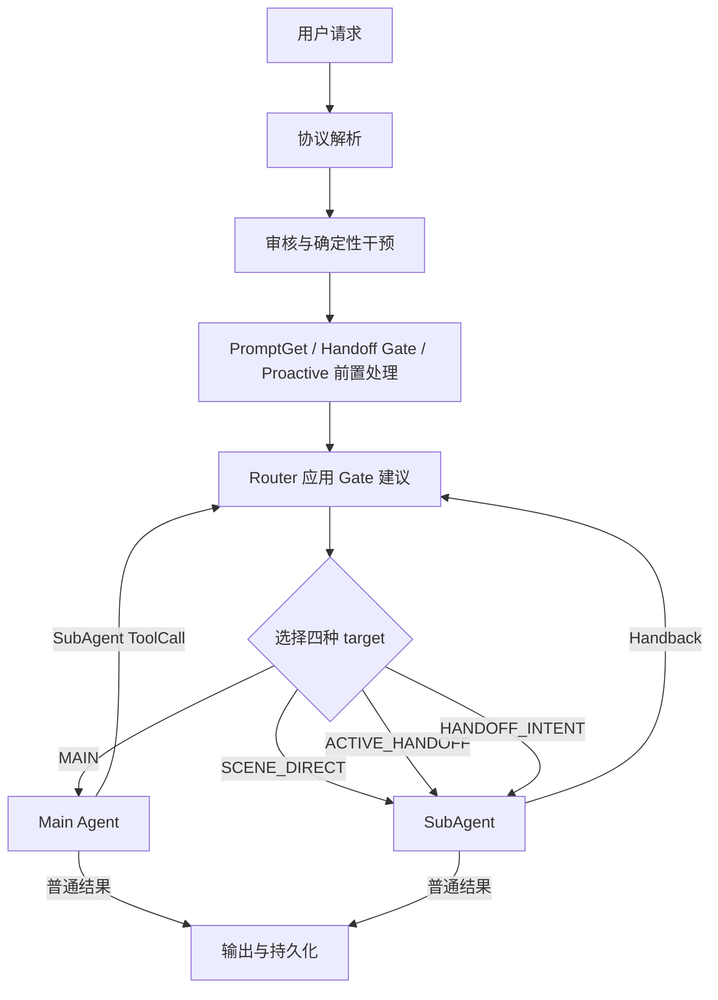

# EduBot 路由与 Handoff 完整业务逻辑

## 阅读定位
本文回答一个核心问题：**在同一个用户 Session 中，系统如何判断本轮该由 Main Agent 还是某个
SubAgent承接，并让任务状态、上下文、流式输出和记忆保持一致。**
文中默认描述EduBot当前一期实现；凡标为”目标设计”的内容，都是后续演进方向，不代表已经在线。算法
Demo只用于说明目标状态机和协议合同，不能当成当前系统能力。

理解这套系统时，先记住一句话：
>Gate 给建议，Router 做决定；Agent 负责执行，Task Store 保存控制状态，ToolCall/
ToolResult 负责闭合跨 Agent 语义。

---

# 第一部分：它要解决什么业务问题

## 1. 为什么不能只做一次意图分类
Main Agent 擅长开放问答、澄清、协调和选择能力；SubAgent 擅长持续完成某一类专业任务，例如连续讲
解、辅导或练习。

如果每轮都让 Main 重新判断是否调用 SubAgent，会带来三个问题：

1. 已经进入专业任务后，每轮都重复选择，增加模型时延和成本；
2. Main可能在相邻两轮之间摇摆，破坏专业任务连续性；
3. SubAgent的进度、播放游标和上下文难以稳定恢复。

如果只记住上轮的active_agent并一直直发，也会产生另三个问题：

1. 用户已经换话题，新问题仍被错误黏在旧 SubAgent
2. 用户想暂时离开、稍后继续，系统只能“继续”或“彻底结束”，无法暂停与恢复
3. 同一个Agent 未来可能同时承担多个不同任务，仅凭Agent 名无法区分任务身份。

所以EduBot的路由不是一次分类，而是一条持续运行的控制闭环：

```text
识别本轮请求
，读取请求级配置和当前任务状态
判断继续、暂停、恢复或交回Main
Router 原子更新状态并选择执行目标
Agent 执行
根据 ToolCall、普通结果或 Handback 再次进入 Router
输出并持久化本轮结果
```

## 2. 系统中的主要角色

| 角色 | 负责什么 | 不负责什么 |
|---|---|---|
| Chat / Live 入口 | 解析请求、执行审核与干预、组织输出协议 | 不决定 Task 最终状态 |
| PromptGet | 返回本请求生效的 Prompt、模型、工具和实验配置 | 不执行路由状态转换 |
| Scene | 表达客户端已经明确指定的业务场景 | 不是语义分类模型，也不是 Task 状态 |
| Handoff Gate | 根据当前 Query 和 Task 快照给出继续、暂停、恢复或澄清建议 | 不读取最终实验开关，不写持久化状态 |
| Proactive | 为可能由 Main 回答的请求提供主动引导内容 | 不决定最终 owner，不创建 Task |
| Router | 解释配置、校验状态、选择最终 target、执行 Task / Topic 转换、调度 Agent | 不替代 Agent 生成业务答案 |
| Main Agent | 普通问答、澄清、选择 SubAgent Tool、接收 Handback 后收尾 | 不是 Task 状态的权威存储 |
| SubAgent | 持续执行专业任务，必要时 Handback | 不直接改 EduBot 的全局路由状态 |
| Task Store | 保存 Session 当前 owner、active / paused Task、Topic、LGI 和 revision | 不理解用户意图 |
| 记忆与观测系统 | 保存消息、协议记录、Task 关联和诊断证据 | 不能替代实时控制状态 |

## 3. 三种容易混淆的 Handoff

| 类型 | 方向 | 触发方式 | 业务含义 |
|---|---|---|---|
| 前置轻量路由 | 当前 owner 与 Main 之间 | Gate 的规则或小模型建议 | 判断当前 Query 是继续当前任务，还是返回或指向 Main |
| Main ToolCall Handoff | Main → SubAgent | Main 生成注册的 SubAgent Tool | 创建或恢复专业 Task，并把本轮交给 SubAgent |
| SubAgent Handback | SubAgent → Main | SubAgent 返回结构化完成信号 | 当前专业 Task 完成，回到 Main 收尾或继续对话 |

前置轻量路由解决“这一轮归谁”；ToolCall Handoff 解决“Main 如何交出一个专业任务”；Handback 解决“专业任务完成后怎样归还控制权”。三者共同围绕 Router 与 Task 状态完成同一件事。

---

# 第二部分：一轮请求如何完整运行

## 4. 总体请求链

当前 Chat 与 Live 共用同一套核心控制链：



Router 不是执行一次就结束。Main 生成 ToolCall，或 SubAgent 生成 Handback 时，当前 HTTP 请求内会再次进入 Router，直到得到普通 FinalResult、受控错误或达到循环上限。

## 5. Chat/ Live的入口处理

### 5. 1请求解析

入口会把协议消息整理成一个请求级上下文，核心信息包括：

外层session_id；
用户身份和设备身份；
本轮消息及最新用户文本；
entry、scene、scene_para;
客户端输入 bucket；
是否流式、播放模式、客户端LGI；
请求ID、时间和链路信息；
本轮后续得到的 Prompt 配置、Gate 结果、Proactive 结果和 Topic。

这个上下文是”一轮请求的共享快照”。PromptGet返回的配置会写入其中，Gate 与Router 也通过它传递建议和执行结果，避免同一请求前后读取不同版本的配置。

### 5. 2审核与确定性干预先于路由

内容审核、正则干预等属于入口门禁。它们可能直接拒绝请求或返回固定响应，因此必须先于 Gate 和 Router.

这条边界很重要：

审核回答“请求是否允许继续”；
Gate回答“如果继续，本轮与现有Task的关系是什么"；
- Router回答“最终由谁执行以及状态如何变化”。

### 5. 3entry、scene和bucket是三个独立维度

entry决定使用哪一套请求级配置场景，例如默认入口和特定业务入口可对应不同 Prompt 配置；
scene是客户端声明的明确业务场景，可触发确定性直达 SubAgent；
- bucket 是请求携带的实验输入，是否真正生效要以 PromptGet 返回的matched为准。

不能从entry推导最终 Agent，也不能把scene和 PromptGet 的配置场景当成同一个概念。

## 6. 前置轻量路由：Prompt、Scene、Gate、Proactive 的关系

### 6. 1四者各自回答不同问题

| 模块 | 回答的问题 | 结果如何被使用 |
|---|---|---|
| PromptGet | 这次请求最终使用什么Prompt、模型、工具和实验开关 | Main 组装上下文；Router 判断Gate 建议是否允许应用 |
| Scene | 客户端是否已经明确指定一个可直达的专业场景 | Router 在无 active/paused Task 时选择SCENE_DIRECT |
| Handoff Gate | 新 Query 与 active/paused Task 是继续、暂停、恢复还是不确定 | 只写入候选建议，等待 Router 校验和应用 |
| Proactive Delivery Gate | 上一轮候选对本轮最新 Query 是否仍然 fit | 结果暂存为 Main 内容候选；是否注入还取决于请求开关和本轮是否实际调用Main，不改变owner |

### 6. 2并行启动，按依赖回收

为了降低首 token 时延，入口尽量并发推进请求级配置、Handoff Gate 和 Proactive。它们虽然并行，但并不对等：

1. Gate 可以先读取 Task 状态并做规则或模型判断；
2. Router 必须同时看到 PromptGet 的最终matched，才能决定是否应用 Gate;
3. 若配置允许，而且 Gate 给出CONTINUE_ACTIVE或RESUME_PAUSED，入口会把它当作强 SubAgent-bound 提示，提前取消或丢弃 Proactive，以减少关键路径等待；
4. 这里的提示仍不是 Router effect：Resume 可能遇到 CAS 冲突，状态也可能在应用前改变。若最终又回到 Main，已经丢弃的 Proactive 结果不会补回，这是当前性能优化留下的边界；
5. 其他仍可能调用 Main 的请求继续等待 Proactive；只有 Main 真正开始执行且请求开关允许时， steering 才进入其上下文；
6. Scene 并不是一个并行的模型 Hook，它在 Router 选择 target 时作为确定性候选生效。

可以把关系简化为：

```text
PromptGet决定“开关和资源”
Gate决定“任务连续性建议”
Scene提供“明确场景候选”
Proactive 提供“Main回答时的引导内容"
Router统一决定“真正落点"
```

### 6. 3 输入bucket 不等于生效bucket

客户端 bucket 只是 PromptGet 的输入。真正控制 Gate 是否应用的是请求级配置返回的matched. edu_main_gate`:

on：Router 可以尝试应用 Gate 建议；
off：Router 忽略建议，沿当前 Scene/sticky/Main 规则路由；
缺失或未知：按关闭处理。

PromptGet 获取失败时，Main 仍可使用本地兜底配置继续服务；Gate 开关则按关闭处理，避免在缺少权威配置时修改Task 状态。

## 7. Router 的权责和四种路由目标

Router 是控制面的最终责任人。它负责：

校验请求级开关；
读取或更新 Task Store；
使用revision/CAS 防止旧建议覆盖新状态；
选择本轮 target;
在调用 Agent 前准备 Topic、Task 和 LGI;
消费 Agent 返回的 ToolCall、FinalResult、Error 或 Handback;
维持ToolCall/ToolResult 协议闭合；
触发下一轮路由或结束请求。

当前有四种 target：

| target | 何时出现 | 是否经过MainLLM | Task 含义 |
|---|---|---|---|
| MAIN | 普通问答、Gate 要求回 Main、Handback后收尾、异常降级 | 是 | 确保Main Topic，不创建专业 active Task |
| SCENE_DIRECT | 无 active / paused Task，且 Scene 明确命中 | 否 | 在调用前创建 Scene Task |
| ACTIVE_HANDOFF | 已有合法 active Task | 否 | 继续同一Task，保留 Topic 和进度 |
| HANDOFF_INTENT | Main 刚产生 SubAgent ToolCall | Main 已在上一轮执行 | 在调用前创建或恢复 Task，再调用 SubAgent |

当前决策优先级可以理解为：

1. 已缓存的 Main ToolCall 意图优先进入 HANDOFF_INTENT；
2. Gate 或 Handback 强制回 Main 时选择MAIN；
3. 无任务且 Scene 命中时选择SCENE_DIRECT；
4. 存在 active Task 时选择ACTIVE_HANDOFF；
5. 其余情况回到MAIN。

有 active 或 paused Task 时，Scene 不会重复 bootstrap。这样可以防止客户端每轮都带同一个 Scene 时不断重建 Task。

## 8. 一次完整业务示例

```text
Q1「给我讲恐龙]
→无 Task，Router 选 MAIN
Main 生成 SubAgent ToolCall(start_new_topic=true)
→Router 创建 T1，进入 HANDOFF_INTENT
SubAgent 回答，T1 保持 active

Q2「再讲讲霸王龙」
→Gate 判断 CONTINUE_ACTIVE
→Router 选 ACTIVE_HANDOFF
SubAgent 延续T1

Q3「先帮我写一段秋天作文开头」
→Gate 判断 PREEMPT_TO_MAIN
→Router 将 T1 从 active 移到 paused，并切到 Main Topic
→Main回答新问题

Q4「继续刚才的恐龙」
→Gate 匹配 paused T1，判断 RESUME_PAUSED
→Router 将 T1 恢复为 active，恢复原 Topic 和 LGI
→SubAgent 接着讲

Q5 SubAgent 完成讲解并 Handback
→Router 完成 T1，清理任务槽，注入 ToolResult
同一请求内再次运行 Main
Main 面向用户收尾
```

---

# 第三部分：Gate 如何判断

## 9. Gate的输入、输出和边界

Gate 读取当前请求和 Task Store 快照，输出一个候选 Evaluation。它不读取最终实验开关，也不直接修改Redis。

当前四种建议是：

| decision | 含义 | 一期Router 的预期动作 |
|---|---|---|
| CONTINUE_ACTIVE | 新 Query 仍属于 active Task | 保持状态，继续当前 SubAgent |
| PREEMPT_TO_MAIN | 新 Query 应由 Main 接管 | active→paused，当前轮去 Main |
| RESUME_PAUSED | 用户明确要恢复 paused Task | paused→active，恢复原任务 |
| CLARIFY | 置信度处于不确定区 | 一期会暂停 active 并交 Main 澄清 |

Evaluation 还会携带：

结果状态：success、skipped、fallback；
来源: rule、model、fallback;
reason 和 margin;
读取状态时的 revision;
Resume 的目标 Task ID;
active/paused 是否存在；
状态读取、规则、模型和总耗时；
规则、Prompt、阈值等版本标识。

这些字段用于解释建议是怎么产生的，不代表建议已经被Router应用。

## 10. Gate 的总体算法

```text
读取Task 快照
→无任务：跳过
→Scene 首轮且无任务：跳过，交给 Scene bootstrap
→Agent 不受当前 Gate 支持：跳过
→先跑高精度规则
只有 paused：做 Resume 规则，不调用二分类模型
有 active 且规则未命中：调用单 token 小模型
→异常：按是否已确认 active进行连续性优先兜底
```

这套算法把“可以高精度确定的控制意图”和“需要语义判断的连续性问题”分开，减少误路由，也缩短多数规则命中请求的关键路径。

## 11. 高精度规则

规则只看当前用户文本，优先处理边界清晰、后果明确的表达。

### 11. 1继续当前Task

典型语义包括：

用户要求修正当前讲解方式，但仍要继续原任务；
调整图片、板书、卡片或展示形式；
明确表达“继续讲清楚”“别停，接着讲”等当前任务修复意图。

这些规则返回CONTINUE_ACTIVE。

### 11. 2让Main接管

典型语义包括：

产品操作、按钮、模式切换等系统控制问题；
明确开始另一课、切换到做题等任务切换；
情绪支持和关系性对话；
明确暂停、退出、停止或结束讲解；
无法直接解析目标的“帮我切换到”
只表达感谢或收尾，且没有继续当前内容的语义。

现为“暂停”和“完成”，这是需要后续统一的产品语义。

### 11. 3为什么规则要放在模型前

高精度控制意图不需要模型自由判断；
规则命中不必读取更多历史或等待模型；
即使历史或模型服务异常，明确暂停/继续仍能被识别；
每条规则有清楚的业务reason，便于回放和验收。

## 12. paused-only 的 Resume 规则

一期最多只有一个paused_task。没有 active、只有 paused 时，Gate 不调用 active continuity模型，而是判断用户是否明确恢复这个任务。

匹配会综合：

是否包含明确的 Task ID；
是否命中任务目标或进度摘要中的关键词；
是否提到对应Agent/能力别名；
是否包含“继续刚才”“回到之前”“恢复上次”等Resumecue。

仅有一个paused不代表系统可以随意猜。裸“继续”若没有任务线索，不应自动恢复；用户只是重复主题名但没有恢复语义时，也可能仍交Main。这样可以避免把普通对话误拉回旧Task。

## 13. active continuity 小模型

当有 active Task、规则又未命中时，Gate 使用一个轻量模型只回答一个二分类问题：

```text
0:继续active Task
1:让Main接管
```

输入只保留路由所需信息：

当前用户 Query；
上一轮真实用户话术；
Task 目标和 Topic 标题；
最近可见进度摘要；
当前Agent 类型和能力描述。

模型使用低温度、单 token 输出和 token logprob，不让它生成业务回答。这样既减少时延，也让决策可以被数值化校准。

### 13. 1margin算法

```text
margin = log P(1) - log P(0)
```

一期默认间值为：

```text
margin <=-0.5 →CONTINUE_ACTIVE
margin >= 2.875→PREEMPT_TO_MAIN
中间区域 →CLARIFY
```

含义是：

只有明显倾向继续时才自动继续；
只有明显倾向切回Main时才自动抢断；
不确定样本不强猜，交给Main澄清。

值属于运行配置，环境可以覆盖；学习时应理解双值思想，而不是把具体数字当成永远不变的业务常量。

## 14. fail-open：异常时优先保持用户连续性

Gate的异常兜底取决于它是否已经确认存在active Task：

| 异常发生位置 | 已知状态 | Gate建议 | 业务考虑 |
|---|---|---|---|
| 已读到合法active，后续输入、模型或解析失败 | 已知当前专业任务 | CONTINUE_ACTIVE | 避免因Gate 故障把连续任务突然踢回 Main |
| 状态读取本身失败 | 不知道是否 active | 无 decision | 不在未知状态下修改 Task，Router 后续按现态处理 |
| 已确认无active | 无当前专业任务 | 无decision | 正常交Main 或Scene |

这叫“服务可用性上的fail-open”，但观测上必须标记为fallback，不能和正常模型命中混在一起。

## 15. 从Gate 建议到Router 生效

Gate decision 只是候选。Router 还要依次完成：

1. 检查请求级matched.edu_main_gate是否为on；
2. 检查 decision 是否存在；
3. 对需要写状态的建议检查 revision;
4. 用 CAS 执行 PREEMPT 或 RESUME；
5. 根据成功、冲突或失败决定当前target；
6. 记录 Router apply result 和真实状态转换。

典型组合如下：

| Gate 建议 | Router apply | 真实结果 |
|---|---|---|
| PREEMPT | success | active → paused，当前轮强制 Main |
| PREEMPT | conflict | 建议基于旧状态，拒绝覆盖；按最新状态重新路由 |
| PREEMPT | failed | 当前轮仍倾向 Main，但持久化 owner 可能未改变；下一轮重新判断 |
| PREEMPT | bucket off | 建议完全不生效 |
| RESUME | success | paused → active，恢复原 Task |
| RESUME | conflict | 恢复目标已变化，不复活旧 Task |
| CONTINUE | continue | 不写状态，随后走 active sticky |

因此，要证明一次路由真正生效，至少要同时看到：

```text
Gate advice
+Router apply result
+Task transition
+final target
+最终Agent输出
```

---

# 第四部分：工程闭环如何成立

## 16. Main ToolCall Handoff

### 16. 1 Main 如何选择 SubAgent

内部 SubAgent 以 Tool 形式注册给 Main。Main 认为专业 Agent 更适合本轮任务时，生成结构化 ToolCall，核心参数是：

```json
{
  "message": "交给 SubAgent 的任务描述",
  "start_new_topic": true
}
```

message是 SubAgent 实际要处理的任务；start_new_topic 是控制语义：

true：一定新建Task/Topic，LGI 从开始；
false：若当前存在同 Agent的唯一 paused Task，则恢复；否则仍新建。

一期只有一个 paused 槽，因此不需要让 Main 从多个 Task ID 中选择。未来进入多任务 Registry 后，必须提供受约束的候选列表，不能让模型自由生成不透明 Task ID。

### 16. 2Router 为什么先准备Task 再调用 SubAgent

当前顺序是：

```text
校验 ToolCall
→创建或恢复Task
→写入结构化 assistant ToolCall
→进入 HANDOFF_INTENT
→调用 SubAgent
```

这样做是为了保证：只有控制状态成功建立，业务执行才开始。否则下游已经工作，而 Router 没有成功记录 owner，下一轮就无法继续或恢复。

它仍存在一个小窗口：Task 已激活但进程在 dispatch前退出。当前通过 provisional cleanup 和后续恢复缩小影响；目标设计需要 durable dispatch outbox 消除这一窗口。

### 16. 3一期限制

Main一轮只应发起一个Handoff Tool；
当前不支持 SubAgent 直接切换到另一个 SubAgent；
未注册或参数非法的 ToolCall 会受控失败，不会创建未知Task；
- Main 在发出 Handoff 前已经流给用户的可见前缀无法撤回，因此 Prompt，应避免“先给结论、再突然转交”。

## 17. Active sticky route

SubAgent一次调用返回普通FinalResult，只代表“这一轮执行完成”，不代表“整个Task 完成”。 Router 会：

保持active_task；
保存当前真实用户话术到previous_user；
用最终可见内容更新progress_summary；
维护 Topic 和 LGI;
持久化 SubAgent turn；
下一轮再由 Gate 判断继续还是让回 Main。

sticky routing 提供低时延连续执行；Gate 防止它错误黏住。两者是一对互补机制：

```text
sticky解决“不要每轮重新选择”
Gate解决“用户已经换话题时及时退出sticky”
```

## 18. SubAgent Handback

Handback 是专业 Task 的完成事件，不是普通 FinalR
Handback 是专业 Task 的完成事件，不是普通 FinalResult，也不是 Pause。
SubAgent 返回指向 Main 的结构化信号后，Router 会：

1. 校验当前 active Task;
2. 将该 Task 视为完成;
3. 清空 active/paused 槽并建立新的 Main Topic;
4. 提取 SubAgent 的完成摘要和返回原因；
5. 合成与原 Handoff 对应的 ToolResult;
6强制下一轮选择MAIN；
7. 让 Main 结合当前 Query 和 SubAgent 结果生成最终用户回答。

推荐的 Handback 语义是：

```json
{
  "status": "handoff_back",
  "summary": "SubAgent 已完成的内容和可交付结果",
  "reason": "为什么现在把控制权交回 Main"
}
```

summary和reason不能混用。Main 需要前者继续回答，需要后者理解控制原因。

### 18. 1三种结束状态

| 表面现象 | Task状态 | 是否可恢复 |
|---|---|---|
| SubAgent 返回本轮 FinalResult | 仍 active | 不涉及恢复，下一轮直接继续 |
| Gate Preempt | active→paused | 可以 Resume |
| SubAgent Handback | 完成并清槽 | 不可以 Resume |

产品若希望“暂时回 Main，稍后接着做”，应该使用 Pause/Preempt；若 Task 已完成，则使用 Handback.

## 19. ToolCall/ ToolResult 协议闭合

### 19. 1为什么必须闭合

从 Main 的消息语义看，调用 SubAgent 是一次 ToolCall。以后重新回到 Main 时，历史中必须有对应 ToolResult，否则 Main 会看到一个永远未完成的工具调用，可能误判任务仍在执行、重复调用或拒绝继续生成。

理想顺序是：

```text
旧 Query
→assistant ToolCall
→SubAgent 执行
user/tool ToolResult
→新Query
→Main 最终回答
```

ToolCall 与 ToolResult 必须使用同一个tool_call_id，并保持结构相邻；当前 Query 必须位于闭合结果之后，确保Main回答的是用户最新问题。

### 19. 2为什么active期间允许暂时orphan

Task 仍 active 时，原 ToolCall 暂时没有 ToolResult，表示控制权仍在 SubAgent。这是有意保留的开放协议，不是错误。

以下时机必须闭合：

Gate 成功 Preempt/CLARIFY，Main 接管；
SubAgent Handback;
状态已经失效但历史仍留有旧 HandoffToolCall；
Scene Direct 或恢复路径没有原始 Main ToolCall，需要合成可配对的 sentinel 协议。

### 19. 3异常healing的边界

当进程异常、状态过期或旧历史缺少ToolResult时，系统会尝试从当前上下文或近期记忆找回原 tool_call_id，找不到时生成补偿 ID，再写入handoff_expired等结构化结果。
healing 能恢复协议合法性，但不能还原已经丢失的真实因果顺序，也不能把过期任务变成成功Handback。因
此观测中要区分：

正常Handback 闭合；
Gate Preempt 闭合；
过期补偿闭合；
仅生成替代 ID 的结构修复。

## 20. Topic、Task、Session 与LGI

### 20. 1四个概念

| 概念 | 含义 |
|---|---|
| Session | 用户连续交互的外层容器，跨 Main/SubAgent 保持不变 |
| Topic | 当前讨论的逻辑话题，用于上下文和记忆归属 |
| Task Instance | 某个 Agent 对某个 Topic 的一次执行实例 |
| LGI | 客户端帧播放/续传游标，不是业务 checkpoint |

一期为了降低复杂度，专业 Task 中让 topic_id == task_instance_id。这是身份简化，不表示两个概念永远等价。外层session_id始终独立，不会因为 Topic 切换而变化。

### 20. 2一期Task模型

一期保存：

- 一个 `active_task`；
- 最多一个 `paused_task`；
- 当前 `active_agent`；
- 顶层 `topic_id`；
- Task 的目标、上一轮用户话术、进度摘要和 `last_global_index`；
- 用于并发控制的 revision。

新建任何全新的 active Task，都会清除旧 paused Task。这是一期容量约束，不是完整历史管理。

### 20. 3一期状态转换

| 触发 | 状态动作 | 结果 |
|---|---|---|
| Scene 首轮 | CREATE | 新 active Task，paused 清空 |
| Main ToolCall 新 Topic | CREATE | 新 active Task，LGI=0 |
| Main ToolCall 恢复 | RESUME | paused → active，恢复旧 LGI |
| active 普通续轮 | CONTINUE | 保持 active，更新进度 |
| Gate PREEMPT | PAUSE | active → paused，Main 成为本轮 owner |
| Gate CLARIFY | 当前一期也执行 PAUSE | Main 澄清，旧 Task 需再次 Resume |
| Gate RESUME | RESUME | paused → active |
| SubAgent Handback | COMPLETE | 清 active / paused，进入新 Main Topic |

### 20. 4LGI的业务合同

LGI用于恢复客户端帧播放进度：

- Main ToolCall 创建的新 Task 明确使用 last_global_index=0；Scene 首轮可以吸收合法的客户端初始 LGI，缺失或非法时才回到0；
active 继续时，可以吸收合法的客户端ACK；
Resume 必须使用 paused Task 保存的 LGI，不能被当前 Main 请求的游标覆盖；
Router 在调用 SubAgent 前先固化最终 LGI，保证下游入参和 Task 状态一致。

同时还存在 Session 级对外帧高水位。Task LGI 负责“这个专业任务从哪里继续”，Session 高水位负责“整个客户端流已经分配到哪里”。二者不能互相替代。

progress summary、LGI 和 checkpoint 也不是一回事:

summary 是语义摘要;
LGI是播放游标；
checkpoint 是 SubAgent 内部可恢复执行状态。

当前一期只有前两者，没有通用checkpoint/restore。

## 21. 内部 Handoff 与外部 Handoff

### 21. 1内部Handoff

内部 SubAgent 接入 EduBot 控制闭环：

创建和更新内部 Task；
支持 active sticky;
由Router 维护 Topic、LGI 和协议闭合；
Handback 后可在同一请求内继续运行Main；
结果写入统一记忆与观测链。

### 21.2 外部 Handoff

外部 Handoff 表示后续owner 由另一个系统或客户端协议承担。它会在 API 层直接交付，不进入内部 Task闭环：

不创建内部 active Task;
不缓存内部 pending intent；
不使用内部 sticky/Handback 状态机；
Live 可直接输出 Handoff 帧；
后续恢复、播放和owner由外部合同负责。

因此，“输出了 Handoff 帧”不能证明“内部Task 已创建”。验收和指标必须先区分 internal/external。

## 22. SSE、Live 与JSON 的交付差异

Router 内部统一产出 MessageDelta、FinalResult、HandoffSignal 和 ErrorEvent，但不同 API 会把它们映射成不同外部协议。

### 22. 1Chat SSE

持续输出文本或结构化帧；
最后一帧被包装成 complete；
外部Handoff 以终止型结果交付；
支持请求中断检查；
客户端提前断开时，会关闭内部生成器并按中断语义持久化已发内容。

### 22. 2Live SSE

复用相同 Router，但把内部事件映射为 narration、card、cmd 等实时帧；
- Error 通常保留独立 error 事件;
外部 Handoff 会先发送 handoff 内容，再发送 complete；
还需要处理播放游标、TTS和帧顺序。

### 22. 3 Chat JSON

聚合 Main 或内部 SubAgent 的 FinalResult 后一次性返回；
无 FinalResult 的外部 Handoff 不容易用普通 JSON 聚合表达；
内部 SubAgent 通常按流式合同工作，因此 JSON 入口也需要在服务端完成流式消费和聚合；
- Scene 首轮、Main ToolCall 首轮和后续 active sticky 必须保持同一套下游 stream 语义。

所以“共用 Router"不等于“所有出口完全等价”。同一个业务场景要分别验证Chat SSE、Live SSE和 Chat JSON 的终态、错误和 Handoff 表达。

## 23. 异常恢复

| 异常点 | 当前恢复策略 | 仍需关注的边界 |
|---|---|---|
| PromptGet 失败 | Main 用本地配置继续；Gate 按 off | 不把 Gate advice 当作已应用 |
| Gate 模型或解析失败 | 已知 active 时继续 active；否则无 decision | fallback 与正常命中分开统计 |
| Gate revision 缺失 | Router 拒绝不安全写入 | 当前轮按现态路由 |
| CAS conflict | 不覆盖新状态 | 重新读取当前 owner，不能按旧建议解释结果 |
| 状态在选择后变化 | 停止调用旧 SubAgent，回 Main | 记录 Task ID、revision 和最终 target |
| SubAgent 调用前失败且无可见输出 | 清理 provisional Task | 若已有可见输出则不能简单回滚 |
| SubAgent 无 Final / Handback | 标记 incomplete / error | 判断 Task 是否仍应 active |
| 客户端中断 | 关闭生成器，保存已实际输出部分 | 中断不能伪造成正常完成 |
| 历史 ToolCall orphan | 写补偿 ToolResult | 只修结构，不宣称恢复真实因果 |
| Router 循环超限 | 受控错误结束 | 排查 ToolCall / Handback 是否反复未闭合 |

跨组件的状态写入、下游执行、记忆写入和 SSE发送目前不是一个事务。因此恢复设计的目标不是假装“绝不会部分成功”，而是让每个阶段可识别、可补偿、可幂等重放。

## 24. 并发一致性

### 24. 1当前已经具备的保护

- Gate 读取 Task 时返回 revision；
PREEMPT/RESUME 使用 CAS，旧快照不能覆盖新状态；
复合状态变更在单次Redis 事务中完成；
新 Task 创建会检查是否已存在 active；
下发前再次确认 active Task，避免调用已经失效的 owner；
流式终态有 settled 保护，避免 Final/Error/Interrupt 重复提交。

### 24. 2CAS不能解决的所有问题
CAS 只能保证“这次写基于我读到的版本”。如果某些继续、进度更新、Handback 或provisional清理只按
Agent 名匹配，而没有同时校验 Task ID、revision 和 command ID，旧请求仍可能作用到同 Agent 的新Task。
另一个边界是同 Session 的重叠流：旧请求可能在新请求接管后继续分配 LGI 或发送 SSE，导致帧顺序和客
户端播放状态交错。目标设计需要：

Session 级 request owner 或 epoch；
owner 变更后，I旧请求失去 LGI 分配和 SSE 发送权；
所有副作用携带 Task ID、revision、request epoch 和 command ID;
同一控制命令可幂等重放；
dispatch 使用outbox，避免“状态已提交、调用未发生”。

## 25. 性能优化为什么成立

当前优化围绕一个原则：**只有会影响最终 target 或最终 Main 输入的工作才进入关键路径。**

- PromptGet、Gate、Proactive 尽量并行
Gate 给出 Continue/Resume 的强 SubAgent-bound 提示时，当前实现提前不再等待 Proactive；这是一项投机优化，不等同于 Router 已提交最终状态；
高精度规则先于历史和模型；
active 小模型只生成一个 token，并使用 logprob margin；
模型客户端使用连接池和短 deadline；
Gate 主要读取 Redis Task 摘要，不在关键路径同步扫描完整记忆；
Prompt 配置在请求上下文中复用，Main 不重复获取；
active sticky 绕过 Main LLM;
Router 在下游调用前一次性确定 Task/Topic/LGI，减少执行中回查。

性能指标必须按阶段拆分。Gate总耗时可能包含配置等待、状态读取和模型调用，不能把总耗时直接解释成“规则计算时间”。推荐至少分开：

```text
PromptGet
Gate state read
Gate rule/ resume rule
Gate model
Proactive gate
overall prehook
Router apply
downstream first token / total
```

## 26. 可观测与验收

### 26. 1一轮请求必须能串成完整证据链

```text
入口 entry / scene / input bucket
→PromptGet source / matched
Gate status / source / decision / reason / margin/ revision
Router apply result
Task transition / owner / Topic / Task ID / LGI
final target / routing source
ToolCall 或下游请求
FinalResult 或 Handback / ToolResult
→最终用户可见回答
Redis/记忆/SSE 持久化结果
```

要把几个阶段分开理解：

HTTP 成功只证明入口返回；
PromptGet 成功只证明配置已取回；
Gate hit 只证明产生建议；
Router apply success 才证明状态转换成功；
final target 证明本轮实际去了哪里；
最终文本与持久化顺序才证明业务语义和协议都闭环。

### 26. 2指标和原始诊断各自负责什么

低基数指标适合回答整体趋势

Gate success/skipped/fallback;
rule/model/fallback 来源；
Continue/Preempt/Resume/Clarify 数量;
Router apply success/conflict/failed/bucket-off;
Task CREATE / CONTINUE / PAUSE / RESUME / COMPLETE；
四种 route target;
Tool 协议正常闭合与healing；
各阶段耗时和异常率。
原始链路记录适合回答单请求原因：当前 Query、任务摘要、decision、margin、revision、Task/Topic
ID、ToolCall ID、Handback摘要、最终文本和实际持久化顺序。

### 26. 3核心验收场景

至少覆盖：

1. 无 Task 的 Main 普通问答；
2. 无 Task 的 Scene Direct;
3. Main ToolCall 创建新 Task;
4. active sticky 继续；
5. 规则命中 Continue 和 Preempt；
6. 小模型三个 margin 区间;
7. paused 明确 Resume;
8. 裸“继续”不应无依据恢复；
9. SubAgent 正常 Handback, 并由 Main 回应当前 Query;
10. Gate off 时的 sticky 和退出行为；
11. PromptGet 失败、Gate timeout、CAS conflict;
12. 下游 incomplete、客户端中断和协议 heaLing；
13. internal/external Handoff;
14. Chat SSE、Live SSE、Chat JSON;
15. 同 Session 重叠请求下的 owner、LGI 和 SSE 顺序。
语义验收不能只看路由标签。有效的切换用例必须同时确认：旧Query、ToolCall、ToolResult、新
Query、最终 Main 文本的顺序，以及最终文本确实回答了新 Query。

---

# 第五部分：当前边界与目标设计

## 27. 当前一期能力边界

当前已经形成一套可工作的轻量控制面：

两个容量为一且互斥的 Task 槽位，正常状态是 active-on ly、paused-on ly 或两者都空；
Gate advice 与 Router effect 分离；
Scene、Main ToolCall、active sticky 和 Handback 进入统一Router 闭环;
PREEMPT/RESUME 使用 revision/CAS;
Topic、Task、LGI 在下发前准备;
内部 Handoff 使用 ToolCall/ToolResult 表达；
Chat/Live 共用控制逻辑，并分别适配交付协议；
规则优先、单 token 模型和并行 prehook 优化关键路径。

同时，一期有明确限制：

1. 只有一个 paused 槽，新 Task 会覆盖l日 paused的可恢复资格；
2. Topic ID 与 Task ID 暂时相等，尚未支持一个 Topic 的多次执行
3. Resume 恢复的是任务身份、语义摘要和播放 LGI，不是 SubAgent 内部 checkpoint
4. CLARIFY当前会暂停active，与“只澄清、不改 durable owner”的目标语义不同；
5. Gate 开启与旧退出逻辑对“退出"可能分别解释为 Pause 和 Complete;
6. SubAgent→SubAgent 不能直接切换，必须先回 Main;
7. 外部 Agent 绕过内部 Task Store；
8. 状态、dispatch、SSE 和记忆不是跨系统原子事务；
9. 同 Agent 新旧请求的因果校验还需要全面升级到 Task ID + revision + command ID;
10. Session 重叠请求缺少统一 request epoch/single-writer;
11，不同出口对外部 Handoff、Error 和 stream 的表达尚不完全一致;
12. progress summary 和 LGI 仍不能替代真正的 checkpoint。

## 28. 目标设计：完整Task控制面

以下是目标方向，不是当前实现。算法 Demo 只能视为状态机和协议原型，其中的多任务 Registry、 checkpoint/restore、幂等命令和 outbox 不能被描述为当前在线能力。

### 28. 1 Session 与 Topic

Session 只保存当前控制指针：

```text
session_id
current_owner
current_topic_id
active_task_instance_id
state_version
request_epoch
```
Topic Registry 保存长期话题身份、标题、状态、当前 Task 指针和最近活跃时间。Checkpoint 的权威记
录只属于 Task Registry/Checkpoint Store；Topic 如需展示“最近 checkpoint"，也只能保存可重建的派生指针。Topic 可以跨多个 Task 生命周期存在。

### 28. 2 Task Registry 和显式状态机

每个Task独立保存：

```text
task_instance_id / topic_id
agent_type / task_goal
status / progress
checkpoint_ref / context_ref
last_global_index
version
```

目标状态至少包括：

```text
ACTIVE
SUSPENDING
PAUSED
RESUMING
COMPLETED
CANCELLED
```

完成和取消的Task仍保留终态记录，不再通过“清空唯一槽位”表达全部历史。

### 28. 3安全Pause 与 Resume

目标Preempt：

```text
CAS 预留 ACTIVE→SUSPENDING
向 SubAgent 请求 checkpoint
校验 task/command/checkpoint
CAS SUSPENDING→PAUSED 并切 OWner
写入 durable dispatch event
```

目标Resume：

```text
校验 PAUSED 和 checkpoint
→CAS PAUSED→RESUMING，Main 暂时仍持有 oWner
→SubAgent restore
成功后 CAS RESUMING→ACTIVE 并切 oWner
失败则回滚PAUSED
```

### 28. 4 Control Executor

Router进一步演进为统一控制执行器，负责：

state version 与 CAS;
command ID 幂等；
checkpoint/restore;
owner 切换；
rollback/compensation;
dispatch outbox;
cancel、expire、switch agent;
internal/external Agent 的统-适配。

Gate 仍然只给建议，Main 仍然负责澄清和普通对话，两者都不直接成为控制状态权威。

### 28. 5 Task-scoped Context

目标上下文分层：

Session 保存跨任务公共身份和长期背景；
Topic保存某个业务话题的共享上下文；
- Task 保存 Agent 执行状态、工具状态、消息窗口和 checkpoint；
- Main 默认只读当前 Topic；
跨Topic信息通过显式摘要或长期记忆进入；
同 Agent 的多个 Task 必须按 Task ID 隔离。

### 28. 6Outbox与可重放控制事件

一次控制命令应原子写入：

```text
next state
command result
control event
dispatch outbox record
```
异步投递可以 at-least-once，但下游必须按 command ID 幂等。这样才能覆盖“状态已提交但请求未发送”
” “结果已返回但完成状态未写入”等跨系统窗口。

## 29. 推荐演进顺序
1. 统一CLARIFY、Pause、Exit、Cancel、Handback 的产品语义；
2. 所有状态副作用增加 Task ID、revision、request epoch 和 command ID 校验；
3. 为同 Session 建立单 owner/epoch，禁止旧请求继续分配 LGI 和发送 SSE；

4. 引入命令幂等和 dispatch outbox;
5. 为 SubAgent 建立真实 checkpoint/restore 合同；
6. 解耦 Topic 与 Task，并保留 Completed/Cancelled 终态；
7. 从单 paused 槽升级为 Task Registry 和受约束的 Resume 候选；
8. 将记忆和执行上下文升级为 Task-scoped；
9. 统一 internal/external Agent 的控制合同和交付适配；
10. 通过 Shadow、分桶和语义验收逐步发布，不把 Gate hit 当成最终成功。

---

# 第六部分：学习总结

## 30. 一张心智模型

```text
用户请求

PromptGet：本轮配置是否允许、Main 用什么资源
Gate：本轮与已有Task是继续、暂停、恢复还是不确定
Scene：是否有明确的首轮专业场景
Proactive：若由 Main 回答，是否补充主动引导
```

Router
校验matched / revision / Task
选择 MAIN / SCENE_DIRECT/ ACTIVE_HANDOFF/ HANDOFF_INTENT
准备Topic/Task/LGI


Main 或 SubAgent

ToolCall
Handback 重新进入 Router
FinalResult 结束本轮


Tool协议闭合、SSE/JSON 交付、记忆与观测


## 31. 必须掌握的十个判断

1，路由是持续控制闭环，不是一次分类；
2. Gate 只给 advice，Router 才拥有最终 effect;
3. 输入 bucket 与 PromptGetmatched必须分开
4. Scene 和 Gate 影响路由归属，Proactive 只影响 Main 的候选上下文，三者不能混成一个总路由器；
5. 四种 target 描述本轮来源，Task 状态描述跨轮连续性；
6. SubAgent 普通 Final 不等于 Handback;
7. Pause 可恢复，Handback/Complete 不可恢复；
8. Topic、Task、Session、LGI 是四种身份或进度概念；
9. ToolCall/ToolResult 的结构闭合和最终文本的语义正确同样重要
10. 一期是 active/paused 两个容量为一且互斥的槽位，完整 Registry、checkpoint、幂等和 outbox 仍是目标设计。

## 32. 自检问题

阅读后，应能独立回答：
为什么 PromptGet 和 Gate 可以并行，但 Router 必须同时看到二者结果？

为什么 Proactive 命中也不能决定最终路由？
Scene Direct 与 Main ToolCall Handoff 有什么不同?
Gate 的规则、单 token 模型和 Router 各自负责什么？
margin 中间区为什么不能直接随机选一个 Agent？
PREEMPT advice 到active→paused 之间还必须经过哪些校验？
start_new_topic=false在一期什么情况下才是真正 Resume？
为什么 SubAgent FinalResult 后 Task 仍然 active?
为什么 Handback 必须完成 Task、闭合 ToolResult，再让 Main 回答？
为什么 LGI 不是checkpoint?
为什么 CAS 仍不足以解决同 Session 重叠请求？
为什么 HTTP 200、Gate hit、Router apply 和最终语义成功是四个不同阶段？
哪些是当前一期能力，哪些只是目标设计？
