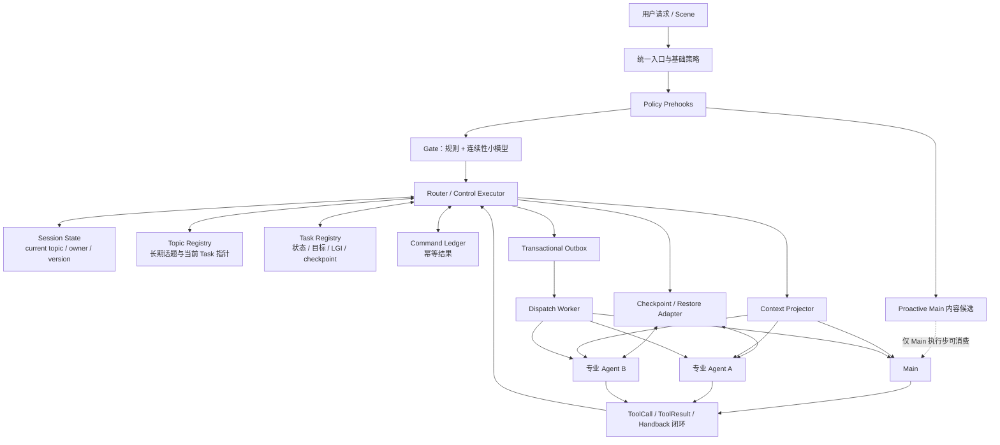

# EduBot 任务编排与 Topic 完整设计

## 导读：这套设计到底解决什么

EduBot的任务编排解决的不是”把一句话分给哪个Agent"这么简单，而是一个持续性的控制问题：

>在同一个用户会话里，当前哪项任务正在进行、由谁负责；新请求到来时，是继续、暂停、恢复、完成，还是切换到另一项任务。

教育场景里的讲解、练习、创作和陪伴往往会跨越多轮。用户可能在讲解中临时提问，处理完又要求“继续刚才的内容”；同一个专业 Agent也可能先后承担多个不同任务。只记住上一次使用了哪个 Agent，无法回答这些问题。
因此，系统需要把“路由”提升为一个轻量控制面：Gate 判断当前请求和已有任务的关系，Router做最终决策，
Task 状态保存持续进度，Topic 隔离不同语义上下文，Agent 只负责自己任务内部的执行。

本文始终区分三层能力：

- **当前一期**：`active_task` 与 `paused_task` 两个容量为一且互斥的槽位；正常状态只有 active-only、paused-only 或两者都空；
- **算法 Demo**：用于验证规则、小模型、Task Registry、完整状态机等目标合同的参考实现，不等于线上已经具备这些能力；
- **最终形态**：在一期和 Demo 基础上推导出的统一任务控制面。

全文按“业务逻辑→核心算法→工程优化→最终形态”展开。

---

# 第一部分：业务逻辑

## 1. 从粘性路由到任务编排

最简单的多Agent路由会记录”上轮由哪个Agent回答”，并在下一轮继续把请求交给它。这种粘性策略适合短对话，却无法稳定支撑持续学习任务。

假设讲解Agent 正在讲恐龙：

1. 用户说“继续讲霸王龙”，应该继续原任务；
2. 用户说“先帮我算一道题”，应该暂时回到Main；
3. 数学题结束后说“继续刚才恐龙”，应该恢复原任务；
4. 讲解Agent主动表示“已经讲完”，应该完成任务，之后不能再把它当作暂停任务恢复；
5. 用户重新发起另一场恐龙讲解，即使还是同一个 Agent，也应该是一个新的 Task。
仅有active_agent只能表达“上一次是谁”，不能表达任务目标、身份、进度、是否可恢复以及恢复到哪
里。任务编排增加的核心能力，是让一次跨轮执行拥有明确的身份和生命周期。

## 2. 七个核心概念的边界

### 2. 1 Session：连续交互的外层容器
Session 表示用户与系统的一段连续会话。它负责承载用户身份、公共配置、跨轮消息流和连接级信息。

一个 Session 可以先后包含多个 Topic 和多个 Task。Session 不等于当前话题，也不等于当前任务。只
用Session作为所有状态的唯一边界，会把不同任务的上下文、播放进度和工具状态混在一起。

### 2. 2Turn：一次用户请求的处理周期

Turn从一条新的用户输入开始，到这次请求向用户产生最终输出为止。

一个 Turn 内可能只有一次 Main 调用，也可能发生：

```text
用户Query
→Main 产生 ToolCall
→Router 调用 SubAgent
→SubAgent Handback
→Router 注入 ToolResult
→Main完成本轮回答
```

因此，Turn 是请求级边界，不是 Agent 调用次数，也不是长期 Task。一个 Task 可以跨越很多 Turn，个Turn 也可能经过多个Agent 执行阶段。

### 2. 3Topic：用户当前讨论的逻辑话题

Topic表示“现在谈的是什么”，用于区分不同语义上下文。例如“恐龙讲解”“数学题”“秋天作文”是三个不同 Topic.

Topic 可以比一次执行活得更久：同一Topic 可能暂停后恢复，也可能由新的 Task 重新执行。最终形态中， Topic 应拥有自己的长期身份、标题、状态和当前 Task 指针。

### 2. 4Task：Agent对一个目标的一次执行实例

Task表示“谁为了什么目标，正在执行哪一次工作”。它至少需要包含：

独立的任务身份；
所属 Topic;
执行 Agent;
任务目标；
当前进度；
生命周期状态；
可恢复信息；
流式播放游标。

同一Topic 可以有多次 Task，同一个 Agent 也可以同时在历史中拥有多个不同 Task。恢复时应定位 Task，而不是只按 Agent 名称匹配。

一期为了降低复杂度，让topic_id与task_instance_id使用同一个值。这只是身份映射的简化，不表示 Topic 和 Task 是同一概念。

### 2. 5Agent owner：当前控制权属于谁

Owner表示系统下一步默认把请求交给谁处理。

有 active Task 时，owner 是该 Task 的 SubAgent；
没有 active Task 时，owner 是 Main；
Gate 只提供建议，不直接改变 owner；
- Router 只有在状态转换成功后，才能把实际控制权交给新的owner。

Owner 是控制面事实，不应由某个 Agent 的自然语言输出自行声明。

### 2. 6LGI：任务续传的流式位置

LGI，即last_global_index，表示客户端已经确认消费到的流式位置。它用于恢复同一Task 时衔接消息帧，避免重复播放或从错误位置继续。

需要区分两层游标：

**TaskLGI**：某个 Task 已确认的续传位置，暂停时随 Task 保存，恢复时继续使用；
**Session 流高水位**：整个 Session 对外分配到的帧位置，用于保证同一会话的输出序列有序。

LGI 是播放游标，不是业务checkpoint。它能说明“客户端看到了哪里”，不能说明“Agent内部执行到了哪步”。

### 2. 7Checkpoint：可恢复的执行状态

Checkpoint是Agent在安全点导出的、可供后续恢复的内部执行状态。它可能包含步骤、工具状态、中间结果或其他Agent私有信息，控制面通常只保存一个不透明引用。

以下三者不能互相替代：

| 信息 | 回答的问题 | 能否独立恢复Agent 内部执行 |
|---|---|---|
| progress_summary | 用户已经看到了什么进展 | 不能 |
| LGI | 客户端播放到了哪里 | 不能 |
| checkpoint | Agent 执行到了哪个安全状态 | 可以，前提是Agent 支持restore |

## 3. 控制面与Agent 的职责边界

任务编排只管理跨 Agent 的控制权，不接管SubAgent 内部工作流。

| 层次 | 负责什么 | 不负责什么 |
|---|---|---|
| Gate | 判断当前 Query 与 active/paused Task 的关系 | 不写任务状态，不直接路由 |
| Router/ControlExecutor | 最终目标选择、状态迁移、owner 切换、失败回退 | 不理解专业 Agent 内部教学步骤 |
| Task Store | 保存 Task、Topic、版本、命令结果和恢复信息 | 不生成用户答案 |
| Main | 通用对话、澄清、兜底、发起Handoff 意图 | 不是Task 状态的权威来源 |
| SubAgent | 完成专业任务、维护内部步骤、产生 checkpoint、发起 Handback | 不自行改写全局 owner |
| Context Plane | 按 Session、Topic、Task 投影正确上下文 | 不替 Router 决定任务生命周期 |

这个边界很重要：控制面负责“哪项任务由谁继续”，SubAgent负责“这项任务内部怎么完成”。

## 4. 当前一期：active 与 paused 两个互斥槽位

### 4. 1状态模型

一期在每个 Session 中最多保存两个任务槽位：

```text
active_task：当前正在由 SubAgent 执行的任务，最多一个
paused_task：被Main 临时抢断、允许恢复的旧任务，最多一个
```

由槽位可以推导出三个主要业务状态：

| active_task | paused_task | 当前 owner | 含义 |
|---|---|---|---|
| 空 | 空 | Main | 当前没有可持续 SubAgent Task |
| 有 | 空 | active Task 的 Agent | 一个任务正在进行 |
| 空 | 有 | Main | Main 正在处理新内容，保留一个可恢复任务 |

一期不允许同时存在 active 和 paused。创建任何全新的active_task 都立即清空旧 paused_task；Resume 则把 paused 原样移动为 active。

### 4. 2一期Task保存的信息

一个 Task 需要让 Gate 能判断是否相关，让 Router 能恢复身份，让下游能继续播放。因此一期主要保存：

| 字段 | 作用 |
|---|---|
| agent_name | 任务的执行 Agent |
| topic_id | 任务所属话题 |
| task_instance_id | 一次任务执行的唯一身份 |
| topic_title | 面向语义判断的话题名称 |
| task_goal | 用户希望完成的目标 |
| previous_user | 最近一次真实用户表达 |
| progress_summary | 已完成内容的可见摘要 |
| last_global_index | 此任务的续传游标 |

### 4. 3一期必须保持的不变量

不变量不是实现细节，而是任何状态迁移都不能破坏的业务规则：

1. 同一 Session 最多一个 active Task;
2. 一期最多一个 paused Task;
3. active Task 存在时，owner 必须与它的 Agent 一致；
4. active Task 不存在时，不能残留 SubAgent owner；
5. 当前 Topic 必须与实际 owner 和 active Task 一致;
6. 新建 Task 必须清除旧 paused 槽位；
7. Resume 必须恢复原 Task、原 Topic 和原 Task LGI，不能重建成新任务；
8. Handback 表示 Complete，完成后不能留下可恢复的 paused Task；
9. 发给 SubAgent 的 LGI 必须等于状态中 active Task 的 LGI;
10. 基于旧快照产生的 Gate 建议，不能覆盖已经更新的状态。

### 4. 4一期在整条请求链中的位置

任务编排位于入口处理之后、Agent 执行之前，并在 Agent 返回后继续闭合状态：

```text
客户端
→Chat/Live入口
→内容审核与确定性解析
→策略配置、Handoff Gate 与 Proactive 内容候选并行准备
→Router 只汇总 Scene、Handoff 和最新任务状态，选择 Main、Scene Direct、active Task 或 Handoff Tool target
→若实际启动 Main，再由 Prompt 组装环节按开关条件消费Proactive 候选
→Main/ SubAgent 执行
→Router 处理普通结果、Handback、错误与中断
→SSE输出与记忆持久化
```

并行准备不表示可以绕过控制顺序。Gate advice 可以提前计算，但 Router 必须在 dispatch 前完成 Topic、Task、owner 与 LGI 的最终决议；Agent 返回后；Router 还要根据结果更新进度或完成任务。

## 5. 五条完整业务流程

五个动作构成一期任务生命周期的主干：CREATE、CONTINUE、PREEMPT、RESUME、COMPLETE。

### 5. 1CREATE:创建新任务

#### 业务触发

- Main 判断用户需要某个专业 Agent，产生 Handoff ToolCall；
首轮请求命中特定 Scene，Router 走确定性 Scene Direct；
用户虽然提到旧话题，但没有合法的恢复目标，只能视为新任务。

#### 完整流程

1. Router 确认当前不存在另一个 active Task；
2. 明确这是新Topic，还是合法的首轮 Scene Topic；
3. 生成新的 Topic 和 Task 身份；
4. 建立任务目标、Agent、初始摘要和LGI；
5. 原子写入新的active_task;
6. 同时清空-期唯一的paused_task；
7. owner 切换到目标 SubAgent；
8. Router 从刚写入的 active Task 组装下游请求；
9. SubAgent 执行，本轮普通结束后仍保持 active。

#### 状态变化

```text
CREATE 前：owner=Main，active=空，paused=可空可有
CREATE 后：owner=目标 SubAgent，active=新 Task，paused=空
```

普通新任务的LGI 从清晰的初始值开始，不能因为旧值是“非空”就意外继承。Scene bootstrap 若需要兼容合法的首轮客户端位置，也必须在创建阶段一次性固化，之后只从 Task读取。

### 5. 2CONTINUE：继续当前任务

#### 业务触发

用户当前表达仍属于active Task，例如“继续”“再举一个例子”“说慢一点”。

#### 完整流程

1. Gate 读取 active Task、当前 Query 和最近上下文；
2. 高精度规则先判断明确继续或表达形式调整；
3. 规则未命中时，小模型判断当前 Query 是否仍应由 active Agent 承接；
4. Gate 给出CONTINUE_ACTIVE建议和读取时的状态版本；
5. Router 验证 active Task 仍是同一个任务；
6. 合法的客户端 LGI 被吸收到 active Task；
7. Topic、Task 和owner 保持不变；
8. Router 使用 active Task 中已经固化的 LGI 调用 SubAgent；
9. SubAgent 普通完成后更新 previous_user 与 progress_summary，Task 继续保持 active。

#### 状态变化

```text
CONTINUE 前: owner=A, active=T1, paused=空
CONTINUE 后:owner=A,active=T1,paused=空
```

一次 SubAgent 返回 Final 只代表本轮调用结束，不代表 Task 完成。

### 5. 3PREEMPT:Main 抢断当前任务

#### 业务触发

用户突然提出与active Task不同的新问题，或明确希望暂时离开当前任务。

#### 完整流程

1. Gate 基于 active Task 快照判断当前 Query 应交给 Main；
2. Gate 给出PREEMPT_TO_MAIN建议、目标和状态版本；
3. Router再次验证读取后的状态没有被其他请求改变；
4. 将合法客户端 LGI 写回 active Task；
5. 把 active Task 的身份、Topic、目标、摘要和 LGI 整体保存为 paused；
6. 清空 active Task 和 SubAgent owner;
7. 建立或切换到新的 Main Topic;
8. 当前 Query 交给 Main；
9. Main 处理完新问题后，paused Task 仍然存在，等待未来明确恢复。

#### 状态变化

```text
PREEMPT 前:owner=A,active=T1,paused=空，topic=T1
PREEMPT 后:owner=Main，active=空，paused=T1，topic=新的 Main Topic
```

Preempt是“暂停并保留”，不是“完成并清理”。

### 5. 4RESUME：恢复暂停任务

#### 业务触发

用户给出明确恢复意图，并能唯一定位到 paused Task，例如“继续刚才的恐龙讲解”。Main 也可以通过 Handoff ToolCall明确表达恢复，而不是新建。

#### 完整流程

1. 规则检查 Query 是否同时包含 Resume cue 和足以定位任务的线索；
2. Gate 可以携带明确的目标 Task；一期 Main ToolCall 只表达 start_new_topic=false，再由 Router 在“同 Agent 且唯一 paused 槽”中推断恢复对象。只有多 Task Registry 的目标形态才允许 Main 从受约束候选中给出精确 Task ID；
3. Router 确认当前没有 active Task；
4. 校验 paused Task 身份、Agent 和状态版本仍匹配；
5. 将 paused Task 原样移动为 active；
6. 清空 paused 槽位；
7. 当前 Topic 恢复为原 Task 的 Topic;
8. owner 切回原 SubAgent;
9. 使用 paused Task 保存的 LGI，而不是当前 Main 请求携带的临时位置；
10，SubAgent根据目标、摘要和游标继续。一期恢复的是任务身份、语义进度和播放位置，不是内部工作流栈帧。

#### 状态变化

```text
RESUME 前:owner=Main, active=空, paused=T1,topic=Main Topic
RESUME 后: owner=A, active=T1, paused=空, topic=T1 原 Topic
```

### 5. 5COMPLETE：完成任务并交回Main

#### 业务触发

SubAgent 已经完成业务目标，通过 Handback 明确交还控制权。产品若定义某些显式退出为终止，也应走同 Complete 语义。

#### 完整流程

1. SubAgent 产生 Handback，携带任务结果、进度摘要、原因和原 ToolCall 关联信息；
2. Router 校验 Handback 属于当前 active Task，防止迟到结果完成另一个同 Agent 新任务；
3. Task 进入完成语义；
4. 清空 active Task 和 owner;
5. 一期同时清空 paused 槽位，确保 Handback 后没有旧任务被误恢复；
6. 创建新的 Main Topic;
7. Router 把 Handback 封装成与原 ToolCall 配对的 ToolResult;
8. 同一个 Turn 内继续交给 Main；
9. Main 结合当前 Query、ToolCall、ToolResult 和上下文，生成面向用户的最终回答。

#### 状态变化

```text
COMPLETE 前:owner=A,active=T1,paused=空
COMPLETE 后：owner=Main,active=空，paused=空，topic=新的 Main Topic
```

Handback 与 Preempt 的本质区别是：前者完成后不可恢复，后者暂停后可以恢复。

## 6. Scene、ToolCall、Handback 与 Topic 切换

### 6. 1 Scene Direct：确定性的首轮启动

Scene 是入口携带的业务场景信号。首轮请求命中明确 Scene，且当前没有 active 或 paused Task 时， Router 可以直接创建相应 SubAgent Task，省去 Main 先判断再发 ToolCall 的一次调用。

Scene Direct 的边界是：

它是路由来源，不是新的 Task 状态；
它只负责bootstrap，已有任务时不能重新覆盖任务；

仅有一个空的Session或MainTopic，不应被误判为“已经有任务”。

### 6. 2Main ToolCall:表达 Handoff 意图

MainToolCall 表示“我建议把当前请求交给某个专业 Agent”。它应明确：

目标 Agent；
任务目标；
是创建新 Topic，还是恢复已有 Task；
恢复时的合法候选目标。

ToolCall 是意图合同，不是状态事实。Router 必须验证当前状态，并在状态转换成功后才执行 Handoff。

一期在只有一个 paused Task 时，可以用start_new_topic丶区分:

true：创建新 Task，旧 paused 被清除；
false：只有唯一paused 且 Agent 匹配时恢复，否则仍然新建。

多paused 的最终形态中，Tool 参数必须从 Router 提供的候选集合中选择精确 Task，不能让模型自由编造任务ID。

### 6. 3 Handback:SubAgent 的完成协议

Handback表示“专业任务已经完成，现在把控制权和结果交回Main”。它不是普通文本，也不是简单地把下一轮 sticky owner 改成 Main。

一个完整Handback 要完成三件事：

1. 结束正确的 Task;
2. 切换owner 和Topic;
3. 用 ToolResult 闭合原 ToolCall，让 Main 理解专业 Agent 做了什么，并继续当前 Turn。

如果业务只是想临时让 Main 回答，应该用 Preempt；如果 SubAgent 真的做完了，才用 Handback。

### 6. 4Topic切换速查

| 事件 | 旧Topic | 新的当前Topic | Task结果 |
|---|---|---|---|
| Main 普通续聊 | Main Topic | 沿用 | 无Task变化 |
| Scene Direct | 无任务 Topic | 新 SubAgent Topic | CREATE |
| Main 新建 Handoff | Main Topic | 新 SubAgent Topic | CREATE |
| active 继续 | SubAgent Topic | 沿用 | CONTINUE |
| active 被抢断 | SubAgent Topic | 新 Main Topic | PREEMPT，旧 Topic 随 Task 暂停 |
| 恢复 paused | Main Topic | 原 SubAgent Topic | RESUME |
| SubAgent Handback | SubAgent Topic | 新 Main Topic | COMPLETE |

## 7. 一期典型案例

### 案例一：新建并持续讲解

```text
用户：「给我讲讲恐龙]
Main:产生新任务ToolCall
Router: CREATE T1, Topic=Dinosaur, owner=讲解 Agent, LGI=0
SubAgent：完成本轮回答，T1 仍 active

用户：「再讲讲霸王龙」
Gate:CONTINUE_ACTIVE
Router:保持 T1 与原 Topic
SubAgent：继续讲解并更新进度摘要
```

### 案例二：临时问数学题，再恢复

```text
初始：T1 正在讲恐龙

用户：「先帮我算一道数学题」
Gate:PREEMPT_TO_MAIN
Router:T1 active → paused，切换到 Main Topic
Main：回答数学题

用户：「继续刚才的恐龙]
Gate:RESUME_PAUSED,target=T1
Router:T1 paused → active,恢复原 Topic 和 LGI
SubAgent：继续恐龙讲解
```

### 案例三：正常完成后不可恢复

```text
T1 讲解完成
SubAgent:Handback(summary,reason)
Router:COMPLETE T1，清空 active/paused，切换到新.Main Topic
Main：结合 ToolResult 给用户收尾

用户之后说：「继续刚才」
结果：T1 已完成，不能按 paused Task 恢复；需要澄清或创建新 Task
```

### 案例四：新任务覆盖一期唯一 paused

```text
T1 已 paused，当前由 Main 处理
用户明确发起全新创作任务
Main:ToolCall(start_new_topic=true)
Router:CREATE T2，并清除 paused T1
结果：T2 active，T1 不再可恢复
```

这是一期容量边界。若业务要长期保留多个暂停任务，必须引入 Task Registry，而不是简单增加更多槽位。

---

# 第二部分：核心算法

## 8. Gate 建议与 Router 决策必须分离

Gate 回答的是一个语义问题：**当前Query 与已有任务是什么关系？**

Router回答的是一个控制问题：**基于当前最新状态，实际要把请求交给谁，并怎样改变任务状态？**

一期常见Gate 建议包括：

| 建议 | 含义 | Router可能执行的动作 |
|---|---|---|
| CONTINUE_ACTIVE | 继续当前 active Task | 保持 owner 和 Task |
| PREEMPT_TO_MAIN | 当前 Query 交给 Main，旧任务可暂停 | active → paused，切 Main |
| RESUME_PAUSED | 恢复明确的 paused Task | paused → active |
| CLARIFY | 意图不够确定，需要 Main 澄清 | 取决于统一后的 Clarify 合同 |

两层不能合并的原因有三个：

1. Gate读到的是快照，执行前状态可能已经变化；
2. 同一建议可能受实验策略、Scene、能力约束或安全策略影响；
3. 只有 Router 能对 Task、Topic、owner 和 dispatch 做一个一致的控制动作。

因此应分别记录“Gate建议是什么”和“Router最终应用了什么”。建议不等于状态已改变。

## 9. 算法Demo的输入设计

算法Demo面向多任务目标态组织GateInput，典型信息包括：

当前 active Task;

当前 Query；
最近若干条经过清洗的用户与当前Agent 消息；
可用Agent 类型和能力；
安全信号；
语音识别置信度与有限条n-best 候选。

输入清洗要去掉控制协议产生的 synthetic ToolCall、ToolResult 转发副本和重复消息，避免算法把系统噪声当成用户意图。

随机生成的 Topic ID、Task ID 不应直接进入连续性小模型。模型应依据任务目标、进度、对话和Query 判断，而不是学习无语义的标识符。

## 10. 规则优先：确定性处理高风险动作

Demo采用“规则优先，小模型兜底”的结构。规则负责高精度、可解释、不能只靠二分类表达的场景：

1.**安全信号**：风险请求强制交给Main 或安全能力；
2.**明确继续**：与 active Task 有清晰连续关系；
3.**表现形式调整**：如“说慢点”“换个例子”，仍属于当前任务；
4.**产品控制与情绪支持**：优先由Main 处理；
5.**显式暂停、退出或取消**：按产品定义映射到 Pause 或Complete；
6.**Agent 能力切换**：目标能力属于另一个 Agent 时产生切换建议；
7.**paused Task 恢复**：从候选中匹配唯一任务；
8.**候选歧义**：无法唯一定位时返回CLARIFY。

### 10. 1Resume不是看到“继续"就恢复

一个可靠的恢复规则需要两个条件：

存在明确的Resumecue，如“继续之前的任务”“回到刚才的内容”;
Query 中有足以定位某个Task的线索，如任务目标、进度关键词、Agent 别名或显式引用。

Demo 对候选进行加权匹配：显式 Task 或通道引用权重最高，任务目标与进度关键词其次，Agent别名只提供弱证据。最高分并列时必须澄清，不能随便选一个。

所以：


“回到刚才的恐龙内容”可以唯一匹配时可Resume；
多个paused Task 下只有一句“继续”，应CLARIFY；
仅重复Topic名但没有恢复语义，不应自动把历史 Task当成当前任务。

## 11. 小模型只判断 active continuity

规则未覆盖时，小模型只做一个受限问题：当前 Query 是继续 active Task，还是应让出给 Main。

模型首token输出0/1：

```text
0:继续 active Task
1:让出给Main
```

系统根据两个 token 的对数概率计算 margin:

```text
margin =log P(1)-logP（0)
```

再使用双值：

```text
margin 较低 →CONTINUE_ACTIVE
margin 较高 →PREEMPT_TO_MAIN
中间不确定区→CLARIFY
```

这种设计的价值是：

小模型不生成用户答案，职责清晰；
高置信样本可以低延迟决策；
不确定样本交给Main澄清，而不是强行二选一；
规则可以覆盖模型难以表达的 Resume、Switch、Safety 等动作。

值属于发布策略，需要通过真实分布校准；Demo中的配置只能说明算法合同，不能直接视为线上已验证值。

## 12. CLARIFY 的两种语义

CLARIFY是当前一期与 Demo 之间最重要的语义差异之一。

### 12. 1一期当前语义

有active Task 时，CLARIFY与“本轮回 Main”路径部分合并，通常会把 active Task 暂停，再由 Main 追问。用户澄清后需要显式 Resume，才能回到原 Task。

优点是持久化owner与本轮实际处理者始终一致；代价是一次不确定判断也会产生真实暂停和后续恢复。

### 12. 2Demo合同

Demo 中，CLARIFY 只让当前 Turn 由 Main 提问，durable owner 和 active Task 不变。用户补充明确后，再决定 Continue 或 Preempt。

优点是澄清本身不会打断任务生命周期；代价是系统必须清晰区分“本轮临时处理者”和“持久owner”，并确保 Main 的澄清不会推进 SubAgent Task 状态。

### 12. 3最终需要统一的产品语义

不能只把两者当作内部实现差异，因为用户体验不同：

一期语义：澄清意味着任务已经暂停；
- Demo 语义：澄清只是一次瞬时控制动作，任务仍 active。

最终设计更适合采用 Demo 语义，但必须同时建立 transient handler、durable owner、下一轮决策和超时策略的完整合同。迁移前还要统一“退出、暂停、取消、完成”的产品含义。

## 13. Demo 的 Task Registry 与完整状态机

一期通过两个槽位隐式表达状态；Demo 则为每个Task保存长期记录，并使用显式状态：

```text
ACTIVE
SUSPENDING
PAUSED
RESUMING
COMPLETED
CANCELLED
```

### 13. 1状态含义

| 状态 | 含义 | owner约束 |
|---|---|---|
| ACTIVE | SubAgent 正常执行，可继续 | owner 为该 Agent |
| SUSPENDING | 已预留暂停，等待checkpoint | 暂不允许其他转换抢占 |
| PAUSED | 已有合法 checkpoint，可恢复 | owner 为 Main 或其他 active Task |
| RESUMING | 正在 restore，尚未成功移交 | durable owner 仍保持Main |
| COMPLETED | 业务正常完成 | 不可 Resume |
| CANCELLED | 用户或系统明确取消 | 不可 Resume，保留终态原因 |

全局不变量是：同一Session 同时最多只有一个正在占有执行权的 Task，即最多一个ACTIVE、 SUSPENDING或RESUMING。

### 13. 2为什么要保留终态记录

一期通过清空槽位表达完成，简单但会丢失 Task 历史。Registry 保留 COMPLETED/CANCELLED后，可以回答：

这个 Topic是否曾经完成过；
“继续刚才”指向的是可恢复Task，还是已经结束的历史；
同一个 Agent 的迟到结果属于哪次任务；
为什么任务结束，以及能否重开。

### 13. 3多paused不等于把槽位改成数组

支持多个暂停任务还需要同时具备：

- Task Registry 和稳定 Task ID;
候选召回、排序和歧义处理；
Main可选择的动态候选合同；
Topic与Task分离；
每个Task 独立的 checkpoint、LGI 和上下文；
一过期、完成、取消与清理策略。

否则系统只是保存了更多状态，却无法可靠地知道用户要恢复哪一个。

## 14. Demo的安全暂停与恢复算法

### 14. 1 安全Preempt/Switch

目标态不能直接把ACTIVE改成PAUSED，因为 Agent 可能还没有到可恢复的安全点。推荐顺序是：

```text
1. CAS:ACTIVE → SUSPENDING,并写入 command_id
2. 请求当前 Agent checkpoint（task_id，command_id)
3. 校验 checkpoint 属于正确的 Task 和命令
4. CAS:SUSPENDING → PAUSED，保存 checkpoint_ref
5. 切换owner
6. 写入持久化dispatch 事件
7. 调度 Main 或目标 Agent
```

checkpoint 失败时，应把SUSPENDING回滚为ACTIVE，不能留下一个看似 paused、实际无法恢复的任务。

### 14. 2安全Resume

```text
1. 校验目标 Task 为 PAUSED，且 checkpoint_ref 有效
2. CAS:PAUSED → RESUMING,durable owner 仍保持 Main
3. 调用目标 Agent restore（task_id，checkpoint_ref，command_id)
4. 成功后 CAS:RESUMING →ACTIVE，并切换 oWner
5. 失败则回滚 PAUSED，Main 继续持有控制权
```

把owner 切给SubAgent 后再 restore，会产生“状态说它负责，但它还没有恢复成功”的窗口，所以顺序不能颠倒。

### 14. 3 SWITCH_AGENT

Demo 还定义了从一个专业能力切换到另一个专业能力的控制意图。其本质不是直接 SubAgent 到 SubAgent 调用，而是 Router 统一执行：

```text
旧Task安全暂停或完成
控制面确认新 Agent 能力与新 Task
→创建或恢复目标Task
owner 原子切换
→dispatch
```

一期还没有把 SubAgent →SubAgent 作为完整通用能力。Demo 的规则和状态机说明了目标合同，不代表当前一期已经支持。

## 15. 上层服务必须承担的职责

算法模块只能输出advice。完整服务还必须承担以下职责：

### 15. 1输入与候选准备

读取当前 Session、active Task 和 paused 候选；
构造有界、去噪、隐私合规的最近上下文；
提供可用 Agent能力、安全信号和语音识别信息；
保证候选 Task 身份来自 Registry，而不是模型生成。

### 15. 2策略编排

先执行安全与确定性规则；
规则未覆盖时调用小模型；
应用值、超时、实验开关和降级策略；
区分 Gate 原始建议、策略修正和最终 Router 决策。

### 15. 3状态与所有权执行

校验Task、Topic、owner 和版本；
执行CAS与显式状态机；
维护 command 幂等结果；
在checkpoint/restore 失败时回滚；
只在状态成功后改变实际dispatch 目标。

### 15. 4Agent适配

为不同 SubAgent 提供统一的 dispatch、checkpoint、restore 和 handback 合同；
保持checkpoint 对控制面不透明；
校验迟到 Final、Error、Handback 属于哪个 Task 和命令；
对不支持checkpoint的 Agent 明确采用“不可恢复”策略。

### 15. 5上下文投影

给 Main 投影当前 Topic 和必要的跨任务摘要；
给SubAgent投影自己的 Task 上下文；
维护ToolCall 与 ToolResult 的成对历史；
- 在 dispatch 前统一解析 Topic、Task 和 LGI，避免下游再次猜测。

### 15. 6持久化与可靠调度

原子保存 next state、command result、control event 和 outbox record；
让异步 worker 可重试 dispatch；
要求下游按 command ID 幂等；
对outbox积压、失败和重复消费建立告警。

### 15. 7观测与兜底

分别记录 advice、apply result、CAS conflict、checkpoint、restore、dispatch 和最终 owner;
模型超时或输入不完整时选择安全降级；
无合法 active/paused Task 时记录 skip 原因，不能凭旧 Agent 名猜任务；
保证观测故障不阻塞主请求。

---

# 第三部分：工程优化

## 16. CAS、幂等与事务分别解决什么

三者经常被混在一起，但保护的故障不同。

### 16. 1CAS：防止旧快照覆盖新状态

Gate 读取 active T1 后，另一请求可能已经完成 T1。旧请求再尝试 Preempt 时，必须因为版本不一致而失败，不能把已完成任务复活为paused。

CAS的判断形式是：

```text
只有 current_version == expected_version，才允许提交 next_state
```

它解决的是并发写入顺序，不解决相同命令被重复执行。

### 16. 2Command幂等：防止副作用重放

网络重试可能让同一command_id再次到达。系统应返回第一次结果，而不是再次 checkpoint、再次切 owner 或再次 dispatch。

幂等台账至少要保存：

```text
command_id
target_task_id
command_type
precondition_version
result
resulting_version
```

CAS 防旧状态覆盖；command 幂等防同一副作用重复。两者都需要。

### 16. 3事务：保证控制状态与待执行事件一致

只原子写 Task 状态还不够。若状态已经变成 active，但进程在 dispatch 前退出，下一轮会认为 Agent 正在执行，实际却从未收到任务。

最终形态应在同一事务中写入：

```text
next state
command result
control event
dispatch outbox record
```

事务外由 worker 至少一次投递；下游依靠 command ID 去重。

## 17. 游标的单一事实来源

LGI 最容易出现的问题，是多个层次各自猜一个值：客户端 payload、Session 高水位、旧 Agent 进度、 active Task、paused Task 都可能给出不同答案。

可靠做法是：

1. Router 在 dispatch 前解析合法客户端 ACK；
2. 根据动作确定 LGI：新建用初始值、继续吸收合法ACK、恢复用 paused 保存值；
3. 把最终值写入 active Task;
4. 下游 envelope 只读取 active Task;
5. 强制 outgoing_lgi == active_task.last_global_index`;
6. 同 Session 重叠请求再用 request epoch 或 stream lease 防止迟到 ACK 倒退游标。

动作与 LGI 的关系如下:

| 动作 | LGI 来源 |
|---|---|
| CREATE | 明确的初始值；不能继承旧 Task |
| CONTINUE | active Task 当前值，加上合法客户端确认 |
| PREEMPT | 先吸收合法确认，再随 Task 保存到 paused |
| RESUME | paused Task 保存值，不被当前 Main Turn 临时值覆盖 |
| COMPLETE | 用于闭合本轮输出，Task 之后不可恢复 |

## 18. 上下文隔离：Topic标签不是隔离本身

仅在消息上增加topic_id，不代表读取、摘要、工具状态和 Agent 内部 session 已经真正隔离。

最终应形成四层上下文：

### 18. 1 Session 共享上下文

保存用户身份、稳定偏好、设备与公共策略。它可以被多个Topic使用，但不应塞入所有任务的完整历史。

### 18. 2Topic上下文

保存长期主题摘要、相关事实和 Topic 历史。Main 需要跨Task 理解同一话题时，可以显式读取这一层。

### 18. 3Task上下文

保存该次执行的消息、工具状态、目标、进度、checkpoint 和 LGI。相同 Agent 的不同 Task 必须按 Task ID 键控。

### 18. 4Turn临时上下文

保存本轮 Query、Gate advice、Router effect、ToolCall/ToolResult 和流式中间状态。Turn 结束后，只把需要持久化的结果投影回Topic/Task。

推荐读取原则是：

Main 默认读取当前 Topic，加上受控的 Session 长期信息；
SubAgent 默认读取自己的 Task，上层显式补充必要的 Topic/Session 信息；
跨Topic内容通过摘要或长期记忆进入，不直接拼接所有历史；
Handback的 ToolCall/ToolResult 必须保持顺序和配对关系。

## 19. 并发与迟到结果

### 19. 1 同Agent不等于同 Task

最危险的并发错误是：I旧 T1 和新 T2 都由 Agent A 执行，旧请求迟到后只按agent_name=A更新状态，于是污染甚至完成了T2。

所有终态更新都应携带：

```text
session_id + task_instance_id + command_id + expected_version
```

仅按Agent名或“当前槽位非空”不足以证明因果关系。

### 19. 2四类跨系统窗口

| 窗口 | 可能结果 | 优化方向 |
|---|---|---|
| 状态 active，dispatch 未发生 | 任务看似运行，实际未启动 | transactional outbox |
| Agent 已完成，Complete 写入失败 | 下一轮仍认为任务 active | 幂等 Complete +重放 |
| SSE 已发送，记忆未写入 | 客户端历史与恢复历史分叉 | 事件序列与异步补偿 |
| 新任务已创建，旧 Final 迟到 | 旧结果污染新任务 | Task/command/version 联合校验 |

### 19. 3终态只能结算一次

流式调用可能先后出现 Final、Error、Interrupt 或网络重试。每个 command 需要settled 标记，保证状态、记忆和用户输出只由一个合法终态结算。

## 20. Outbox与可重放控制事件

Outbox不是普通日志。它是已经提交、但还需要可靠投递的业务记录。

一个控制事件至少要说明：

Session、Topic、Task 和 command 身份；
前置与结果版本；
Gate advice 与 Router effect;
owner 变化;
checkpoint 或 restore 结果；
dispatch 目标；
重试次数与最终投递状态。

Worker 可以重复投递，但 Agent 必须以 command_id幂等。若 outbox 长时间积压，系统需要告警、补偿和人工诊断入口。

算法Demo 给出了控制事件、命令幂等和 outbox 方向的合同参考；真正的生产持久化、worker 和跨 Agent适配仍属于上层服务建设内容，不能把Demo直接等同于已上线控制面。

## 21. 可观测性：看见建议、执行和最终效果

一次路由至少有三个不同事实：

```text
Gate advice
→Router apply result
→实际 owner/ dispatch / final answer
```

建议的指标分层：

| 层次 | 关键问题 |
|---|---|
| 输入 | 是否有合法active/paused 快照，候选是否完整 |
| 决策 | 规则、小模型或降级产生了什么advice |
| 应用 | Router 是否采用，是否 CAS conflict，为什么忽略 |
| 状态 | Task、Topic、owner、version最终是什么 |
| 执行 | checkpoint、restore、dispatch 是否成功 |
| 业务 | 最终回答是否承接了当前Query，旧任务能否按预期恢复 |

HTTP 成功、模型返回或 Store 写入成功，都不能单独证明业务路由正确。验收必须沿着Query、Task 状态、Router effect 和最终输出一起看。

---

# 第四部分：最终形态

## 22. 当前一期、算法Demo与最终控制面对照

| 能力 | 当前一期 | 算法Demo | 最终形态 |
|---|---|---|---|
| active Task | 最多1个 | 唯一active | 保持单一执行owner |
| paused Task | 最多 1 个 | Registry 中可有多个候选 | 热候选 + 长期 Registry |
| Topic/ Task | 身份值暂时相等 | 概念分离 | 完全分离，Topic 可有多次 Task |
|---|---|---|---|
| Preempt | active 直接保存为 paused | SUSPENDING +checkpoint | 安全点、回滚、outbox |
| Resume | 恢复身份、摘要和 LGI | RESUMING + restore | 真实 Agent checkpoint adapter |
| Complete | 清空槽位，不保留终态记录 | COMPLETED | Registry 保留终态与原因 |
| Cancel | 语义尚需统一 | CANCELLED | 与产品退出/过期策略统一 |
| CLARIFY | 通常伴随暂停 | durable state 不变 | 推荐瞬时处理与持久owner 分离 |
| Switch Agent | 无通用 Sub-Sub 能力 | 规则与状态机合同 | Router 统一执行 |
| 并发保护 | 关键转换使用CAS | version +command replay | 所有副作用带因果身份 |
| checkpoint | 无真实执行checkpoint | callback合同 | 各Agent adapter 实现 |
| Outbox | 尚无完整闭环 | 事件与目标合同参考 | 事务写入、worker、重试、告警 |
| 上下文隔离 | Topic 标签和任务摘要 | 输入合同 | Task-scoped context 与 memory |

## 23. 最终控制面架构



### 23. 1Session State 只保存当前指针

```text
session_id
current_topic_id
current_owner
active_task_instance_id
state_version
```

它不再承载所有任务详情，避免一个巨大 Session JSON 成为并发热点。

### 23. 2 TopicRegistry 保存长期话题

```text
topic_id
title
topic_status
current_task_instance_id
last_active_at
version
```

Topic 可以在 Task 完成后继续存在，也可以关联多次任务执行。

### 23. 3 Task Registry 保存执行事实

```text
task_instance_id
topic_id
agent_type
status
task_goal
progress_summary
task_context_ref
checkpoint_ref
last_global_index
version
```

Registry 是历史和恢复的权威来源；Gate 只接收其中有限的热候选投影。

### 23. 4ControlExecutor统一执行状态与副作用

Control Executor 负责：

CAS与命令幂等；
SUSPENDING/RESUMING预留；
checkpoint/restore;
owner 切换;
dispatch/outbox;
回滚与补偿；
最终 Router effect。

Main 是通用对话、澄清与兜底能力，不是 owner、Topic 或Task 的权威存储。

### 23. 5 Agent Adapter隔离异构实现

各Agent通过统一合同接入：

```text
checkpoint(task_id,command_id)
restore(task_id,checkpoint_ref,command_id)
dispatch（task_id,topic_id,command_id,query)
handback（task_id,command_id,result)
```

控制面不理解Agent内部的章节、工具或工作流，只校验身份、版本和结果。

## 24. 分阶段迁移路线

### 阶段1：先统一业务语义

明确CLARIFY、暂停、退出、取消、Handback 和Complete 的用户可见含义，形成唯一状态迁移表。没有语义共识，技术升级只会把不一致固化得更复杂。

### 阶段2：加固一期因果校验

所有 Continue、进度更新、Handback、失败清理都携带 Task ID、command ID 和 expected version，优先解决同 Agent 新旧任务互相污染。

### 阶段 3:统一Topic、Task与LGI 决议点

Router 在 dispatch 前一次性确定最终 Topic、Task 和 LGI；下游不再从 payload、旧投影或 Agent 名称重新推断。

### 阶段4：引入命令台账与outbox

先把 next state、command result 和 dispatch record 原子提交，补齐重试、积压告警和下游幂等，降低状态已变但Agent未收到任务的风险。

### 阶段5：显式状态机，仍保持单paused

先在一期容量内引入SUSPENDING/RESUMING/COMPLETED/CANCELLED，验证状态合同和回滚，再扩大任务数量。

### 阶段6：接入真实checkpoint/restore

逐个 Agent 增加 adapter。不能 checkpoint 的 Agent 明确标记为不可暂停恢复，只允许 Complete 后重建新 Task。

### 阶段7:解耦Topic与Task

允许同一Topic 重开任务、换 Agent 或保留完成历史；将topic_id == task_instance_id从业务不变量降为迁移兼容关系。

### 阶段 8:引入多 Task Registry

建设长期 Registry、热候选召回、Resume 消歧和动态 Tool 参数。先支持 Main 与多个 paused 的恢复，再开放通用 Switch Agent。

### 阶段 9:完成 Task-scoped Context

消息、工具状态、摘要、LGI 和 Agent 内部执行 session 逐步按 Task 隔离；Session 只提供受控共享背景。

### 阶段10：Shadow、灰度与回滚

先只记录 Gate advice，不改变 owner；再小流量执行 Router effect。发布门禁分别关注决策、CAS、 checkpoint、dispatch、最终owner 和用户回答，任何阶段都能回退到安全 Main 路径。

## 25. 主要风险与应对

| 风险 | 用户可见后果 | 应对 |
|---|---|---|
| CLARIFY 语义不统一 | 一次澄清意外暂停任务 | 先冻结产品合同，再迁移状态机 |
| “退出”有时Pause、有时Complete | 用户以为结束，系统却又恢复 | 区分暂停、取消、完成指令 |
| 新 Task 清除唯一 paused | 旧学习任务不可恢复 | 明示一期边界，升级 Registry |
| 同 Agent 旧结果迟到 | 新任务被错误更新或完成 | Task+ command +version 联合校验 |
| checkpoint 失败仍切 owner | paused Task 实际不可恢复 | SUSPENDING 预留与失败回滚 |
| restore 未完成就交 owner | 请求进入未准备好的 Agent | RESUMING 时 owner 保持 Main |
| 状态与 dispatch 分裂 | 看似 active，实际未启动 | transactional，outbox |
| LGI 多来源竞争 | 重复播放、跳帧或倒退 | active Task 为唯一事实来源 |
| Topic 标签但读取未隔离 | 任务间上下文串扰 | Task-scoped context projection |
| 多paused 恢复歧义 | 恢复了错误任务 | Resumecue+候选评分+Clarify |
| 动态 Task ID 由模型生成 | 指向不存在或越权任务 | Router 提供有限候选enum |
| outbox 积压 | 状态更新后执行长期延迟 | worker 监控、重试、补偿与告警 |
| 外部 Agent 绕过控制面 | owner 与真实执行不一致 | 统一Adapter 和 Handback 合同 |
| 模型阈值漂移 | Continue/Preempt误判上升 | Shadow 校准、分桶监控、快速降级 |
| Task TTL 或数据清理错误 | 可恢复任务突然消失 | Registry 生命周期和归档策略 |

## 26. 验收设计

验收要同时看业务结果、状态变化和最终输出，不能只看请求成功。

### 26. 1一期业务验收

| 场景 | 关键前置 | 预期状态 | 预期业务结果 |
|---|---|---|---|
| CREATE | 无 active | 新 Task active，paused 清空 | 目标 Agent 收到新任务，LGI 正确初始化 |
| CONTINUE | T1 active | T1 仍 active | 原 Agent 承接当前 Query |
| PREEMPT | T1 active | T1 paused，owner=Main | Main 回答新问题，T1 可恢复 |
| RESUME | 仅 T1 paused，Query 可唯一匹配 | T1 active，恢复原 Topic / LGI | 原 Agent 延续旧任务 |
| COMPLETE | T1 active 并 Handback | active / paused 都空 | Main 收尾，T1 不可恢复 |
| Scene Direct | 无 active / paused 且 scene 有效 | Scene Task active | 不依赖 Main 意图生成即可启动 |
| 新建覆盖 paused | T1 paused，明确创建 T2 | T2 active，T1 被清除 | 行为符合一期容量约束 |
| 并发 CAS conflict | Gate 使用旧版本 | 旧转换被拒绝 | 新状态不被旧请求覆盖 |
| 迟到 Handback | T1 已被 T2 替代 | T2 不变 | 旧结果不能完成新 Task |

### 26. 2最终状态机验收

| 场景 | 必须证明什么 |
|---|---|
| checkpoint 失败 | SUSPENDING 回滚ACTIVE，owner 不丢失 |
| restore 失败 | RESUMING回滚PAUSED，Main 保持 owner |
| command 重放 | 返回第一次结果，不重复 checkpoint 和 dispatch |
| outbox 重投 | 下游只执行一次，最终事件可追溯 |
| 多paused 歧义 | 不自动猜测，Main 发起澄清 |
| 同 Topic 重开 | 新 Task ID，不覆盖旧终态记录 |
| 同 Agent 多 Task | 消息、checkpoint、LGI 和迟到结果互不污染 |
| SwitchAgent | 旧任务先安全落态，再创建或恢复目标任务 |
| Context 隔离 | 新 Topic 不读取旧 Task 私有工具状态 |
| CLARIFY | 按统一合同验证 transient handler 与 durable owner |

### 26. 3每条链路都要核对的字段

```text
用户Query
Gate advice 与理由
Router apply result
Session / Topic / Task ID
active / paused / status
owner
LGI
state version / command ID
checkpoint/ restore 结果
dispatch 目标
最终回答是否真正回应当前Query
```

## 27. 综合案例：从一期走向最终形态

### 27. 1多任务恢复歧义

最终形态中，用户可能有三个 paused Task：恐龙讲解、英语作文和数学练习。

用户只说“继续”：

1. 规则识别出 Resume cue；
2. 三个候选都缺少唯一线索；
3. Gate 返回CLARIFY;
4. Main展示经过Router 授权的候选，如“继续恐龙讲解，还是英语作文？”
5. 用户选择后，Router 使用精确 Task ID 执行 Resume；
6. restore 成功后才切 owner。

这里需要的不是更大的分类模型，而是Registry、候选约束、澄清协议和恢复状态机共同工作。

### 27. 2同-Topic换Agent

用户先让讲解Agent 介绍太阳系，之后希望练习 Agent 基于同一主题出题：

1. Topic仍是“太阳系学习”；
2. 原讲解 Task 完成或安全暂停；
3. Router 在同一Topic 下创建新的练习 Task；
4. Context Projector 只把主题摘要和必要知识投影给练习 Agent；
5. 原讲解 Agent 的内部工具状态不直接泄露；
6. Topic Registry 保留两次 Task 的关系。

这说明 Topic 是业务连续性，Task 是执行连续性，两者必须最终解耦。

### 27. 3进程在状态提交后退出

Router 已把 T1 置为 active，但进程在真正调用 Agent 前退出：

没有outbox时，状态和执行永久分叉；
有 outbox 时，dispatch record 与状态同时提交;
- worker 重启后重投；
Agent 按command ID 去重；
控制事件最终能解释为何 T1被执行一次。

这说明可靠编排不是“把Redis写得更原子”，而是让状态、命令和外部副作用形成可恢复闭环。

## 28. 学习总结

学完这套设计，应建立以下判断：

1. Session 是连续交互容器，Turn 是一次请求周期，Topic 是语义主题，Task 是一次 Agent 执行；
2. Agent owner 表示控制权，不能用上轮 Agent 名代替 Task 状态；
3. LGI 解决流式续传，checkpoint 解决内部执行恢复，摘要只提供语义进度；
4. 一期有 active/paused 两个容量为一且互斥的槽位，不是通用多任务调度器；
5. CREATE、CONTINUE、PREEMPT、RESUME、COMPLETE 必须同时维护 oWner、Topic、Task 和 LGI;
6. Scene 是确定性启动来源，ToolCall 是 Handoff 意图，Handback 是 Complete 协议；
7. Gate 只给advice，Router 才拥有最终决策和状态变更权；
8. 规则处理安全、Resume、Switch 和歧义，小模型只判断 active continuity;
9. cAs 防旧快照覆盖，command 幂等防副作用重放，outbox 解决状态与 dispatch 的事务边界；
10. Topic 标签不等于上下文隔离，最终需要 Task-scoped message、tool state、memory、LGI 与 checkpoint;
11. Demo 验证的是目标合同，Task Registry、完整状态机和 outbox 不能被描述成当前一期已上线能力；
12. 最终控制面应把 Main、SubAgent、存储和上下文都接入统一的 owner、Task 和命令合同。

一句话概括整个演进方向：

>从“记住上轮用了哪个Agent”，演进到“用可验证、可恢复、可追溯的任务状态，统一管理每一轮控制权”。
