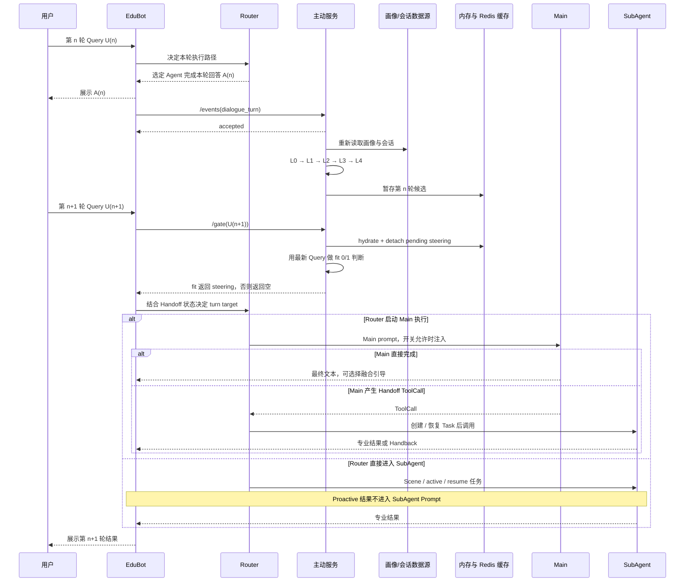
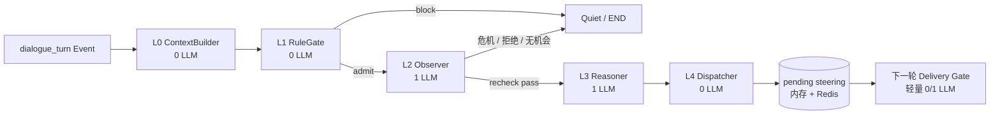

# 主动服务完整业务与算法设计

## 文档定位

本文是一份面向完整学习的主动服务说明，重点回答四个问题：

1. 主动服务为什么要把“后台生成候选”和“下一轮实时落地”分开？
2. EduBot、主动服务、Prompt 配置、路由与 Main 各自负责什么？
3. L0-L4 如何把用户状态变成可交付的 steering，系统又如何限制它的风险？
4. 当前已经形成了哪些闭环，哪些仍只是能力接口或目标设计？

本文中的状态词含义如下：

**当前实现**：系统已经具备的产品能力，但是否在某个环境启用，仍取决于部署配置和实验开关。
**条件启用**：能力存在，但只有相关模块、开关和路由条件满足时才生效。
**当前未闭环**：局部模块存在，但缺少可靠交付、持久化、反馈归因或效果验证中的至少一环。
**目标设计**：为完整业务闭环建议补齐的能力，不应描述成当前已经发生的事实。

---

## 1. 核心判断：主动服务是“两阶段控制”，不是一条即时推荐

当前 steering 主链可以概括为：

```text
第n轮回答结束
→EduBot 异步发送dialogue_turn 事件
主动服务重新读取画像和会话数据
→L0-L4生成候选guidance
→候选以 pending steering 暂存

第n+1 轮用户发来最新Query
→EduBot 同步调用 Proactive Delivery Gate
→主动服务用最新Query重新判断候选是否仍合适
→合适则返回steering+behavior，不合适或异常则返回空
→只有本轮实际启动 Main 执行、Prompt开关明确开启且 steering 非空时才注入
→Main 先处理最新 Query，再决定自然融合、忽略，或产生新的 Handoff ToolCall
```

这套设计的本质是“先准备、后确认”：

```text
prepare =上一轮后台准备候选 guidance 和 candidate goal
confirm =下-轮 Delivery Gate 确认候选仍 fit
```

当前主动服务把 Gate fit 视为自己的“已交付”提交点，会立即推进频控，并在 candidate goal 信息仍完整时提交目标；跨 Worker 水合可能丢失这部分字段。这个提交点早于 EduBot 的 Prompt 开关、Main 注入、最终responder 和用户可见结果。目标闭环应增加下游 ACK，·在明确的注入或用户可见口径后再提交状态。

它解决的是一个时间差问题：上一轮结束时看起来有价值的延伸，到下一轮可能已经过时。用户可能换题、拒绝、情绪变化、急于获得答案，或已经进入某个 SubAgentTask。主动服务必须允许最新用户意图否决旧候选。

---

## 2. 业务目标与明确不做什么

### 2. 1业务目标

主动服务希望在不打断主任务的前提下，提高教学对话的连续价值：

发现用户没有显式提出、但与当前学习目标相关的延伸机会；
利用画像、历史、掌握度、错误模式和当前话题做个性化引导；
让主动内容自然融入主回答，而不是像广告或机械弹窗一样打断用户；
让昂贵的理解与规划发生在后台，把实时请求中的额外成本控制在一个轻量判断内；
目标上只在用户真正有机会看到主动内容后，才推进目标和频控状态；当前实现仍在 Delivery Gate fit 时提前提交，后文会单独说明这一缺口；
- 为后续效果归因、反馈学习和策略迭代建立 intervention 身份。

### 2. 2当前不做什么

主动服务当前不应被理解为：

**最终路由器**：它不决定本轮去Main 还是 SubAgent；Router 才拥有最终路由权。
**最终回答者**：steering 是内部引导，不是直接展示给用户的完整回答。
**每轮必推系统**：没有明确增益时应保持安静，异常时也应让主回答继续。
- **Handoff Gate**：Handoff Gate 判断任务承接关系；Proactive Delivery Gate 判断旧候选是否适合最新Query，二者目的和状态影响完全不同。
- **推荐 Query 或开场 Prompt 的总称**：这些是独立能力，不经过 Session pending steering 槽。
- **已经完成的在线学习系统**：当前缺少完整、持久、可归因的 delivery-to-feedback-to-policy 闭环。
- **业务效果证明**：接口成功、Gate 命中或Prompt 注入都不能单独证明用户真的受益。

---

## 3. 当前能力地图与目标边界

| 能力 | 当前状态 | 与steering 主链的关系 | 关键边界 |
|---|---|---|---|
| L0-L4 Graph steering | 当前实现 | 主链后台决策 | 事件只负责唤醒，真实数据重新读取 |
| Proactive Delivery Gate | 当前实现 | 主链实时落地门 | 只判断候选是否适合最新 Query，不决定 Router route |
| Prompt steering 注入 | 条件启用 | EduBot 的 Main 执行环节 | Gate hit、Prompt 开关、实际启动 Main、非空 steering 缺一不可；Main 后续仍可能 ToolCall Handoff |
| Redis steering cache | 当前实现 | 跨 Worker 水合 | 提升可达性，但当前不是全局原子消费 |
| Graph card 能力 | 当前关闭 | 与 steering 共用部分决策框架 | 主端卡片接收、反馈和稳定投递尚未形成完整闭环 |
| Legacy 异步推荐 | 能力保留 | 独立旧链 | 不等于当前 steering E2E 已接通 |
| 推荐 Query API | 独立能力 | 不进入 Session steering 槽 | 面向可点击 Query 候选，使用独立实验门 |
| Opening Prompt API | 独立能力 | 不进入实时 Gate | 面向下一 Session 的离线开场 Prompt 组装 |
| Feedback / Reflector | 局部能力 | 目标上承接干预效果 | Graph 侧 durable ledger、归因和蒸馏尚未闭环 |


---

## 4. 三种Gate：名字相近，职责不同

### 4. 1 Handoff Gate

Handoff Gate 面向 Multi-Agent 控制面。它根据当前 Query、最近对话和 active/paused Task，向 Router 提供继续承接、让回 Main、恢复暂停任务或需要澄清等建议。

它只提供候选判断；Router 负责开关约束、状态变更、并发版本校验、Task/Topic 更新和最终 dispatch。

### 4. 2 Proactive Delivery Gate

Proactive Delivery Gate 面向主动内容交付。它拿到：

上一轮生成的 pending steering;
生成候选时保存的最近对话；
下一轮用户的最新 Query。

然后用一个轻量0/1判断回答：“这个旧候选现在是否仍适合？”

它不修改 Handoff Task，不决定 Main/SubAgent 路由，也不直接写最终回答。

### 4. 3Prompt开关

Prompt 开关不是模型 Gate，而是运行时配置门。即使 Proactive Delivery Gate 返回 steering，只有请求级配置明确允许，Main才会获得这段内部引导。

三者可以同时出现在入口预处理阶段，但不能混成一个“总Gate”。

---

## 5. Gate命中到用户受益：十个不同阶段

| 阶段 | 说明 | 能否证明下一阶段 |
|---|---|---|
| 1. Event accepted | 主动服务收到了门铃 | 不能证明后台 Graph 完成 |
| 2. Pipeline completed | L0-L4 已结束 | 不能证明产生候选 |
| 3. Steering staged | 候选已写入 pending 槽 | 不能证明下一轮 Gate 会读到 |
| 4. Gate invoked | 下一轮确实调用了 /gate | 不能证明命中 pending |
| 5. Gate fit | 最新 Query 判定 fit；当前服务此时已推进 clock，并在信息完整时提交 goal | 不能证明 EduBot 收到响应 |
| 6. EduBot received | EduBot 收到非空 steering | 不能证明 Prompt 开关开启 |
| 7. Switch on | 请求级 Prompt 配置允许 steering | 不能证明本轮会执行 Main |
| 8. Prompt injected | Router 启动 Main 执行，steering 进入其 system context | 不能证明 Main 采用，也不能证明最终 responder 仍是 Main |
| 9. Semantic consumption | Main 的文本或决策语义上体现 guidance | 不能证明用户获得业务收益 |
| 10. Final effect | 用户理解、继续学习、点击或后续行为改善 | 需要反馈与归因证据 |

因此必须明确：

```text
Gate 命中 ≠ 开关开启
开关开启 ≠ Prompt 注入
Prompt 注入 ≠ Main 采用
Main 采用 ≠ 最终 responder 一定是 Main
Main 采用 ≠ 最终业务有效
```

---

## 6. 上一轮事件到下一轮实时Gate的完整时序



这个时序有四个重要性质：

1.**事件是异步门铃**：accepted只表示接收，不表示后台决策完成。
2.**候选天然跨轮**：第n轮产生，第n+1 轮才有机会交付。
3. **miss 是正常状态**：用户来得太快、后台没有产出、Redis 未命中、候选过期或最新 Query 不合适，都应返回空并继续正常回答。
4. **Main 执行不等于最终 responder 是 Main**：steering 可能已进入 Main Prompt，但 Main 随后产生 ToolCall，最终可见内容仍由 SubAgent 承接。

---

## 7. EduBot侧完整集成链

### 7. 1客户端与降级原则

EduBot只有在主动服务模块启用且服务地址有效时，才创建主动服务客户端。客户端按Worker 复用连接，避免每个请求重复建立连接。

当前关键预算可按以下方式理解：

/gate是同步请求路径，调用侧默认只愿意等待约200ms；
/events是异步通知，调用侧默认预算约 300Oms，但它只覆盖事件 HTTP 边界，不覆盖后台 Graph；
- timeout、网络错误、非成功响应、响应解析错误和业务错误都不阻断主回答。

这里的fail-open是“主对话继续开放”，不是“异常时也强行展示主动内容”

### 7. 2入口预处理的并发关系

一次Query 到来后，入口阶段可能并发准备三类信息：

```text
Prompt配置获取
Handoff Gate 候选判断
Proactive Delivery Gate 判断
```

它们共享同一个请求上下文，但输出彼此独立：

Prompt 配置决定模型、工具、实验开关和 steering 是否可注入；
Handoff Gate 给 Router 提供任务承接建议；
- Proactive Gate 返回上一轮候选是否仍适合。

当前入口会把 Handoff Gate 的 Continue/Resume 当作强 SubAgent-bound 提示，提前取消或丢弃 Proactive；主动 steering 不会交给 SubAgent。这个动作发生在最终 Router effect 之前，Resume 仍可能遇到CAS冲突或状态变化，因此存在“后来回到Main，但候选已被提前丢弃”的窗口。目标上应由最终 route hint 或可恢复的 disposition 决定取消。

### 7. 3ProactiveGate请求上下文

EduBot在审核和规则干预之后，向主动服务发送本轮最新信息：

```json
{
  "session_id": "session-123",
  "user_id": "user-123",
  "utdid": "device-123",
  "user_utterance": "本轮最新 Query",
  "request_id": "request-123",
  "proactive_type": "steering"
}
```

成功时，响应结果只暂存在本轮 RequestContext 中。失败时保持为空；它不会因此改变 Router 状态。

### 7. 4Prompt注入的必要条件

当前 steering 注入至少需要同时满足：

1. 本轮运行模块包含 steering；
2. 请求级 Prompt 配置明确返回主动 steering 开启；
3. Proactive Gate 返回非空 steering；
4. Router 在本轮实际启动一次 Main 执行。

这里要求的是“Main 执行步骤发生”，不是“最终 responder 必须是Main”。Main 看到 steering 后仍可能产生 Handoff ToolCall，随后由 SubAgent 输出最终可见内容。

请求入口携带的 experiment bucket 只是配置计算的输入，不是最终开关结论。学习和验收时应读取 Prompt配置合并后的有效值，并把on、显式off和字段缺失分开统计：

on：满足其他条件时允许注入；
显式off：明确不注入；
missing：没有得到该项配置，不能当作命中，也不应默认为开启。

注入位置在 Main system context 的后部，排在基础角色、画像、记忆和会话环境等主要上下文之后。它由两部分组成：

**behavior contract**：告诉 Main 如何安全使用主动内容；
**steering segment**：本次候选的目标、焦点和引导方向。

如果 Prompt 开关没有明确开启，/events和/gate 仍可以 shadow 运行，但 Main 不消费其结果。

### 7. 5Main的消费合同

Main收到的不是“必须照抄的推荐文案”，而是一条可舍弃的内部建议。行为合同要求：

最新用户请求永远优先；
核心回答必须独立完整，不能依赖主动内容才能成立；
最多自然融合一个短小延伸；
没有明确增益时可以完全省略；
不得向用户泄露内部steering、策略、评分或候选目标。

因此需要同时检查 Main 的文本或 ToolCall 决策，并结合本轮 Query，才能判断 guidance 是否被语义消费；若 Main 后续 Handoff，还要单独标记最终 responder。

### 7. 6 回答后的 Event posthook

回答结束后，EduBot 调度dialogue_turn事件。流式链路在收尾阶段调度，因此正常完成、异常、被打断或客户端断连都可能产生事件。

当前事件 payload 不携带完整对话，也不明确声明 finish reason。事件的业务含义更接近“这一 Session可能有新数据，请重新读取”，而不是“这一轮已完整且可靠持久化”。

---

## 8. 主动服务API与数据模型

### 8. 1统一响应信封

主要API 使用统一信封：

```json
{
  "code": 0,
  "message": "success",
  "data": {}
}
```

code=0表示接口业务处理成功，但具体能力是否产出内容仍要看data。例如 Gate 正常 miss 也可以是成功响应。

### 8. 2POST /api/v1/events

用途：接收异步事件门铃。

核心请求模型：

| 字段 | 含义 |
|---|---|
| event_id | 事件身份，用于去重和链路关联 |
| event_type | 事件类型，例如 dialogue_turn |
| user_id | 用户身份 |
| utdid | 设备或画像查询身份 |
| session_id | 会话身份，可选 |
| timestamp | 事件发生时间 |
| source | 事件来源，例如 EduBot |
| payload | 扩展业务数据；当前主链通常不依赖它还原对话 |

响应中的status=accepted表示事件已接收并安排后台处理。

当前去重是进程内有界集合：同一 Worker 内的重复event_id可被抑制，但多 Worker 或重启后不能提供全局 exactly-once。并且事件在后台处理前就被标记已见；后台失败后，同 Worker 使用同一 ID 重试可能仍会被抑制。

### 8. 3POST /api/v1/gate

用途：在下一轮实时判断 pending steering 是否仍适合。

请求模型：

| 字段 | 含义 |
|---|---|
| session_id | pending 槽的 Session 维度 |
| user_id | 与 Session 共同定位候选 |
| utdid | 用户数据身份，可为空但建议贯穿 |
| user_utterance | 本轮最新 Query，是实时判断的关键输入 |
| request_id | 调用链关联 ID；缺失时服务可生成 |
| proactive_type | 当前真正服务的是 steering |

响应模型：

```json
{
  "request_id": "request-123",
  "steering": "可选的内部引导段",
  "behavior": "仅在 steering 交付时返回的行为合同"
}
```

当前card和subtag类型不会走同等交付能力，而是返回空结果。

### 8. 4POST/api/v1/feedback

用途：接收推荐或干预反馈。

核心字段包括：

feedback_id：反馈事件身份；
user_id：用户身份；
recommendation_id：被反馈对象；
feedback_type：接受、拒绝、完成、忽略等结果；
timestamp：反馈时间；
payload：补充上下文。

接口接收成功不等于 Graph steering 已完成反馈归因；当前 legacy 推荐与 Graph intervention 的反馈处理边界不同。

### 8. 5POST/api/v1/recommend/query

用途：同步拉取一组可点击的推荐 Query。

它按用户设备身份查询候选并受独立实验信号控制；请求可带 request ID 和兼容分桶信息，响应中的列表顺序就是展示优先级。

它不携带 Session，不读取 pending steering，也不参与 L0-L4 跨轮控制。即使业务上都叫“推荐”，也必须与 steering 分开理解。

### 8. 6POST /api/v1/opening_prompt

用途：为下一Session 组装个性化开场 Prompt。

输入包括用户身份、候选Session 列表以及离线准备的历史Query；系统并行读取画像和历史摘要后组装 Prompt。当前只有画像和 Query 两类个性化证据都具备时才值得生成；数据缺失属于业务常态，应与系统故障分开统计。

它不调用实时 Delivery Gate，也不读写 pending steering。

### 8. 7Card推送合同

Graph card 的目标交付方式是：主动服务在卡片内容已经就绪且 Gate 判 fit 后，主动推送给主端，传递 card ID、引导文案、入口标签、屏幕内容和intervention ID。

当前主业务尚未形成稳定的接收、展示、点击和反馈闭环，因此这部分应作为待接通能力，而不是steering 主链的既成结果。

---

## 9. 数据源与用户状态构建

### 9. 1Event是门铃，持久化数据才是真值

当前默认的数据获取方式是按用户和Session读取画像与会话数据：

```text
Event 到达
拉取离线画像
拉取 Session 历史
解析回复轮次、Handoff 状态和学习信息
→重建本轮 descriptive state
```

单个数据源失败时会降级为空或部分数据，避免主动服务拖主对话。

把Event设计成门铃有两个优点：

事件重复时，系统仍可收敛到持久化数据的同一视图；
EduBot不需要在事件里复制完整画像和对话，减少接口耦合。

代价是系统依赖数据可见性：如果回答尚未持久化，L0可能读到旧历史。

### 9. 2两层状态模型

用户状态分为“描述事实”和“会话控制状态”两层。

#### UserFacts：可重新读取的描述事实

用户画像：年级、学科、认知、自我效能、动机、接受度等；
掌握度与薄弱点；
错误事件；
情绪与学习记忆摘要；
最近更新时间。

这些字段每次Event 都可由外部数据重新构建。

#### SessionContext：主动策略的会话状态

user_id / session_id / utdid;
对话 speaker turns 与当前用户文本；
当前turn；
steering/card 双通道频控账本；
active goal;
interval pending signals;
pending steering;
armed、ready、pending card 槽；
perception cache 与已引导知识点；
in_handoff状态。

L0刷新描述事实时，应保留goal、频控时钟、pending 槽和其他策略状态，避免一次全量读取把控制状态清空。

### 9. 3对话轮次算法

这里的一个 dialogue round 以用户消息为计数单位，而不是把 user 和 assistant 两条消息分别算两轮。

当数据源只返回窗口历史时，系统需要保持 turn 单调：

可见用户轮次增加时，直接采用更大的计数；
历史被截断但发现新的当前用户文本时，仍向前推进一轮；
重复读取同一历史时，不重复增加。

这保证频控、goal age 和 decided turn 在常见重复门铃下保持基本稳定。

### 9.4 当前因果锚点不足

当前事件没有携带turn_id、持久化版本或 history high watermark。后台读取发生较晚时，可能出现：

第n轮事件读取到第 n-1 轮数据；
第n轮事件延迟后读取到已经包含第n+1 轮的数据；
用户太快进入下一轮，Gate 先 miss，候选随后才 stage；
- 多个门铃对同一数据视图重复运行。

因此当前能保证的是“按某个读取时刻重建状态”，不能严格保证“候选只绑定上一轮已提交快照”。完整设计需要事件携带可验证的轮次与持久化锚点。

---

## 10. Graph 总览：L0-L4的职责与模型成本



| 层级 | 核心问题 | 模型调用 | 输出 |
|---|---|---|---|
| L0 ContextBuilder | 用户现在是什么状态？ | 0 | SessionContext |
| L1 RuleGate | 本轮是否值得花模型成本？ | 0 | Admission 与 channel availability |
| L2 Observer | 用户当前姿态和机会是什么？ | 1 | Perception + deterministic recheck |
| L3 Reasoner | 是否介入、目标如何变化、用什么引导？ | 1 | Corrected decision、goal、guidance、card intent |
| L4 Dispatcher | 如何表达、暂存和等待交付？ | 0 | pending steering / card |
| Delivery Gate | 到下一轮还适合吗？ | 1 个轻量判断 | steering + behavior 或空 |

一个完全 admitted 的后台 turn 使用两次主模型；L1 阻断时使用零次；下一轮实时链只增加一次便宜的 fit 判断。

---

## 11. L0 ContextBuilder：从数据真值重建上下文

LO的职责不是决策，而是给后续层提供稳定、可重复的输入。

核心算法：

1. 根据用户和 Session 读取最新画像与历史；
2. 将画像转换成可用于模型的摘要；
3. 从历史重建（speaker，text）对话序列；
4. 按用户消息计算单调 turn；
5. 识别当前用户文本、回复数和in_handoff；
6. 更新 UserFacts 和对话描述字段；
7. 保留 goal、clock、pending signals 和 pending slots。

它坚持三个约束：

不从空事件payload编造对话；
不因为重复 Event 重复推进turn；
不让描述状态刷新覆盖策略状态。

LO的主要风险不是模型错误，而是数据一致性：读取太早、部分数据源失败、窗口截断或跨系统身份不一致，都会影响后续判断。

---

## 12. L1 RuleGate：确定性准入与双通道 cooldown

L1用纯规则决定是否值得唤醒L2/L3。检查顺序是：

1. 全局 kill switch;
2. 当前是否处于 Handoff/SubAgent 承接状态；
3. 是否达到 cold-start 最小轮次；
4. steering Session cap;
5. card Session cap;
6. 各通道距上次服务侧 delivery clock 的最小 gap；当前 steering clock 在 Gate fit 时推进，目标上应改为真实交付ACK。

每个通道有独立Clock：

```text
gap = current_turn - last_output_turn
available = count < session_cap AND gap >= min_gap
```

关键语义是：

候选生成、写入缓存或Gate miss 不消耗频控额度；
- 当前 steering 在 Gate fit 时 tick，仍可能早于 Prompt 注入；card 则以推送确认作为 tick 边界；
目标上两种通道都应在各自定义的真实交付ACK后tick；
steering 和 card 可以独立冷却；
两个通道都不可用时整条Graph 结束，零模型成本；
只有一个通道不可用时仍可进入 L2/L3，但后校正会强制删除被冷却通道的 intent。

拒绝、催促、情绪或危机不是L1的关键词规则。这些需要结合语境，由L2感知，再用确定性规则复查。

---

## 13. L2 Observer：描述用户姿态，不直接决定投递

Observer 使用最近若干 user-led 对话轮、当前用户文本和画像摘要，输出 Perception：

当前话题；
user act;
engagement;
问题具体程度；
领域词汇使用；
opportunity:none / weak/ normal；
emotional tone;
crisis;
stop-or-shift 信号。

Observer的设计原则是“描述，不决策”。模型输出后还有一层确定性recheck：

crisis →阻断;
refusal 或 stop/shift →阻断，并把信号留给下一次决策；
opportunity=none →阻断；
opportunity=weak→允许继续，但提醒L3 更保守；
negative emotion →不自动阻断，但要求降低强度或先安抚。

如果模型超时、返回空、JSON无法解析或字段非法，L2返回空并静默结束本轮。系统不能为了提高“产出率”而伪造一个默认Perception，因为错误的主动介入比没有介入风险更高。

---

## 14. L3 Reasoner：Goal、Guidance 与 Intent 的唯一决策脑

### 14. 1一次模型联合决策

L3用一次模型同时回答：

```text
should_engage
goal_update_action
active_goal
guidance
card_intent (card phase)
slot_decision (card phase)
```

联合决策比“一个模型定目标、另一个模型写引导、第三个模型选卡片”更容易保持一致，也减少模型调用与跨模型
冲突。
输入包括：

- L2 perception；
- 最近对话与当前 Query；
- 当前 active goal；
- 距上次真实干预的间隔；
- 画像与学习记忆；
- interval pending signals；
- 已引导知识点；
- 未来可选的蒸馏经验。

### 14. 2ActiveGoal模型

Goal描述主动教学希望逐步推进的方向，主要包括：

goal_id：目标身份；
objective：目标描述；
topic：所属话题；
path：预期推进步骤；
current_step：当前步骤；
target_depth/ current_depth：目标与当前深度；
covered_points：已经覆盖的知识点；
goal_age_turns：目标持续轮次。

可选动作有：

| 动作 | 含义 |
|---|---|
| create | 没有目标时新建 |
| maintain | 保持目标，不推进 |
| advance | 沿现有路径前进 |
| revise | 修订目标内容但延续身份 |
| branch | 从现有目标分支出新方向 |
| drop | 清除已经不合适的目标 |

确定性状态机约束动作合法性：没有 active goal 时非 create 会退化为 maintain；已有目标时重复 create 会按推进语义纠正；create/branch 产生新身份；revise 沿用身份；advance 的步数有界； drop 清空目标。

### 14. 3Guidance 模型

Guidance 不是最终展示文案，而是结构化教学意图：

should_guide：是否建议引导；
guide_strength`:strong / medium / weak;
guide_means：闲聊追问、好奇钩子、触发讲解、扩展角度、召回关联或轻邀请；
direction：希望把对话引l向哪里；
anchor：必须锚定的当前内容；
curiosity_angle：可激发兴趣的角度；
knowledge_points：计划涉及的知识点；
tool_topic：只有触发特定讲解能力时才允许存在。

L4 会把它投影成 Main 所需的 objective、focus、covered points 和 steering section，并去掉内部 rationale。

### 14. 4 Intent 与 channel

should_engage只是总意愿，真正可交付的 intent 分成不同 face：

- steering intent：由 Main 自然融合；
- card intent：直接生成并推送卡片，不让 Main 再写卡片内容。

如果所有 intent 在后校正中都被删除，本轮就必须变成 quiet turn；不能保留“should engage=true"却没有任何合法内容。

### 14. 5 确定性 post-correction

模型输出不是状态真值。L3按顺序执行代码约束：

1. 合法化goal action;
2. drop或should_engage=false时删除 guidance；
3. 删除处于 cooldown 的 channel intent；
4. card phase 关闭时删除幻觉出的 card；
5. 与已引导知识点冲突时整轮降级；
6. 同轮 steering/card 方向不一致时整轮降级；
7. 检查card 必填字段、长度和 readiness；
8. 拦截健康焦虑、越界工具主题等内容红线；
9. 已占用卡片槽未被明确处理时，禁止写入新 card；
10. 没有 surviving intent 时，不允许 create/advance/revise/branch 推进 goal。

这层约束把“模型建议”变成”可执行候选”，并保证频控、安全、状态机和结构合同不会只依赖Prompt自觉。

### 14. 6CandidateGoal为什么延迟提交

在gate delivery mode 下，包含 steering 的 goal 变更先保存为candidate_goal，不会在 L4 生成候选时立即成为 active goal。

当前实现把下一轮Delivery Gate 判 fit 当作主动服务侧的“交付"时刻，并立即：

在 candidate goal 信息仍存在时，把它提交为 active goal；
tick steering clock;
记录已引导知识点；
返回 steering + behavior。

同 Worker 内存路径通常保留完整 candidate goal；跨 Worker Redis 水合当前没有完整序列化 candidate goal 和提交标志，因而还可能出现“steering 返回了、clock 推进了，但 goal 没有同步推进”的分叉。

这只实现了“相对候选生成延迟提交”，还没有实现“相对真实用户可见延迟提交”。Gatefit之后仍可能发生调用侧超时、Prompt 开关关闭、Router 直接走 SubAgent、Main 忽略 steering，或 Main 产生 ToolCall 后由 SubAgent 成为最终 responder。

目标设计应把两阶段继续拆开：Gate fit 只产生可交付 token；EduBot 在 Prompt 已注入或更强的用户可见口径成立后返回ACK，主动服务再原子提交goal、clock 和知识点。这样才能避免“系统以为教过、用户实际没看到”的假进度。

---

## 15. L4Dispatcher：表达、暂存与卡片状态机

L4不再判断“该不该做”，只把 corrected decision 物化为可交付状态。

### 15. 1 Steering 暂存

有合法 guidance 时，L4:

1. 投影成 EduBot view；
2. 生成 steering section;
3. 创建 PendingSteering;
4. 写入 SessionContext 单槽；
5. 镜像到 Redis，并保存有界的最近对话 tail。

PendingSteering 包含：

| 字段 | 作用 |
|---|---|
| steering_segment | 返回给 EduBot 的内部引导 |
| behavior_version | Main 行为合同版本 |
| intent | 原始 guidance，便于交付记账 |
| intervention_id | 干预身份，用于全链归因 |
| decision_snapshot | 决策摘要和关联 ID |
| candidate_goal | 当前等待 Gate fit 后提交、目标上等待下游 ACK 的目标 |
| 延迟提交标志 | 是否暂缓目标提交；当前延迟边界止于 Gate fit |
| decided_turn | 生成候选时的轮次 |
| created_at | TTL 和审计时间 |

当前是单槽设计：新的候选可以替换旧候选，避免同一Session 堆积多个主动建议。

### 15. 2 Quiet turn

没有 surviving guidance 时，L4 只记录 skip 原因，不生成空候选，也不消耗频控额度。

### 15. 3Card状态机

Card phase 的目标状态机是：

```text
card intent
timing=after_condition → armed slot
timing=now
light：内容已在决策中生成→pending card
heavy：调用外部内容工具
预算内完成 →pending card
较晚完成→ready slot + pending signal

下一次决策处理 occupied slot
→fire/keep /cancel
→deliver/hold / discard
→pending card 进入下一轮 Delivery Gate
```

硬性 readiness rule 是：只有 on_screen_text 已经拿到，卡片才能进入 pending；不能先展示一个入口，再发现内容尚未生成。

当前card phase 默认关闭，所以这套状态机属于已准备但未完成业务接入的能力。

---

## 16. Pending Steering 缓存与跨 Worker 水合

### 16. 1为什么需要Redis

/events的后台 Graph 可能由 Worker A 执行，而下一轮/gate可能落到 Worker B。仅使用进程内 SessionContext 会让 B 看不到 A生成的候选。

因此系统同时维护：

进程内 SessionContext：同 Worker 快路径；
- Redis:跨 Worker 的 pending steering 镜像。

缓存 key 由user_id + session_id 构成，value 保存候选和有界对话 tail，并设置 TTL。默认 TTL 较长，用来防止永久残留；实时 Gate 仍需再次判断内容是否合适。

### 16. 2多机房策略

当前策略以降低实时 RTT 为优先：

Event后台向多个写入机房并发写；
Gate 默认只读本机房；
消费后同步除本机房副本；
其他机房副本后台删除；
Redis 异常全部降级为 miss，不阻塞主回答。

这把跨区成本放在后台，实时路径只承担本地读删

### 16. 3水合与短锁

Gate 首先查看本 Worker 内存：

1. 若内存没有 pending，则从 Redis 读取；
2. 把 pending 和对话 tail 水合到当前 SessionContext;
3. 在短锁内从本进程槽中 detach；
4. 在锁外执行模型judge；
5. 根据结果交付、丢弃或回槽；
6，清理缓存副本。

短锁只保护槽位转移，避免实时Gate排队等待后台模型。

### 16. 4当前一致性缺口

#### 跨Worker 不是全局原子消费

两个 Worker 可能同时：

```text
A GET 同一候选
BGET同一候选
A judge
B judge
A/B DELETE
```

进程内锁无法阻止这一情况。当前没有全局 atomic claim、GETDEL、Lua compare-and-delete 或 delivery token，因此不能保证 exactly-once。

#### 多机房存在短暂重复窗口

本机房删除完成后，其他机房副本仍可能短暂存在。若后续请求路由到其他机房，仍有机会再次水合并判断。

#### Candidate Goal 跨 Worker 丢失

当前 Redis 候选镜像没有完整保存candidate_goal和“交付后提交标志”。跨 Worker 水合后可以返回steering，但无法按原始语义提交目标，造成“内容交付成功、goal状态未推进”的分叉。

#### decided_turn尚未成为防重条件

虽然候选保存了生成轮次，当前 Gate 还没有用它与最新 Session 版本做严格 stale/duplicate 校验。

这些问题不会阻塞主回答，但会影响重复交付、频控、goal一致性和效果归因。

---

## 17. Delivery Gate 核心算法

### 17. 1判断输入

实时判断使用三类信息：

```text
候选 steering segment
候选生成时保存的最近对话
第 n+1 轮最新 user utterance
```

它只输出严格的0/1：

1：仍然fit，可以交付；
0：已不适合，抑制交付；
- timeout、异常、空或不可解析输出：按Gate error 处理。

### 17. 2Steering 判定流程

```text
无pending
→空结果

pending 超过 TTL
→丢弃，空结果

Gate check 关闭
→跳过模型判断，直接按交付处理

Gate check 开启
→轻量模型0/1判断
1：当前实现立即 tick clock；candidate goal 信息存在时提交目标，再返回 steering + behavior
0:丢弃 steering，返回空
error/timeout：丢弃 steering，返回空
```

steering 在unfit 后被丢弃，是因为它生成成本相对低，下一轮后台可以重新计算；保留旧建议反复尝试更容易造成陈旧干预。

### 17. 3Card的非对称策略

Card 是相对昂贵的成品。目标策略是：

fit=1：推送卡片，确认成功后tick cardclock；
fit=0:放回 pending card，TTL 内下一轮可重判；
judge error:同样保留；
push 失败：不计为真实交付。

steering“0即丢弃”、card“0可保留”是交付后的策略差异，不是模型判断标准不同。

### 17. 4Fail-open的准确含义

服务内部常把异常降级称为fail-open，但从用户可见内容看更准确的表述是：

对主回答：开放，正常继续；
一对主动干预：保守关闭，不展示未经确认的内容。

这是一种“核心业务可用性优先、附加干预安全优先”的双重策略。

---

## 18. Card、Legacy 推荐、Feedback 与 Reflector

### 18. 1 Graph Card

Graph card 与 steering 共享 L0-L3 的用户理解和 goal，但有独立 cooldown、槽位、内容生成和直接推送合同。

当前边界：

决策与状态机能力存在；
默认 phase关闭；
主端稳定的 card receiver、展示确认、点击反馈尚未闭环；
因此不能用局部card能力证明线上卡片链已完成。

### 18. 2Legacy 推荐链

系统还保留一套旧异步推荐流程：

```text
Internal Event
→UserStateManager
NeedDetector
→Rule/LLM Reasoner
→Tool 与 Dispatcher
Delivery 或 PendingQueue
→Feedback
→Reflector / Memory evolution
```

NeedDetector 会从重复错误、负面情绪、认知负荷、掌握度和对话推进中选择最高urgency 机会。

Legacy 还维护 fatigue，思想上可写成：

```text
fatigue =基础打扰敏感度
+最近多次曝光的时间衰减影响
+拒绝或烦恼反馈的额外惩罚
随休息时间产生的恢复量
```

规则门会阻断 Handoff、过高 fatigue、过短推送间隔和每日上限；通过规则后再运行模型Gate，·必要时进入慢 Reasoner。

当前这条链的真实交付默认关闭，且与 EduBot 当前 steering hooks 不构成同一 E2E。

### 18. 3 Legacy PendingQueue 的限制

投递失败的旧推荐可以进入进程内 PendingQueue，按类型设置 TTL 和尝试次数。但当前它不是durable queue:

进程重启会丢失；
没有独立重试Worker；
没有可靠定时器自动推进；
需要后续事件显式触发；
部分投递状态可能在HTTP 真正成功前被提前写入，存在误记风险。

因此它更像一个 best-effort 延迟槽，而不是可靠消息系统。

### 18. 4 Feedback 与 Reflector

Legacy feedback 可按完成、接受、延迟、忽略、拒绝、烦恼拒绝等类型映射为固定reward，并把经验分为正向、警示和偏好类别。

这属于受启发的规则奖励与经验积累，不是完整的在线策略训练。迟到反馈还依赖原始 reasoning context 是否仍在进程内缓存。

Graph intervention 以独立 intervention ID 开头，目标上应进入 EvidenceLedger；当前 ledger 与离线 hindsight grading、蒸馏和在线经验读取没有形成durable 闭环。

---

## 19. 当前尚未闭环的部分

| 领域 | 当前已有 | 仍缺少什么 |
|---|---|---|
| 轮次因果 | Event + full fetch | turn/version/high-watermark 锚点 |
| 事件可靠性 | 进程内去重+ BackgroundTask | durable inbox、处理状态、可重试幂等 |
| 跨 Worker steering | Redis 镜像与水合 | 全局 atomic claim 和 delivery token |
| Goal 一致性 | 同 Worker 延迟提交 | candidate goal 完整跨 Worker 持久化 |
| Prompt 交付 | Gate 返回与条件注入 | 注入确认、Main 消费判定、最终语义效果记录 |
| Card | 状态机和推送合同 | 主端receiver、展示确认、点击与反馈闭环 |
| Feedback | API 与 legacy reward | Graph delivery ledger、归因窗口、可靠标签 |
| Reflector | 接口与经验模型 | durable evidence、离线评分、蒸馏、版本、回滚 |
| 状态恢复 | Redis 恢复pending steering | goal、clock、signals、card slots 的恢复 |
| 多机房一致性 | 后台多写、本地读 | 副本版本、防重复和冲突仲裁 |
| 生产效果 | 分阶段日志和Trace | Gate→注入→Main文本→用户反馈的请求级联结 |

所以当前准确结论是：**steering 的生成与实时 Gate 主链已经具备，完整的可靠交付、状态一致性和反馈学习闭环仍未完成。**

---

## 20. 超时预算与Fail-open 设计

### 20. 1当前预算层级

主动服务的时间预算分成多个相互独立的边界：

| 边界 | 当前默认理解 | 是否进入主回答关键路径 |
|---|---|---|
| EduBot Gate 调用 | 约 200 ms | 是，保护首包 |
| 主动服务轻量 Judge | 约 400 ms | 是，由 Gate 请求触发 |
| EduBot Event 调用 | 约 3000 ms | 否，只负责门铃送达 |
| 后台 L0-L4 | 由数据读取和两次主模型共同决定 | 否，但决定候选能否赶上下轮 |
| Heavy card 就绪等待 | 约 10 s | 当前 card phase 关闭 |
| Card push | 约 5 s | 当前 card phase 关闭 |

这些是理解默认行为的参数，不代表任一环境的最终生效值；真实运行必须读取部署配置并结合调用链时延验证。

当前存在一个重要错配：调用侧可能在200ms 先超时，而服务端仍在 400ms 内继续判断。若服务随后 detach、删除或提交候选，就可能出现“用户未收到steering，但服务以为已经消费”的状态分叉。
目标上应满足：
目标上应满足：

```text
caller deadline
2 network reserve + service queue reserve + judge deadline + response reserve
```

或者由deadline propagation 和取消感知确保调用侧超时后，服务不会错误提交交付状态。

### 20. 2每层失败如何降级

| 失败位置 | 当前降级目标 |
|---|---|
| Prompt 配置失败 | 使用安全兜底配置；默认不注入主动内容 |
| EduBot / Gate timeout | 主回答继续，gate result 为空 |
| Redis 失败 | 同 Worker 可走内存；跨 Worker 视为 miss |
| Gate 模型失败 | 不交付 steering |
| Event 发送失败 | 不影响已生成的本轮回答 |
| L0 数据失败 | 使用部分 / 空状态，必要时 quiet |
| L2 失败 | silent skip |
| L3 失败 | maintain goal + no engage |
| Card tool / push 失败 | 不计为真实交付 |

任何fail-open 都必须有reason，不能把“正常返回空”与“依赖异常”混在同一个miss 指标里。

---

## 21. 并发、异步与性能优化

### 21. 1已有优化思路

上一轮后台做两次主模型，下一轮只做轻量fit 判断；
L1在模型前阻断，避免成本倒置；
EduBot 并发准备 Prompt 配置、Handoff Gate 和 Proactive Gate；
主动服务客户端按Worker复用连接；
Event后台执行，不延长上一轮回答；
每个 Session 用 pipeline lock 避免同进程后台 Graph 交错；
Delivery Gate 使用独立短锁，detach 后在锁外 judge;
Redis 多机房后台并发写，Gate 只读本地；
对话 tail限条数和单条长度，控制缓存与 Prompt 体积；
单槽+TTL限制陈旧候选和状态膨胀；
获得强 SubAgent-bound 提示时尽早取消无用 Proactive；同时记录它发生在最终 Router effect 前的投机窗口。

### 21. 2当前性能浪费

在旧推荐投递关闭时，Event 仍可能先为 legacy 状态读取一次数据，Graph L0 再读取一次。一次门铃可能重复拉取画像和 Session。

可以优化为：

legacy 关闭时直接进入 Graph；
将第一次读取的 UserData 作为带版本输入传给 L0；
画像和Session 在允许的情况下并发读取；
复用数据源连接池；
给profile、session、L2、L3、cache、judge 分别设置预算与指标；
合并短时间内针对同一Session 的重复门铃
- 用 Router route hint 替代狭义的 Handoff Gate 判定，减少最终去 SubAgent 时的无效 Proactive 等待。

### 21. 3并发正确性优先级

目标形态的性能优化不能破坏以下顺序：

1. 先确定候选属于哪个数据版本；
2. 再原子 claim 候选；
3. 再 judge 最新 Query；
4. 只有调用方成功接收且满足交付定义，才提交goal与clock；
5. 最后异步做副本清理和分析上报。

否则“降低几十毫秒”可能换来重复交付或错误goal进度。

---

## 22. 状态持久化与恢复边界

### 22. 1当前durable 与非durable 状态

| 状态 | 当前主要载体 | 重启/跨Worker行为 |
|---|---|---|
| 用户画像、会话历史 | 外部持久化数据源 | 可重新读取 |
| pending steering +对话 tail | 内存+Redis | 可跨Worker 水合 |
| active goal | 进程内 SessionContext | 重启可能丢失 |
| steering/card clock | 进程内 SessionContext | 重启可能重置 |
| pending signals | 进程内 SessionContext | 重启丢失 |
| armed/ready/pending card | 进程内 SessionContext | 重启丢失 |
| event 去重集合 | 单进程内存 | 跨Worker、重启不共享 |
| legacy PendingQueue | 进程内内存 | 重启丢失 |
| Graph evidence ledger | 当前未形成 durable 写入 | 无法可靠归因 |

### 22. 2目标持久化原则

不必把所有Perception原文都作为在线强状态，但以下状态应可恢复并有版本：


intervention clocks;
pending steering/card 及完整 candidate transition；
delivery claim 和确认状态；
event processing state;
intervention ledger;
- feedback attribution state。
每次写入需要带 Session version 或 expected revision，避免旧 Worker 覆盖新状态。内容事实和策
略状态应分开存储，防止全量画像刷新误覆盖控制面。

---

## 23. 可观测性：从“调用成功”升级到“语义生效”

### 23. 1建议的关联主键

```text
event_id
request_id / gate_request_id
session_id / user_id / utdid
intervention_id
turn_id / history_version
goal_id / goal_revision
delivery_token
```

高基数字段应进入受控Trace或诊断日志，不应直接作为指标标签。

### 23. 2分阶段事件

建议记录：

```text
event_accepted
pipeline_started / pipeline_completed
context_fetched + history_version
L1 admission reason
L2 perception + recheck reason
L3 decision + demotion reasons
steering_staged + cache regions
gate_cache_hit / judged / verdict
prompt_switch_resolved
router_final_target
main_execution_started
prompt_injected
main_text_or_toolcall_completed
final_responder
semantic_consumption_verdict
user_feedback / attributed_outcome
```

### 23. 3语义验收分层

一次主动服务验收至少分为：

1.**生成验收**：Graph 是否用正确数据版本产生候选？
2.**落地验收**：下一轮 Gate 是否拿到同一 intervention 并判 fit？
3.**配置验收**：请求级Prompt开关是否明确开启？
4.**执行验收**：Router 是否在本轮真正启动过Main 执行步骤？
5.**注入验收**：Main system context 是否包含对应 steering 与 behavior？
6.**消费验收**：Main 的文本或 ToolCall 决策是否在优先处理新 Query 的前提下体现 guidance；最终responder 是 Main 还是后续 SubAgent？
7. **效果验收**：用户后续是否点击、继续探索、理解改善或明确拒绝？
完整语义 PASS 不能只看 HTTP 200、Event accepted、Gate hit、缓存命中或 Prompt 日志。至少要把
最新 Query、候选 guidance、Main 是否实际执行、Main 文本或 ToolCall、最终responder 和用户可见结果关联起来。

### 23. 4推荐指标

Event接收率、后台完成率和各阶段耗时；
L1 block reason 分布；
L2/L3模型失败与解析失败率；
staged rate、Gate hit/miss/unfit/error rate;
Redis 内存命中、远端命中、跨 Worker 水合和重复claim 率；
Prompt switch on/off/missing;
Main execution、direct SubAgent route、最终 responder 和 proactive disposition；
injected rate、semantic consumed rate;
intervention 后用户接受、拒绝、忽略和继续学习率；
按人群、场景、goal 类型和 guidance means 的增益与风险。

---

## 24. 安全、隐私与治理

主动服务会处理用户Query、画像、学习历史、情绪和模型输入输出，安全要求应高于普通推荐系统。

### 24. 1数据最小化

Event只传身份和必要元数据，完整数据按授权读取；
Gate 缓存只保存有界对话 tail，不复制整段历史；
Prompt 只携带完成当前判断所需的画像摘要；
日志避免记录完整画像、完整会话和模型原文；
身份字段和业务内容分级存储，限制查询权限和留存期。

### 24. 2凭据与传输

服务凭据进入密钥管理系统，不写入普通配置或日志；
跨服务和Redis访问使用加密传输、最小权限和定期轮换；
cachekey必须包含明确租户/环境边界，防止跨环境或跨用户碰撞；
删除与过期策略覆盖主缓存、跨区副本、日志、Trace 和离线ledger。

### 24. 3模型与内容安全

最新用户意图优先，防止陈旧 steering 劫持回答；
steering 仅作为内部提示，Main 不得泄露内部目标、分数和策略；
crisis、健康敏感、强拒绝和不打扰信号应阻断主动介入；
对未成年人画像和情绪信息采用更严格的用途限制；
模型输出必须经过结构校验与确定性红线检查；
离线蒸馏经验上线前需要人工审计、安全过滤、版本和回滚。

### 24. 4可观测数据治理

若捕获LLM I/O，必须明确：

哪些环境允许；
是否脱敏；
最大截断长度；
谁可访问；
保留多久;
用户删除请求如何传播；
线上诊断与离线训练是否使用不同权限域。

不能为了调试便利，把敏感文本永久留在高可见日志中。

---

## 25. 典型故障场景与用户效果

| 场景 | 当前用户效果 | 状态风险 | 正确观测 |
|---|---|---|---|
| 主动客户端未启用 | 正常回答，无主动链 | 无候选生成/交付 | resolved config |
| Event HTTP 失败 | 本轮回答不受影响 | 下一轮可能无候选 | event send status + event ID |
| Event accepted、Graph 未完成 | 本轮回答正常 | 下一轮 Gate 可能 miss | pipeline root / result |
| L0 读到旧历史 | 可能 quiet 或生成错轮候选 | 因果错位 | history version / turn anchor |
| L1 block | 正常回答 | 无模型成本 | admission reason |
| L2 parse/timeout | 正常回答 | 本轮 silent skip | perceive request ID + error type |
| L3 失败 | 正常回答 | goal maintain，无 intent | decision request ID + fallback |
| Redis 故障 | 同 Worker 可能命中，跨 Worker miss | 可达性下降 | region + operation + latency |
| 两 Worker 同时 GET | 可能重复交付 | 非原子消费 | intervention ID + delivery token |
| Gate 无 pending | 正常回答 | 无 | no-session / empty-slot reason |
| Gate judge=0 | 正常回答，无 steering | 候选丢弃 | unfit verdict |
| Gate judge error | 正常回答，无 steering | 候选按保守策略处理 | fail-open reason |
| 调用侧先超时 | 正常回答，无 steering | 服务可能仍消费候选 | 双端 request ID + cancel state |
| Gate fit、Prompt off | 正常回答，无注入 | 当前 goal / clock 已可能提前提交 | gate fit + switch off |
| Gate fit、Router 直接去 SubAgent | SubAgent 回答，无注入 | 当前服务侧仍可能已提交候选状态 | turn target + disposition |
| Prompt 已注入、Main 随后 ToolCall | 最终由 SubAgent 承接 | Main 可能只在路由决策中消费 steering | Main decision + final responder |
| Prompt 已注入、Main 忽略 | 回答正常但无主动延伸 | 不能算消费成功 | final text semantic check |
| Main 生硬照搬 steering | 用户体验下降 | Prompt 控制失效 | Query / steering / answer 联合审查 |
| 跨 Worker goal 字段丢失 | 用户看到引导 | goal / clock 与用户事实不一致 | intervention + goal revision |
| Card 生成较晚 | 当前轮不展示 | ready slot 等待后续决策 | card state transitions |
| Card push 失败 | 不展示 | 不应 tick clock | HTTP confirm + delivery ledger |
| 进程重启 | 主回答继续 | goal、clock、signals、legacy queue 丢失 | restart + state recovery audit |

---

## 26. 面向未来的完整闭环

### 26. 1可靠事件入口

把/events从best-effort 门铃升级为可恢复处理：

- Event 携带 turn_id / topic_id / response_version / history_high_watermark；
durable inbox 保存 received、processing、completed、failed；
同一Event 全局幂等；
后台失败可重试；
新事件可合并过旧事件，但不能误抑制失败重试。

### 26. 2版本化用户状态

L0 读取同一个一致性快照，并把读取版本写入 decision snapshot。若候选生成时数据已经落后，L4 不 stage；若 Gate 发现 Session 版本跨越过大，直接丢弃旧候选。

### 26. 3原子Delivery Claim

Redis采用原子状态机：

```text
STAGED
→CLAIMED(delivery_token,request_id,deadline)
→JUDGED_FIT/ JUDGED_UNFIT
→DELIVERED_ACKED / RELEASED/ EXPIRED
```
claim 使用版本比较或 Lua 原子操作；跨区副本携带同一 revision；调用侧超时后可安全释放或由 lease
过期恢复。

### 26. 4交付确认后提交状态

只有满足明确 delivery definition 后，才原子提交：

candidate goal;
intervention clock;
guided knowledge points;
delivery ledger.
对steering，delivery definition 至少应区分“Gate 返回成功""EduBot 收到""Prompt 已注入”和
“Main 已输出”；业务可以选择在哪一级提交 goal，但必须统一口径并可补偿。

### 26. 5Route-aware主动交付

入口编排应使用 Router 的最终或足够强的 route hint：

Main-bound:等待 Proactive Gate;
SubAgent-bound：取消或保留候选，按产品策略处理；
一CLARIFY:通常抑制I日 steering；
route发生变化：不把已消费候选误记为已注入。

### 26. 6Card完整链

补齐：

```text
card decision
→内容 readiness
→Gate fit
主端幂等 receiver
→展示ACK
点击/关闭/忽略反馈
→intervention attribution
```

卡片 ID、intervention ID、Session 和 goal revision 应贯穿全链。

### 26. 7Feedback、归因与反思

每次真实交付打开一条 durable intervention record，记录：

决策上下文版本;
perception 与 goal action 摘要；
guidance/card intent;
Gate verdict;
Prompt 开关和 route;
实际展示内容；
后续若干轮用户行为；
显式反馈与安全事件。
离线归因需要定义窗口、正负标签、无反馈处理和反事实对照。模型或规则只能在经过人工抽检、安全过滤和偏差
评估后，把经验蒸馏到可版本化MemoryStore。

### 26. 8可回滚的策略学习

目标学习闭环应是：

```text
durable evidence
→hindsight grading
human audit / safety filter
experience distillation
versioned online retrieval
A/B experiment
guardrail metrics
→rollback
```
这才是完整的”反馈改善下一次决策”。固定reward映射、接口存在或进程内经验缓存都不足以单独称为在线学
习。

---

## 27. 设计取舍总结

| 设计取舍 | 获得什么 | 付出什么 |
|---|---|---|
| 上一轮后台生成、下一轮实时 Gate | 降低主链成本，允许最新 Query 否决 | 引入跨轮竞态和候选可达性问题 |
| Event 只做门铃、L0 full fetch | 解耦事件协议，重复事件易收敛 | 依赖数据可见性，可能重复拉取 |
| L1 规则先行 | 降成本、频控稳定 | 需要正确维护 clock 和 turn |
| L2 描述、L3 决策 | 职责清晰，错误更可控 | admitted turn 需要两次主模型 |
| L3 联合 goal + intent | 减少跨模型不一致 | 单次输出结构复杂，需要强后校正 |
| Candidate goal 延迟提交 | 避免未展示内容推进目标 | 需要可靠跨 Worker 持久化与交付 ACK |
| 单 pending 槽 + TTL | 控制陈旧和状态膨胀 | 新候选会覆盖旧候选 |
| Redis 多写、本地读 | 降低跨区实时 RTT | 留下副本与重复消费窗口 |
| Fail-open 主回答 | 主业务高可用 | 主动链 miss 增多，必须可观测 |
| Main 自然融合 steering | 用户体验自然 | Gate hit 后仍需语义验收 Main 是否采用 |

---

## 28. 学习总结

完成本文后，应能准确回答：

1. 为什么/events是门铃，而不是对话数据真值？
2. 为什么steering 在上一轮生成、下一轮才交付？
3. Handoff Gate、Proactive Delivery Gate 和 Prompt 开关分别负责什么？
4. Gate hit 为什么不等于 Prompt 注入，更不等于用户受益？
5. L0-L4各自做什么、各用几次模型？
6. 为什么目标上 cooldown 应由真实交付推进，而当前 Gate fit 提交点仍会造成什么偏差？
7. Goal、Guidance、Intent 三者有什么区别？
8. candidate goal 为什么必须延迟提交？
9. Redis 如何解决跨 Worker 可达性，又留下哪些一致性问题？
10. 为什么 steering unfit 后丢弃，而 card 可以保留重判？
11. Graph card、Legacy 推荐、推荐Query 和 Opening Prompt 为什么不能混为一条链？
12，当前为什么还不能称为完整反馈学习闭环？
13，调用侧200ms与服务侧400ms预算为什么可能造成状态分叉？
14，一次主动介入要满足哪些证据，才能从“调用成功”升级为“语义生效”？

最重要的一句话是：
>主动服务负责在合适时机提出可舍弃的教学引导；Router 决定去哪里，Prompt开关决定能否注入，Main
决定如何表达，而最终用户行为才决定这次主动介入是否真正有效。
