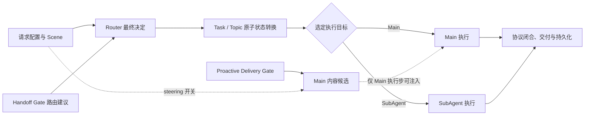
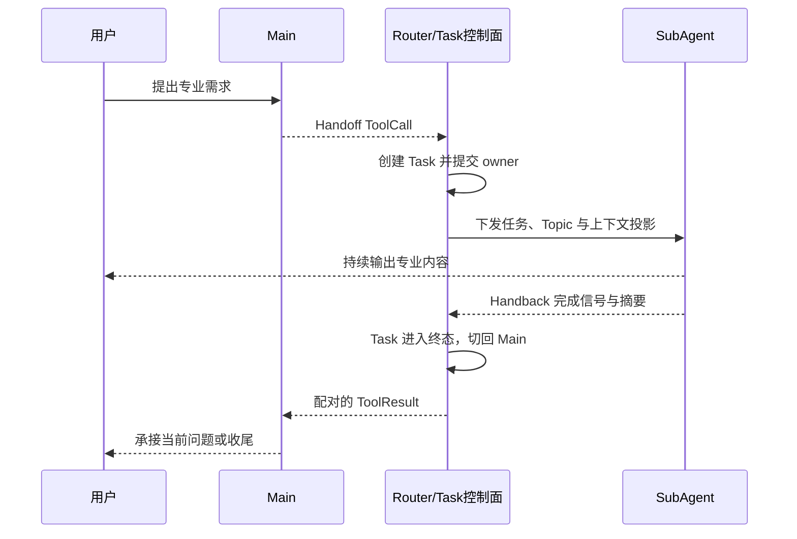
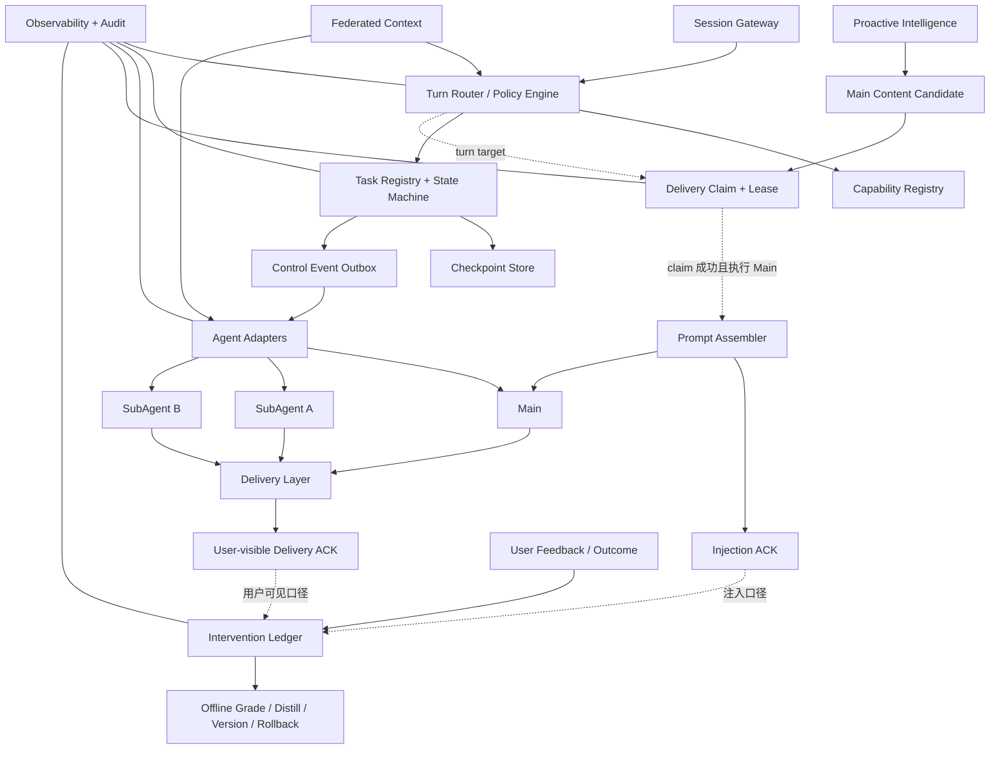

# 统一架构与链路工程设计

## 1. 为什么要把三条链放在一起学习

路由、任务编排和主动服务解决的是三个不同问题：

**路由**：这一轮由谁回答；
**任务编排**：跨轮任务由谁持续负责，怎样暂停、恢复和完成；
**主动服务**：系统是否发现了一个用户没有明确提出、但值得主动帮助的机会。

它们又共享同一套底层约束：请求配置、控制权、状态一致性、上下文隔离、协议闭合、失败降级、时延预算和可观测性。只看其中一条链，很容易出现局部合理、系统冲突：

Gate 认为应该切换，但状态已经被另一请求更新；
- Main 发起了 Handoff，但 Task 尚未建立；
主动服务返回了 steering，但本轮最终去了 SubAgent；
客户端看到了回答，服务端任务状态却没有完成；
一个新 Topic 误用了旧 Task 的上下文或播放游标。

因此，正确的整体理解是：**配置与候选算法提供信号，Router 作为控制面决定所有权，Task 系统保存持续状态，Agent 执行业务，交付层保证用户看到连续结果。**

## 2. 四个平面与权责边界

| 平面 | 核心问题 | 典型能力 | 明确不负责 |
|---|---|---|---|
| 配置面 | 本请求启用哪些模型、Prompt、实验能力 | 场景配置、实验匹配、请求级配置快照 | 不直接切换 Agent，不修改 Task |
| 控制面 | 本轮归谁，Task / Topic 如何变化 | Scene 策略、Handoff Gate、Router、状态机 | 不生成垂类业务内容 |
| 执行面 | 如何完成回答或专业任务 | Main、讲万物等 SubAgent、Tool | 不绕过控制面修改全局 owner |
| 数据与交付面 | 上下文怎样组装，结果怎样保存和送达 | Session / Topic / Task 数据、记忆、SSE、日志、Trace | 不以“没看到日志”反推“没有执行” |

最重要的所有权链：



这条边界带来四个判断：

1. Gate 的PREEMPT是建议，不是已经切回 Main；
2. Main 的 ToolCall 是转交意图，不是 Task 已经创建；
3. SubAgent 的 Handback 是完成信号，不是状态已经清理；
4. 主动服务命中是候选教学意图，不是最终回答已采用。

## 3. 统一业务身份模型

### 3. 1Session：用户感知的连续会话

Session 表示一段连续交互。它是多轮消息、控制状态和客户端重连的外层容器。同一Session 内可以依次经历普通聊天、多个Topic和多个专业Task。

Session不能直接代表当前任务，因为“这段会话还在继续”不等于“刚才那个任务还在继续”。

### 3. 2Turn：一次输入到一次稳定结果

Turn 表示一次用户输入触发的完整处理周期。它应有唯一请求身份，用于连接配置解析、Gate、Router、 Agent执行、输出、持久化和观测。

在流式场景中，一个Turn 会产生多帧，但控制面仍应把它视为一个有开始、有终局的原子业务单元。

### 3. 3Topic：语义上下文边界

Topic回答“当前在谈什么”。它承担三项职责：

区分旧话题与新话题，减少上下文污染；
作为消息、摘要和记忆的归属边界；
为 Task 的暂停与恢复提供可回到的语义位置。

Main 普通续聊通常沿用当前 Main Topic；创建专业任务时进入 Task Topic；从任务抢断回 Main 或任务完成时进入新的 Main Topic；恢复任务时回到原 Topic。

### 3. 4Task：有生命周期的工作单元

Task回答“系统正在替用户完成哪件持续工作”。它至少需要保存：

负责的 Agent;
任务目标；
Topic身份；
最近用户意图；
当前进度摘要；
客户端输出进度；
生命周期状态与版本。

当前一期为了降低复杂度，让新 Task 的 Topic 与 Task 使用同一个身份，但二者概念上必须分开。目标形态采用Topic 1:N Task：一个长期 Topic 可以先后由多次 Task、甚至不同 Agent 执行；单个 Task 仍只归属一个 Topic。若未来要表达任务内部的主题片段，应另建TopicSegment，不能复用 Topic 身份。

### 3. 5 Durable Owner、Turn Target 与 Stream Owner

“谁在处理”至少要拆成三层：

**durable owner**：跨轮任务控制权，保存在 Task 状态中；
**turn target**：本轮Router 实际选择的处理者；
**streamowner**：当前仍有权分配播放游标并向客户端发帧的请求/执行者。

一期大多数正常路径中三者一致，但不能把它们合并成一个字段。Demo 的CLARIFY可以让Main 临时处理本轮而 durable owner 仍是 SubAgent；PREEMPT 提交失败时也可能降级由Main 回答，但不能谎称持久状态已切换。并发请求下，stream owner 还必须独立防止旧请求继续发帧。

Durable owner 变化必须由 Router/状态机提交，turn target 必须记录最终选择，stream owner 必须带lease/epoch；三者都不能由模型自然语言或客户端猜测决定。

### 3. 6 ToolCall ID:跨Agent 协议配对

Main 发起 Handoff 时会形成一个 ToolCall；SubAgent 完成或返回后，Main 需要收到与它配对的 ToolResult。配对身份保证模型历史里每次工具调用都能闭合。

它不等于 Task ID。一个 Task 可能经历重试、恢复或多个工具交互，但每次 ToolCall/ToolResult 都必须单独配对。

### 3. 7GlobalIndex：客户端播放游标

GlobalIndex用于给流式帧排序和支持断线续传。它不等于消息序号、Task 版本或Trace 序号。

不同动作的Task LGI合同是：

| 动作 | Task LGI |
|---|---|
| Main ToolCall 创建新 Task | 固定从 0 开始 |
| Scene bootstrap | 使用合法的客户端初始 LGI；缺失或非法时为 0 |
| CONTINUE | 吸收合法 ACK，并与 active Task 状态对齐 |
| RESUME | 使用 paused Task 保存值，不被当前 Main 请求覆盖 |

Task LGI 可以因进入新任务而重置；真正要求单调的是 Session 对外帧高水位。同一 Session 的并发输出不能重叠或倒退，客户端ACK只能推进已确认进度，不能无条件覆盖服务端高水位。

## 4. 请求级配置为什么必须是快照

一次请求可能受到场景、实验桶、环境配置和默认值共同影响。正确流程是：

```text
请求场景与实验输入
→配置服务完成实际匹配
生成本请求唯一的配置快照
EduBot 侧的 Handoff Gate、Router、Main，以及“是否消费 Proactive 结果"在同一快照上工作
```

主动服务远端的 Delivery Gate 和 L0-L4 使用自己的服务配置域；EduBot 不会把整个 Prompt 配置快照发给主动服务。共享的是 EduBot 对候选结果的消费开关，而不是两边所有配置合并成一份。

必须区分：

1. 请求带来了什么实验输入；
2. 配置服务实际命中了什么；
3. Gate 在该配置下给了什么建议；
4. Router是否应用以及状态是否提交；
5. 最终 Agent 是否真正消费了相应 Prompt 或能力。

若同一请求的不同阶段分别读取动态配置，就可能出现Gate 按旧版本判断、Main 按新版本执行，最终无法解释行为。请求级快照既是正确性设计，也是观测和回放的基础。

## 5. 上下文必须按层次和所有权组装

上下文不是把全部历史拼成一个长字符串。一个合理的结构是：

```text
用户级稳定画像与长期记忆
+当前 Topic 的近期消息
+当前 Task 的目标、进度与 checkpoint
+本轮用户Query
+当前owner的系统指令与能力边界
+本轮被允许消费的主动steering
```

不同数据解决不同问题：

| 数据 | 作用 | 风险 |
|---|---|---|
| 当前Query | 本轮显式需求 | 被历史或steering 淹没 |
| Topic消息 | 局部语义连续性 | 跨Topic 污染 |
| Taskcheckpoint/摘要 | 恢复未完成工作 | 摘要过期、丢失精细状态 |
| 用户画像 | 稳定偏好与事实 | 过期、隐私、越权 |
| Gate最小上下文 | 判断是否继续当前任务 | 输入过多导致慢和偏置 |
| Proactivesteering | 附加教学方向 | 越权改变用户显式意图 |
| ToolCall/ToolResult | 跨Agent 闭环 | 开启未闭合或重复闭合 |

### 5. 1为什么Gate只应读取最小上下文

Handoff Gate 的任务是分类，不是回答。它只需要当前Query、任务目标、最近进度、必要的上一轮信息和 Agent能力。历史越长，成本越高，也越容易让分类模型被旧话题带偏。

### 5. 2为什么Main与SubAgent不能共享所有私有状态

用户级事实可以共享，但垂类 Agent 的内部工作状态、工具中间结果和未完成计划应按 Task 隔离。Main 获得的是可解释、可审计的投影，例如任务目标、进度摘要和完成结果，而不是整个私有运行时。

## 6. 并发一致性与原子状态转换

### 6. 1状态版本与CAS

Gate 读到 Task 状态后，另一个请求可能已经完成抢断或恢复。如果旧请求仍按旧状态写入，就会覆盖新结果。因此每次状态读取都需要版本，Router应以“我判断时看到的版本”作为提交条件。

```text
读取状态revision=10
→计算PREEMPT
→提交时要求revision 仍为10
→若已经是11，则拒绝旧判断并按现态处理
```

CAS解决的是旧判断覆盖新状态的问题，但不能解决全部分布式一致性。

### 6. 2当前原子存储仍解决不了什么

相同业务请求被重复发送；
下游已经执行，但本地状态尚未提交；
SSE已发给客户端，但消息尚未持久化；
Worker崩溃后副作用是否应该重放；
同一 Session 两个请求同时流式输出；
- 多 Worker 同时消费同一个 proactive slot。

这些问题需要进一步组合：幂等command、Session owner/lease、checkpoint、outbox、终态记录和可重放事件日志。

Task CAS 与 proactive slot claim 是两套一致性问题。当前 proactive 的“读候选 →锁外 Judge→ 删除”不是跨 Worker 原子消费，两个 Worker 可能同时判断同一 intervention；Redis 镜像还没有完整保存candidate goal 的提交语义。目标上应使用 delivery_token +atomic claim +lease+ ACK，并让跨机房副本共享 revision，不能误以为 Task Store 的 CAS 已经覆盖主动服务。

### 6. 3建议的不变量

无论一期还是最终形态，都应该明确维护：

个Task 在一个时刻只有一个durableowner；
一个 Session 在一个时刻最多有一个可直接面向用户的输出 owner;
Task的状态变化只能沿合法状态机发生；
Resume 必须指向精确 Task，而不是模糊地恢复“某个旧 Agent”；
Handback/Complete 进入终态，不再作为 paused Task 恢复；
每条ToolCall只能闭合一次；
同一command 重放不产生第二次副作用；
Session 对外帧高水位单调递增；Task LGI 按 CREATE/SCENE/CONTINUE/RESUME 合同变化。

## 7. 跨Agent协议闭合

一次正常 Handoff 的业务闭环：



真正的成功不是某个接口返回成功，而是：

Task在下发前已准备好；
下游收到正确的 Task、Topic 和 Query；
Handback 对应当前 active Task；
Task 进入正确终态；
ToolResult 与原 ToolCall 配对；
Main最终回答响应的是当前用户问题；
客户端帧、消息历史和控制状态顺序一致。

### 7. 1常见失败窗口

| 失败窗口 | 后果 | 目标治理手段 |
|---|---|---|
| ToolCall 已记录，Task 未建立 | 模型历史出现孤儿调用 | prepare-before-dispatch、恢复扫描、outbox |
| Task 已建立，下游调用失败 | 状态显示 active 但没有进展 | 明确失败状态、重试预算、可恢复 checkpoint |
| 下游完成，Handback 未提交 | 重复执行或继续黏在 SubAgent | Handback 幂等、终态版本、补偿事件 |
| Task 已完成，ToolResult 未补回 | Main 历史不闭合 | 协议恢复与孤儿修复 |
| SSE 已发，持久化失败 | 用户视图与服务端视图分叉 | 发送 / 落盘顺序合同、事件重放 |

## 8. 关键路径性能设计

### 8. 1按依赖图并行，而不是机械等待所有分支

入口可以并发启动配置解析、Handoff Gate 和 Proactive Gate，但 Router 不必总等最慢分支：

- active Task 的 Continue 或 paused-only 的 Resume 建议是强 SubAgent-bound 提示，当前入口会提前取消或丢弃主动结果；
- 该优化发生在最终 Router effect 前，Resume 仍可能因 CAS 冲突或状态变化失败，因此它是投机提示，不是已提交路由；
- 若本轮仍可能启动 Main，应保留主动候选；只有 Main 实际执行且开关允许时才注入；
- Router 必须等待会改变 durable owner 的控制信号，不能为了省时绕过状态判断。

这种优化的本质是识别关键依赖，而不是简单“把三个请求并发”。

### 8. 2分层时延预算

```text
总请求耗时
入口解析与安全审核
控制面关键路径
请求级配置
oWr清后作用是否应该重放： Session 满个请求同时流式输出；
Proactive缓存读取与可选投递判断

被选Agent首字与总生成
流式发送
持久化与异步后处理
```

比较耗时时必须先对齐同一请求、同一窗口和相同指标定义。总耗时不能简单与Redis加模型耗时相减，因为网络排队、连接池、序列化、锁等待、审核、Router、SSE和持久化都可能在链路中，而且部分阶段并行。

主动服务还有一个独立预算错配：调用侧约 200ms 的 deadline 小于服务侧约 400ms 的 Judge 预算。调用方可能先返回正常主回答，而服务端稍后仍把候选判 fit、提交 goa l/clock 并删除缓存。目标上需要 deadline propagation、取消感知，或满足caller deadline ≥ 网络余量+ 排队余量+ judge deadline +响应余量。

### 8. 3已有和推荐的优化策略

确定性规则优先，小模型只处理不确定区；
分类模型只输出极短结果，并用 logprob margin 判断可信度；
连接池、严格deadline、取消无用并行分支；
高频Main续聊只刷新必要租约，不制造状态版本变化；
主动服务把昂贵感知/推理放到后台，实时Gate只消费缓存并做轻量适配；
缩短锁内逻辑，把网络和模型调用放在锁外；
对同 Session 引入请求owner/epoch，避免双流交错；
对 Task command、Handback、event、feedback 和 delivery 使用幂等键；
将控制事件写入 durable outbox，再由执行层可靠消费。

## 9. 失败语义与降级原则

主链应尽量继续服务用户，但每次降级都必须可区分：

| 失败点 | 用户侧降级 | 控制面原则 |
|---|---|---|
| 配置服务失败 | 使用稳定默认配置 | 记录配置来源和降级原因 |
| Handoff Gate 超时 | active Task 倾向继续，否则回 Main | 不因路由依赖故障意外丢任务 |
| Proactive Gate 超时 | 不注入 steering，正常回答 | 主动能力不阻塞显式需求 |
| CAS 冲突 | 拒绝旧判断，按现态重决策 | 不覆盖更新后的 Task |
| SubAgent失败 | 受控错误、重试或恢复Main | 避免无限黏住和黑屏 |
| 观测系统故障 | 业务继续 | Telemetry不成为单点 |

“Fail-open”只代表用户体验不断链，不代表工程上可以把失败样本统计成正常命中。至少要区分disabled、 skipped、miss、timeout、error、stale、applied 和 delivered。

## 10. 可观测性要证明业务语义

建议围绕一条业务状态链组织观测：

```text
路由 / 任务链：
请求输入 →实际配置命中 →Handoff Gate advice
→Router target/apply result → Task/Topic 状态前后
→ToolCall/ToolResult/Handback → 最终 responder
客户端输出与持久化终态

主动服务链：
Event accepted →Graph completed → steering staged
→ Delivery Gate fit / unfit / error → EduBot received
→Prompt switch on/off/missing → turn target
→Prompt injected →Main 文本或 ToolCall 中的语义消费
最终responder→用户结果与反馈归因
```
两条链可以共享 request/session/turn 身份，但不能把 steering 和 Tool 协议压缩成同一个阶段。主动
服务还需要 intervention ID、candidate goal revision、delivery token 和 ACK，才能解释“服务已提交状态，但用户并未看到”的分叉。

不同证据的证明范围：

| 证据 | 能证明 | 不能单独证明 |
|---|---|---|
| 接口成功 | 请求到达、协议层正常 | 路由语义和最终效果正确 |
| 配置命中 | 本请求采用了什么能力配置 | Router已应用 |
| Gate结果 | 算法给了什么建议 | 状态已提交 |
| Router transition | 控制状态变化成功 | 下游内容质量正确 |
| Agent调用 | 下游被执行 | 客户端完整收到 |
| 服务端流式帧 | 服务端发送了什么 | 客户端播放顺序正确 |
| 消息与状态持久化 | 服务端最终视图 | 用户实际看见什么 |
| 客户端审计 | 最终交互结果 | 内部阶段是否正确 |

关键指标应同时有：

决策量：各 Gate decision、Router target、transition 数;
质量量：恢复成功、错误切换、孤儿ToolCall、steering 最终消费率；
时延量：各阶段耗时、首字时间、端到端时间；
一致性量：CAS冲突、重复command、状态修复、游标倒退；
降级量：配置、模型、Redis、下游和观测失败次数。

## 11. 安全、隐私与行为边界

三条链都会接触学生消息、画像、学习状态、内部Prompt和干预策略。完整设计至少需要：

Gate和主动服务只读取完成判断所需的最小数据；
用户文本不能伪造内部 Handoff、Handback 或 steering 控制信号；
Tool名称、参数、目标Agent必须白名单校验；
用户、设备、Session 和 Task的关联要防越权读取；
日志默认不记录凭据、完整画像和无必要的用户原文；
模型输入输出观测要有脱敏、长度限制、环境开关和留存周期；
主动策略要有冷启动、频控、拒绝、退出和敏感场景保护；
反馈、event、delivery 和ToolCall 要防重放；
长期记忆、短期 Redis 状态和 Trace 分别定义生命周期。

## 12. 目标架构

最终形态不应是“给Redis 多加几个字段”，而应形成独立、可演进的多Agent 控制面：



核心原则：

1. Router/Task State Machine 是唯一控制权威；
2. Main是通用聊天、澄清和兜底能力，不是所有状态的隐式权威；
3. 每个专业 Agent 通过 Adapter 接入统一 Task/Tool/Handback 合同;
4. 上下文采用联邦投影，共享稳定事实，隔离私有工作状态；
5. Task Registry 支持多 paused Task、精确恢复和可查询历史；
6. checkpoint/restore 保证恢复的是工作进度，而不仅是 Agent 名称；
7. command_id + CAS + outbox 保证控制事件可幂等、可恢复;
8. 主动服务提供 Main 内容候选，不参与 owner 选择；Turn target、Prompt 开关和用户显式需求共同决定能否注入；
9. proactive slot 使用全局原子 claim、delivery token 和 lease；Injection ACK 由 Prompt 组装层确认，用户可见 Delivery ACK 由交付层确认，二者不能合并；goal / clock / 知识点应选择并固定一种业务口径后提交；
10. Intervention Ledger、反馈归因、离线评分、策略版本和回滚共同组成可学习闭环，不能用 Gate hit 代替。

## 13. 分阶段演进建议

### 阶段一：收敛一期语义

明确 Gate advice 与 Router effect;
统一Handback、退出、Preempt、CLARIFY 的状态语义;
收敛 Task/Topic/LGI 的单一决议点；
补齐 ToolCall/ToolResult 闭合和孤儿修复；
建立请求级配置快照和语义观测。

### 阶段二：引入 Task Registry 与显式状态机

从单一 paused 槽位升级为可查询 Task Registry;
将暂停、恢复、完成和取消变成合法状态转换；
为 Task 增加 command_id、revision、checkpoint 元数据；
对异构Agent 建立统一Adapter。

### 阶段三：可靠执行与联邦上下文

checkpoint/restore 接入真实 SubAgent;
控制事件使用durable outbox；
引入 Session 请求 owner/lease 和客户端游标世代；
Main、Task、用户记忆按权限投影。

### 阶段四：主动服务形成可学习闭环

steering的生成、投递、消费和结果均可关联；
pending slot 使用全局原子 claim、delivery token、lease 与超时释放；
candidate goal 完整持久化，并明确选择 Injection ACK 或用户可见 Delivery ACK 作为提交口径；
多机房副本携带统一revision，避免重复消费；
feedback/evidence 真正持久化；
在线频控与离线经验蒸馏形成版本化策略；
使用业务收益与安全指标驱动策略送代，而不是只优化命中率。

## 14. 综合案例：从专业任务到抢断、恢复和主动介入

假设用户依次说：

```text
帮我讲恐龙
继续讲霸王龙
先问一道数学题
继续刚才的恐龙
我有点跟不上
```

完整系统应这样理解：

1. 第一轮 Main 或 Scene 策略创建讲解 Task，进入恐龙 Topic，专业 Agent 成为 owner；
2. 第二轮 Gate 判断仍属于 active Task，Router 保持 owner，沿用 Task 与播放进度；
3. 第三轮 Gate 判断新问题不属于当前 Task，Router 将恐龙 Task 暂停并进入新的 Main Topic；
4. 第四轮规则识别明确恢复意图：一期恢复原Task、Topic、进度摘要和 LGI；目标状态机还会在 RESuMING 阶段 restore checkpoint，成功后才切 durable owner;
5. 第五轮显式求助仍在 active Task 内。当前入口会丢弃 Proactive 结果，主动服务 L1 也会因处于 Handoff 状态阻断后台 Graph，因此应由专业 Agent 根据自己的 Task 上下文降低难度。只有先由 Router 回到Main、Main 完成本轮回答并发送 Event后，主动服务才可能为**再下一轮**生成候选；面向 SubAgent 的 route-aware steering 属于未来独立合同；
6. 当专业 Agent 正常 Handback， Task 进入完成态，Router 给 Main 补齐 ToolResult，并由 Main 承接后续普通对话。

这个案例同时检验：路由归属、任务状态、Topic隔离、恢复算法、主动策略边界、协议闭合和客户端连续性。

## 15. 学习完成标准

如果能独立回答以下问题，才算真正掌握整体设计：

为什么候选Gate不能直接修改 Task？
Scene Direct、active sticky、Main ToolCall Handoff 分别适合什么场景?
Session、Topic、Task、Owner、ToolCall 和Global Index 各解决什么问题？
Preempt与Handback 为什么一个可恢复、一个不可恢复？
为什么一期两个容量为一且互斥的active/paused 槽位不是通用任务编排？
CAS 解决什么，又为什么仍需要command_id、checkpoint 和 outbox?
主动服务从上一轮事件到下一轮Gate的时序是什么？
为什么主动服务命中不等于Main 已消费，更不等于业务有效？
怎样证明一次Handoff 在控制状态、模型协议、客户端输出和持久化上都成功？
目标架构为什么必须是控制面、Task Registry、联邦上下文和 Agent Adapter 的组合？

