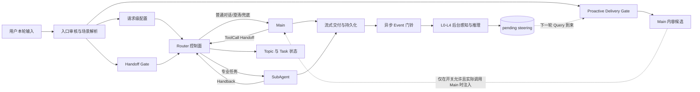

# EduBot 路由、任务编排与主动服务完整学习手册

这套文档只讲系统本身：完整业务逻辑、核心算法、状态设计、跨服务协议、工程优化、异常边界和最终演进形态。

正文直接从业务问题出发，依次解释业务流程、算法判断、状态变化、工程取舍和最终形态。

## 文档目录

1. [路由与 Handoff 完整业务逻辑](./01-路由与Handoff完整业务逻辑.md)
   - 一轮请求怎样决定由 Main 还是 SubAgent 承接；
   - 前置轻量路由、Scene、Handoff Gate、主动服务与 Router 的关系；
   - Main ToolCall Handoff、sticky Handoff、Handback 和协议闭合；
   - 路由算法、并发一致性、失败降级、时延与观测设计。

2. [任务编排与 Topic 完整设计](./02-任务编排与Topic完整设计.md)
   - Session、Topic、Task、Owner 和播放游标的边界；
   - 一期 active/paused 两个容量为一且互斥槽位的完整状态转换；
   - 新建、继续、抢断、恢复、完成时 Topic 如何变化；
   - 算法 Demo 的完整状态机、checkpoint/restore、幂等和目标架构。

3. [主动服务完整业务与算法设计](./03-主动服务完整业务与算法设计.md)
   - EduBot 与主动服务两侧的端到端链路；
   - 从上一轮 `/events` 到下一轮 `/gate` 的实时 Steering 时序；
   - 感知、规则门、推理、目标维护、投递和反馈算法；
   - 缓存、多 Worker、一致性、超时、频控、安全和未来学习闭环。

4. [统一架构与链路工程设计](./04-统一架构与链路工程设计.md)
   - 三条链怎样组成一个统一多 Agent 系统；
   - 配置面、控制面、执行面、数据与交付面的权责；
   - 上下文隔离、CAS、幂等、outbox、SSE 和语义验收；
   - 目标控制面架构、分阶段演进路线和综合案例。

## 先建立的系统全景



学习这套系统时，始终抓住三个问题：

1. **谁有最终决定权？** Scene 和 Handoff Gate 提供路由候选，Router 拥有最终路由和状态变更权；主动服务只提供 Main 可舍弃的内容候选。
2. **什么状态需要跨轮保存？** Session 保持会话连续，Topic 隔离语义，Task 保存持续工作，Owner 表示当前控制权。
3. **什么才算真正成功？** 不是接口成功，而是候选判断、状态转换、Agent 执行、协议闭合、客户端结果和持久化终态共同正确。

## 当前实现与最终形态

| 能力 | 当前形态 | 最终形态 |
|---|---|---|
| 路由 | Scene、规则、小模型和 Main ToolCall 组合 | 独立可演进的 Turn Router / Policy Engine |
| 任务状态 | 两个容量为一且互斥的槽位：active-only 或 paused-only | Task Registry 支持一个 active 与多个 paused Task、精确恢复 |
| Topic | 一期与 Task 强绑定 | Topic 与 Task 解耦，一个 Topic 可保留多次 Task 执行 |
| 暂停恢复 | 保存摘要、Topic 和游标后直接恢复 | SUSPENDING/PAUSED/RESUMING + checkpoint/restore |
| 一致性 | 状态版本和 CAS | command 幂等、Session owner、outbox、可重放事件 |
| 主动服务 | 异步生成 pending steering；实时 Gate 判断是否仍 fit，开关与 Main 执行决定能否注入 | 生成、投递确认、消费、反馈、证据和离线蒸馏闭环 |
| 上下文 | Main、Task、画像和记忆的组合投影 | 联邦上下文，稳定事实共享、私有工作状态隔离 |

## 推荐阅读顺序

第一次阅读建议按1→2→3→4：

1. 先搞清“一轮请求归谁”；
2. 再理解“跨轮任务怎样保持”；
3. 然后学习“系统怎样主动发现机会”；
4. 最后把三条链放回统一控制面，理解工程取舍和最终架构。

第二次阅读建议选择一个完整案例贯穿四篇，例如：

```text
帮我讲恐龙
→ 继续讲霸王龙
→ 先问一道数学题
→ 继续刚才的恐龙
→ 我有点跟不上
→ 专业任务完成并返回 Main
```

逐轮回答：当前 owner 是谁、active/paused Task 是什么、Topic 是否变化、Gate 为什么这样判断、客户端游标怎样延续、主动 steering 是否允许消费、最终协议怎样闭合。

