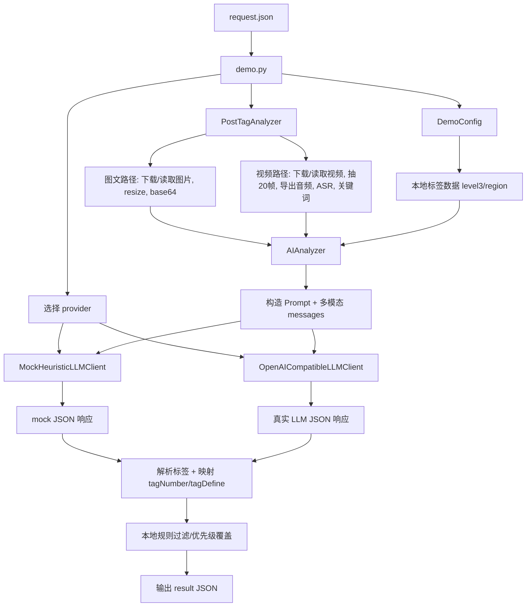

# AI Tags Demo 技术文档

> 日期: 2026-03-30  
> 版本: V2（独立算法 Demo）  
> 核心代码量: `demo.py + core/*.py` 约 1,278 行 Python  
> 定位: 面向“教育内容兴趣标签 + 地域标签”抽取链路的可独立运行 Demo  
> 目标: 单独阅读本文档，可以理解 `aitags` 目录的模块边界、运行方式、核心算法、设计取舍与已知问题

---

## 目录

1. [项目定位与边界](#1-项目定位与边界)
2. [整体架构](#2-整体架构)
3. [目录结构与模块职责](#3-目录结构与模块职责)
4. [完整执行链路](#4-完整执行链路)
5. [入口层：`demo.py`](#5-入口层demopy)
6. [配置层：`DemoConfig`](#6-配置层democonfig)
7. [媒体编排层：`PostTagAnalyzer`](#7-媒体编排层posttaganalyzer)
8. [标签理解层：`AIAnalyzer`](#8-标签理解层aianalyzer)
9. [LLM Client 抽象层](#9-llm-client-抽象层)
10. [数据结构全览](#10-数据结构全览)
11. [Prompt 设计与规则后处理](#11-prompt-设计与规则后处理)
12. [运行模式、依赖与降级策略](#12-运行模式依赖与降级策略)
13. [关键设计决策](#13-关键设计决策)
14. [已知问题与技术债](#14-已知问题与技术债)
15. [如何把这个 Demo 讲成面试项目](#15-如何把这个-demo-讲成面试项目)

---

## 1. 项目定位与边界

### 1.1 这个目录到底是什么

`aitags` 不是原始生产服务，而是把原项目中“标签抽取算法主链路”独立出来后的演示目录。

它保留的核心能力是：

- 图文/视频内容预处理
- 视频均匀抽帧
- 视频音频转写入口
- 本地兴趣标签候选与地域标签候选组织
- 多模态 Prompt 构造
- LLM 返回 JSON 解析
- 本地后验规则过滤

它刻意移除的上下游集成包括：

- HTTP 服务入口
- Apollo 配置中心
- 远端标签拉取
- 回调通知
- 生产环境部署脚本

所以这个 Demo 的真实定位应该表述为：

> 一个聚焦“教育内容标签理解”的独立算法演示目录，而不是完整生产服务。

### 1.2 解决的业务问题

输入一条教育内容动态：

- 图文帖子
- 视频帖子

输出两类标签：

- **兴趣标签**：描述内容主题，例如 `物理`、`中考`、`地方教育通知`
- **地域标签**：不是抽地名，而是判断“最应该接收这条内容的用户当前所在地域”

### 1.3 为什么要做成独立 Demo

原始服务的问题是：

- 算法逻辑和 HTTP/回调/Apollo 混在一起
- 不适合单独演示算法主链
- 不适合面试场景快速解释“核心价值”

把它独立出来的目的不是“重做一套系统”，而是：

1. 把算法主干从基础设施里剥离
2. 保留真实业务约束
3. 允许本地 mock 运行
4. 允许切换到真实 OpenAI 兼容接口

---

## 2. 整体架构

### 2.1 四层结构

```text
CLI 入口层
    demo.py
        ↓
配置层
    DemoConfig
        ↓
媒体编排层
    PostTagAnalyzer
        ↓
标签理解层
    AIAnalyzer
        ↓
LLM Provider 抽象
    MockHeuristicLLMClient / OpenAICompatibleLLMClient
```

### 2.2 完整流程图



### 2.3 本 Demo 和原服务的本质差别

| 维度 | 原服务 | `aitags` Demo |
|---|---|---|
| 启动方式 | HTTP 服务启动 | CLI 启动 |
| 配置来源 | Apollo + 本地兜底 | 纯本地 JSON + 环境变量 |
| 标签返回 | 回调给上游 | 直接打印 JSON |
| LLM 依赖 | 真实网关 | `mock` 或真实网关 |
| 使用场景 | 集成服务 | 演示算法链路 |

---

## 3. 目录结构与模块职责

### 3.1 目录树

```text
aitags/
├── README.md
├── TECH_DOC.md
├── TECH_aisearch.md
├── TECH_userprofile.md
├── requirements.txt
├── demo.py
├── assets/
│   ├── demo_image_physics.png
│   ├── demo_video_cover.png
│   └── demo_video_policy.mp4
├── __init__.py
├── examples/
│   ├── image_request.json
│   └── video_request.json
├── data/
│   ├── level3_tags_info.json
│   └── region_tags_info.json
└── core/
    ├── __init__.py
    ├── config.py
    ├── llm_clients.py
    ├── ai_analyzer.py
    └── post_tag_analyzer.py
```

### 3.2 文件职责表

| 文件 | 职责 |
|---|---|
| `demo.py` | CLI 入口，装配 request、provider、config、analyzer |
| `core/config.py` | 本地配置与标签 JSON 加载 |
| `core/post_tag_analyzer.py` | 图文/视频媒体预处理与编排 |
| `core/ai_analyzer.py` | Prompt 构造、候选标签组织、结果解析、规则过滤 |
| `core/llm_clients.py` | LLM provider 抽象，支持 `mock` 和 OpenAI 兼容接口 |
| `assets/*` | 目录内本地媒体样例，保证 demo 不必依赖外网 URL |
| `data/*.json` | 本地标签候选源 |
| `examples/*.json` | 演示输入样例 |

### 3.3 当前目录的独立化修正

这一版 `aitags` 已经补了几项关键的独立化修正：

- 包内 import 已统一为 `aitags.*` 语义，不再残留 `algorithm_demo.*`
- 示例请求默认引用 `assets/` 下的本地媒体，而不是外网 URL
- `demo.py` 会把 request 里的相对路径解析为相对 request 文件所在目录的绝对路径
- 环境变量优先使用 `AITAGS_*`，并兼容旧的 `ALGO_DEMO_*`
- 媒体处理补了缺 `cv2` / 缺 `moviepy` 时的降级路径

但这不等于它已经是标准 Python 包。它仍然依赖脚本启动时的路径注入，后面会单独说明。

---

## 4. 完整执行链路

### 4.1 CLI 路径

```text
python aitags/demo.py --request examples/image_request.json --provider mock
```

执行顺序：

1. 解析命令行参数
2. 读取 request JSON
3. 根据参数覆盖 `needInterestTag` / `needRegionTag`
4. 初始化 `DemoConfig`
5. 选择 provider
6. 初始化 `PostTagAnalyzer`
7. 调用 `analyze_request`
8. 输出结果 JSON

### 4.2 图文路径

```text
request(type=image)
    ↓
收集 image_urls + image_paths
    ↓
逐张读取图片（本地或远程）
    ↓
cv2 解码 + 宽度压缩到 800
    ↓
JPEG 编码 + base64
    ↓
AIAnalyzer 构造多模态 Prompt
    ↓
LLM provider 返回 level3_tags / region_tags
    ↓
规则后处理
    ↓
输出 tags / regionTags
```

### 4.3 视频路径

```text
request(type=video)
    ↓
选择 video_url 或 video_path
    ↓
远程视频则下载到临时目录
    ↓
moviepy 读取 duration / fps
    ↓
按总帧数均匀抽 20 帧
    ↓
每帧 resize + JPEG + base64
    ↓
若有音轨且 enable_asr=True，则导出 16k wav
    ↓
FunASR 转写 + jieba 关键词
    ↓
如有封面，再把封面图插到 frames[0]
    ↓
AIAnalyzer 构造 Prompt
    ↓
LLM provider 返回标签
    ↓
规则后处理
    ↓
输出 result JSON
```

### 4.4 真正的“算法边界”

这个 Demo 的算法核心到哪里为止？

- 到 `AIAnalyzer._call_llm_api()` 为止，是“内容理解前的特征组织 + LLM 调用”
- `MockHeuristicLLMClient` 与 `OpenAICompatibleLLMClient` 是“决策提供者”
- LLM 之后的解析与规则过滤，仍然属于算法主链

因此边界不是“LLM 前”，而是：

> 输入内容预处理 + LLM 决策 + 后验纠偏，三者合起来才是这个 Demo 的算法主链。

---

## 5. 入口层：`demo.py`

### 5.1 主要职责

`demo.py` 只做装配，不做业务决策。

职责包括：

- 参数解析
- request 加载
- provider 选择
- config 初始化
- analyzer 初始化
- 结果输出

这是一种典型的“thin entrypoint”设计。

### 5.2 参数定义

关键参数如下：

| 参数 | 作用 |
|---|---|
| `--request` | 指向输入 JSON |
| `--provider` | `mock` 或 `openai-compatible` |
| `--llm-base-url` | 覆盖真实 LLM 网关 URL |
| `--llm-api-key` | 覆盖真实 LLM key |
| `--llm-model` | 覆盖模型名 |
| `--need-interest-tag` | 覆盖 request 中的兴趣标签开关 |
| `--need-region-tag` | 覆盖 request 中的地域标签开关 |
| `--disable-asr` | 视频 demo 跳过 FunASR |
| `--output` | 保存输出 JSON |
| `--log-level` | 日志级别 |

### 5.3 设计意义

这层设计的价值不是复杂，而是明确：

- **输入是 request 文件**
- **输出是结果文件/标准输出**
- **中间 provider 和 analyzer 都可替换**

这让 Demo 更像一个“算法实验壳”，而不是绑定固定部署环境。

### 5.4 一个仍然存在的问题

`demo.py` 通过下面的方式修正 Python 路径：

```python
CURRENT_DIR = Path(__file__).resolve().parent
PROJECT_ROOT = CURRENT_DIR.parent
if str(PROJECT_ROOT) not in sys.path:
    sys.path.insert(0, str(PROJECT_ROOT))
```

这说明目录没有被按标准 Python package 安装，只是通过运行时 `sys.path` 注入让脚本可执行。

这在 Demo 场景可接受，但在正规可发布包场景是不规范的。

---

## 6. 配置层：`DemoConfig`

### 6.1 职责

`DemoConfig` 的目标非常单纯：

- 读取本地标签 JSON
- 读取 LLM 相关环境变量
- 组织出 `get_config()` 可返回的字典

### 6.2 它和原服务 `Config` 的差异

原服务 `Config`：

- Apollo
- 定时刷新
- 远端标签拉取
- 本地兜底

Demo `DemoConfig`：

- 纯本地数据
- 无调度器
- 无远端依赖
- 无状态刷新

这个差异是刻意设计，不是功能缺失。因为 Demo 要解决的是：

- 独立性
- 可复现性
- 可演示性

### 6.3 加载字段

`DemoConfig` 返回的配置字典主要包括：

```python
{
    "llm_url": ...,
    "api_key": ...,
    "llm_model": ...,
    "level3_tags_cache": [...],
    "region_tags_cache": [...]
}
```

### 6.4 标签数据兼容逻辑

兴趣标签支持两种结构：

1. 远端风格：

```json
{
  "code": 0,
  "data": {
    "list": [...]
  }
}
```

2. 本地风格：

```json
[
  {"tagName": "...", "tagNumber": "...", "description": "..."}
]
```

地域标签同理支持：

1. 远端风格 `{"code":0,"data":[...]}`
2. 本地风格 `[...]`

这说明 `DemoConfig` 不是简单“读 JSON”，而是保留了原服务中对标签结构兼容的思路。

### 6.5 设计评价

优点：

- 简单
- 无外部依赖
- 容易复现

缺点：

- 无热更新
- 无标签数据校验
- 无版本管理

---

## 7. 媒体编排层：`PostTagAnalyzer`

这是 Demo 里最接近“多模态内容预处理引擎”的部分。

### 7.1 职责

`PostTagAnalyzer` 同时负责：

- 图文和视频路径分发
- 本地/远程资源读取
- 图片 resize + base64
- 视频下载与清理
- 视频抽帧
- 音频转写
- 关键词抽取
- 调用 `AIAnalyzer`

它实际上是整个 Demo 的 orchestration core。

### 7.2 初始化阶段

初始化时会创建：

- `config_instance`
- `AIAnalyzer`
- `enable_asr`
- `audio_lock`
- `ali_audio_model = None`

需要注意的是：

- ASR 模型不是启动时就加载
- 而是在 `_get_audio_model()` 第一次被调用时懒加载

这个设计比原服务更合理，因为它避免了：

- 图文 demo 启动时也要加载 ASR 模型
- `--disable-asr` 时还要碰重依赖

### 7.3 图文路径详解

#### 输入支持

图文支持两类来源：

- `image_urls`
- `image_paths`

两者会被拼成一个统一列表：

```python
image_sources = [*(image_urls or []), *(image_paths or [])]
```

这意味着 Demo 比原服务更强，因为：

- 原服务主要面向 URL
- Demo 额外支持本地图片，方便脱离线上资源演示

#### 图像处理步骤

每张图的处理是：

1. `_load_binary()` 读取二进制
2. `cv2.imdecode` 解码
3. 若宽度大于 `800`，按比例缩小
4. `cv2.imencode(".jpg", frame)` 转 JPEG
5. `base64.b64encode(...)`

为什么要压缩到 800 宽？

- 降低多模态输入体积
- 避免大图直接传给 LLM 导致 token 与带宽成本上升

#### 失败策略

单张图失败不会中断整体：

- 记录 warning
- 继续处理下一张图

这是典型的“部分容错”策略。

### 7.4 视频路径详解

#### 7.4.1 视频来源处理

如果是远程 URL：

- 下载到临时目录

如果是本地路径：

- 直接使用现有文件

所以 `_resolve_video_source()` 的返回值是：

```python
(video_path, temp_dir)
```

`temp_dir` 只有远程下载时才不为空。

#### 7.4.2 均匀抽 20 帧

抽帧逻辑不是按固定秒数，而是按总帧数均匀采样：

```python
frame_interval = max(total_frames // 20, 1)
frame_positions = list(range(0, total_frames, frame_interval))[:20]
```

如果最后一帧没包含进去，且还没达到 20 帧，会补最后一帧。

这个策略的优点：

- 简单
- 成本可控
- 对不同长度视频统一行为

缺点：

- 没有时序理解
- 抽不到关键镜头时，信息会丢

#### 7.4.3 音频转写

若视频存在音轨且 `enable_asr=True`：

1. 导出 `16k` WAV
2. `_transcribe_audio_ali()` 调用 FunASR
3. 若有 transcript，再用 `jieba` 做关键词统计

#### 7.4.4 为什么要加 `audio_lock`

`_transcribe_audio_ali()` 包裹了：

```python
with self.audio_lock:
    result = model.generate(...)
```

这说明作者默认假设：

- FunASR 推理线程安全不可靠
- 或者模型资源占用高，不适合并发冲击

代价是：

- 视频并发时，ASR 实际串行

#### 7.4.5 封面图插入策略

若传入 `cover_url` 或 `cover_path`：

- 封面被插到 `frames[0]`

这意味着视频视觉输入不是纯时间序列帧，而是：

- 封面优先
- 正文帧随后

这是一个非常业务化的设计，因为封面常常最概括主题。

### 7.5 关键词抽取的真实作用

`_extract_keywords()` 会产出：

- `keywords`
- `word_freq`

但要注意：

- 它们只被放进 `audio_info`
- **没有直接进入 Prompt**

所以它们现在是：

- 调试/观察特征
- 不是最终决策的主特征

### 7.6 输出结构

无论图文还是视频，最终输出都统一为：

```python
{
    "tags": {...},
    "regionTags": {...}
}
```

这让上层 CLI 不需要关心内部差异。

---

## 8. 标签理解层：`AIAnalyzer`

`AIAnalyzer` 是 Demo 里真正的“标签决策控制器”。

### 8.1 职责

它做的事不是单纯“调 LLM”，而是：

1. 组织候选兴趣标签和地域标签
2. 把树形地域标签拍平
3. 构造 Prompt
4. 构造多模态 `messages`
5. 调用 `llm_client.complete()`
6. 解析 JSON
7. 把标签映射回 `tagNumber` / `tagDefine`
8. 做后验规则过滤

### 8.2 兴趣标签候选组织

候选兴趣标签来自 `level3_tags_cache`。

主要派生出两个视图：

#### `level3_tags_simple`

只保留标签名列表，例如：

- `升学新政`
- `地方教育通知`
- `物理`
- `中考`

它直接进入 Prompt，作用是约束模型“只能从这里选”。

#### `tags`

结构是：

```python
{
    "物理": ("33", "与学校物理课程进度同步..."),
    ...
}
```

作用是把模型返回的标签名映射回：

- `tagNumber`
- `tagDefine`

### 8.3 地域标签候选组织

地域标签更复杂，因为输入是树。

处理逻辑：

1. `_flatten_region_tags()` 深度遍历树
2. 如果节点有 children，继续递归
3. 只保留叶子
4. 过滤与顶层目录重名的伪叶子，例如 `国内地区`
5. `region_leaf_tags` 再按 `regionName` 去重

然后再衍生：

- `region_tags_simple`
- `region_tags`

### 8.4 一个重要但不体面的现实

`region_leaf_tags` **没有过滤** `needHidden=True` 的节点。

这意味着：

- 一些理论上不该进入候选集的隐藏地域
- 仍可能进入 Prompt

这是算法主链的真实技术债，不能忽略。

### 8.5 Prompt 构造策略

#### 图文兴趣标签 Prompt

强调：

- 标题最重要
- 图片作为辅助证据
- 必须从候选列表选择
- 要参考标签定义
- 要参考正负示例

#### 视频兴趣标签 Prompt

强调：

- 音频转写是核心依据
- 视频画面是辅助
- 标题进一步补充

#### 地域标签 Prompt

强调：

- 不是抽取地名
- 而是识别“最应该接收内容的用户当前所在地域”
- 如果只是提到地点，但不是地域定向内容，应返回空数组

这个语义设定比普通 NER 更接近分发系统需求。

### 8.6 多模态消息格式

`_build_messages()` 组装的是 OpenAI 兼容消息体：

```python
[
  {"role": "system", "content": "..."},
  {"role": "user", "content": [
      {"type": "text", "text": prompt},
      {"type": "image_url", "image_url": {"url": "data:image/jpeg;base64,...", "detail": "low"}}
  ]}
]
```

所以本 Demo 的多模态本质上是：

- 文本 Prompt
- 多张图像

视频被转换成“多帧图片 + 音频文本”。

### 8.7 规则后处理

LLM 返回标签之后，不会被直接信任。

会经过：

#### `_validate_tag_by_rules`

按标签配置必含词和排除词。

例如：

- 学科标签必须有 `课内/教材/知识点/解题/...`
- `生态环境` 要有生态学信号，不能只是园艺
- `竞赛活动` 必须是正规竞赛，不是闯关小游戏

#### `_apply_priority_overrides`

如果标签里包含 `地方教育通知`：

- 只允许和 `书籍推荐 / 中考 / 高考` 共存

这是明显的业务压制逻辑。

#### `_post_validate_and_filter`

串起：

1. 规则校验
2. 优先级覆盖
3. 去重
4. 限制最多 3 个标签

### 8.8 响应解析

`_parse_response()` 做两件事：

1. 尝试把 content 解析成 JSON
2. 只保留候选映射表里存在的标签

这一步防止：

- LLM 自创标签
- 返回格式污染

---

## 9. LLM Client 抽象层

这一层是 `aitags` 相比原始服务最有“Demo 意识”的重构。

### 9.1 `LLMTask`

```python
@dataclass
class LLMTask:
    messages: list[dict[str, Any]]
    response_field: str
    candidate_names: list[str]
    context_text: str
    post_id: str | None = None
```

它把一次 LLM 调用显式结构化了，优势是：

- provider 之间输入统一
- mock 与真实接口都可以消费同一任务结构

### 9.2 `BaseLLMClient`

抽象基类只有一个方法：

```python
complete(task: LLMTask) -> str
```

这意味着 `AIAnalyzer` 不关心 provider 细节，只关心返回一个文本字符串。

### 9.3 `OpenAICompatibleLLMClient`

#### 作用

对接真实 OpenAI 兼容接口。

#### 关键逻辑

- 自动清理 base URL 末尾的 `/chat/completions`
- 请求体中使用：
  - `model`
  - `max_tokens=800`
  - `temperature=0.0`
  - `stream=True`
- 用 `requests.post(... stream=False)` 发请求
- 再按 SSE 风格逐行解析 `data: ...`

#### 需要指出的不一致

它虽然请求体写了 `stream=True`，但 `requests` 侧没有真正开启流式消费优势，仍然是：

- 协议上按流式
- 客户端库上按非流式

这和原服务的实现保持一致，但并不优雅。

### 9.4 `MockHeuristicLLMClient`

这是本 Demo 最重要的“独立性补丁”。

#### 作用

不依赖任何线上 LLM 服务，也能完整走：

- request → analyzer → provider → response → filter → result

#### 兴趣标签 mock 逻辑

使用：

- 关键词表
- 学科词表
- 课内信号表
- 若干业务直觉规则

例如：

- 命中 `教育局/学校/通知/公告` -> `地方教育通知`
- 命中 `中考` -> `中考`
- 命中 `物理 + 知识点/课堂/教学` -> `物理`

#### 地域标签 mock 逻辑

使用：

- 地域信号词
- 通用内容排除词
- 小规模城市到省份映射表

例如：

- `长沙` -> `湖南`
- `石家庄` -> `河北`
- `乌鲁木齐` -> `新疆`

#### 关键限制

必须明确：

- 它**不看图片本身**
- 它只看 `context_text`
- 视频场景里看到音频内容，是因为 `context_text` 已把 transcript 拼进去

所以 mock provider 只能证明：

- 算法链路能跑

不能证明：

- 真实多模态识别效果

这是一个本质限制，不能故意模糊。

---

## 10. 数据结构全览

### 10.1 Request JSON

图文示例：

```json
{
  "post_id": "demo-image-001",
  "type": "image",
  "title": "物理知识点总结",
  "text": "初中电学知识点梳理，面向中考复习。",
  "image_paths": ["../assets/demo_image_physics.png"],
  "needInterestTag": true,
  "needRegionTag": false
}
```

视频示例：

```json
{
  "post_id": "demo-video-001",
  "type": "video",
  "title": "长沙小升初政策解读",
  "text": "长沙本地升学家庭关注的小升初政策说明。",
  "video_path": "../assets/demo_video_policy.mp4",
  "cover_path": "../assets/demo_video_cover.png",
  "needInterestTag": true,
  "needRegionTag": true
}
```

### 10.2 Result JSON

CLI 最终输出结构：

```json
{
  "provider": "mock",
  "elapsed_seconds": 0.123,
  "request": {...},
  "result": {
    "tags": {
      "raw_response": "...",
      "status": "...",
      "tagName": ["物理"],
      "tagNumber": ["33"],
      "tagDefine": ["..."]
    },
    "regionTags": {
      "raw_response": "...",
      "status": "...",
      "tagName": [],
      "tagNumber": [],
      "tagDefine": []
    }
  }
}
```

### 10.3 视频中间结构 `video_info`

```python
{
    "frames": [base64_jpg, ...],
    "frame_info": [
        {
            "index": 1,
            "position": 320,
            "timestamp": 10.67,
            "size": (800, 450)
        }
    ],
    "video_info": {
        "duration": 32.0,
        "total_frames": 960,
        "fps": 30.0,
        "extracted_frames": 20
    },
    "audio_info": {
        "transcript": "...",
        "keywords": [...],
        "word_freq": {...}
    }
}
```

### 10.4 标签 DTO

无论兴趣标签还是地域标签，统一使用：

```python
{
    "tagName": list[str],
    "tagNumber": list[str],
    "tagDefine": list[str]
}
```

这保证了输出层一致。

### 10.5 本地数据集结构

#### `level3_tags_info.json`

每个兴趣标签核心字段：

- `tagName`
- `tagNumber`
- `description`

本地候选规模约：

- `108` 个兴趣标签

#### `region_tags_info.json`

树形结构，顶层至少包括：

- `国内地区`
- `国外地区`

拍平与去重后，实际候选大约：

- `47` 个叶子候选
- 其中约 `12` 个带 `needHidden=true`

---

## 11. Prompt 设计与规则后处理

### 11.1 Prompt 的本质角色

本 Demo 并不是“让模型自由总结”，而是“让模型从候选集合里做受约束选择”。

Prompt 的作用是：

1. 明确任务定义
2. 明确候选集合
3. 明确正负示例
4. 约束返回格式

### 11.2 兴趣标签 Prompt

关键约束有三层：

#### 候选约束

只能从 `level3_tags_simple` 里选。

#### 业务定义约束

给出标签定义，而不是只给标签名，防止模型按字面理解。

#### 正负样例约束

例如：

- `"细胞分裂过程详解"` -> `生物`
- `"数学家的有趣故事"` 不能选 `数学`

### 11.3 地域标签 Prompt

真正重要的是：

> 地域标签不是“哪里被提到”，而是“最应该接收内容的人当前在哪里”。

这是整个地域判定的业务核心。

### 11.4 后验规则存在的必要性

如果只靠 Prompt，会出现：

- 模型泛化过度
- 学科标签被滥打
- 通知类内容与泛知识内容混淆

因此必须再加本地规则。

### 11.5 当前规则体系覆盖范围

当前规则重点覆盖：

- 学科标签
- `生态环境`
- `竞赛活动`
- `地方教育通知`
- `书籍推荐`

这是“重点治理”，不是完整覆盖。也就是说：

- 有些标签很严格
- 有些标签几乎完全靠 LLM

这不是完美设计，但很现实。

---

## 12. 运行模式、依赖与降级策略

### 12.1 `mock` 模式

优点：

- 不需要 API key
- 不需要线上 LLM
- 能跑通完整算法链路

缺点：

- 不看图像内容
- 不等于真实模型效果

### 12.2 `openai-compatible` 模式

优点：

- 真正走多模态 Prompt
- 更接近线上效果

缺点：

- 依赖外部网关
- 依赖 API key
- 调试成本更高

### 12.3 `--disable-asr`

这是非常实用的演示开关。

意义在于：

- 视频 Demo 不一定总需要完整音频转写
- 在机器依赖不齐全时，可以先演示视频抽帧 + LLM 主链

### 12.4 Lazy import 策略

`PostTagAnalyzer` 里把一些重依赖放进函数体内导入：

- `cv2`
- `numpy`
- `moviepy`
- `torch`
- `funasr`
- `jieba`

这样做的好处是：

- 只有走到对应路径才会触发依赖
- 图文 demo 不必在启动时碰 ASR

这是比原始服务更好的 Demo 化改造。

---

## 13. 关键设计决策

### 13.1 为什么保留 LLM，而不是完全改成规则 demo

如果完全改成规则系统，这就不是原项目的算法核心了。

原项目的价值就在于：

- 多模态内容组织
- 候选标签约束
- LLM 决策
- 规则纠偏

四者共同构成主链。

### 13.2 为什么要有 mock provider

因为如果去掉 HTTP/Apollo/回调之后，仍强依赖真实 LLM 网关，那这个 Demo 仍然不独立。

mock 的目标不是模拟真实效果，而是让：

- 代码结构完整
- 链路完整
- 演示不依赖外网

### 13.3 为什么视频只抽 20 帧

这是典型的成本控制：

- 帧太少 -> 信息不足
- 帧太多 -> token/传输成本过高

20 帧不是“最优理论值”，而是现实工程折中。

### 13.4 为什么 ASR 懒加载

因为 Demo 的目标不是“启动时证明依赖全齐”，而是：

- 按需使用
- 降低图文场景启动负担

### 13.5 为什么支持本地文件路径

因为演示场景不能完全依赖公网资源。

支持：

- 本地图片
- 本地视频

是 Demo 化的必要改造。

---

## 14. 已知问题与技术债

这部分必须客观，不做粉饰。

### 14.1 仍未标准打包发布

问题：

- 运行仍依赖 `demo.py` 在启动时把父目录注入 `sys.path`
- 当前不是通过标准的 `pyproject.toml` / wheel 方式发布

影响：

- 脚本直跑没问题
- 但做成标准包、发到别的环境、挂进 CI 时仍不够规范

### 14.2 mock provider 不看视觉内容

问题：

- mock 只使用 `context_text`
- 图像帧不会被真正理解

影响：

- 只能证明链路通
- 不能证明多模态效果

### 14.3 隐藏地域未过滤

问题：

- `needHidden=true` 仍可能进入候选集

影响：

- 不该被模型选择的地域仍有机会被选中

### 14.4 候选标签数据本身带噪声

问题：

- 本地复制来的标签源不是完全干净

影响：

- Prompt 候选质量受污染
- 模型可能学到无关标签

### 14.5 关键词抽取没有进入最终决策

问题：

- `keywords` 和 `word_freq` 只进 `audio_info`
- 没进 Prompt

影响：

- 存在计算但未充分利用的中间特征

### 14.6 真实流式和伪流式混用

问题：

- payload `stream=True`
- requests `stream=False`

影响：

- 解析逻辑与客户端行为不完全一致

### 14.7 Demo 仍依赖重包

问题：

- 视频路径需要 `moviepy/torch/funasr`
- 图像路径需要 `cv2/numpy`

影响：

- 不是零依赖 Demo
- 首次配置成本仍然不低

---

## 15. 如何把这个 Demo 讲成面试项目

正确讲法不是：

- “我做了一个打标签 demo”

而应该是：

> 我把原教育内容标签服务中的算法主链独立成了一个可运行 Demo，保留了图文/视频媒体处理、多模态 Prompt、候选标签约束、LLM 决策和规则纠偏，同时把 HTTP、Apollo、回调这些基础设施剥离出去。这样做的目的是让算法边界清晰、便于演示和分析，也更容易验证哪些能力来自模型，哪些能力来自本地规则和媒体编排。

### 15.1 你必须能回答的问题

1. 为什么要做 `mock` provider，而不是强依赖真实 LLM？
2. 为什么图文与视频 Prompt 权重不同？
3. 为什么地域标签不是抽地名？
4. 为什么要在 LLM 后面再做规则过滤？
5. 为什么视频只抽 20 帧？
6. 为什么 ASR 要串行锁？
7. 这个 Demo 相比原服务到底去掉了什么？
8. mock 模式有哪些地方不能代表真实效果？

如果这些问题回答不清，这份 Demo 还不能支撑你把它当作“核心项目讲解材料”。

### 15.2 最终判断

这个 `aitags` 目录是一个**有价值的算法演示壳**，但不是完整生产系统。

它的优点是：

- 结构清晰
- 方便演示
- 保留了原始算法主链
- 支持离线 mock 和在线真实接口两种模式

它的短板是：

- 包命名迁移不彻底
- mock 不具备真实视觉理解
- 标签数据治理问题仍保留
- 视频与 ASR 依赖较重

如果你想继续把这份 Demo 做到更成熟，下一步优先级应该是：

1. 做标准包发布元数据，去掉运行时 `sys.path` 注入
2. 明确过滤 `needHidden` 地域
3. 给 mock provider 增加视觉占位解释能力或显式标注“不看图”
4. 把关键词特征真正接进 Prompt 或规则层
